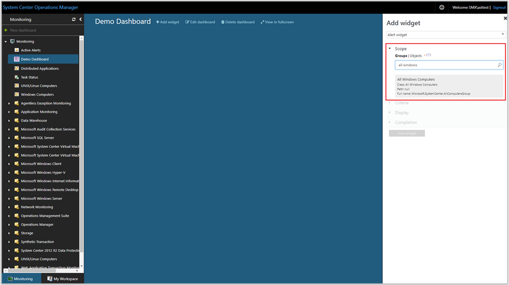

---
ms.assetid:
title: Create a Dashboard with the Alert Widget in the Web console
description: This article describes how to create a new HTML5 dashboard in System Center Operations Manager with the Alert widget.
author: jyothisuri
ms.author: jsuri
ms.date: 04/10/2025
ms.custom: UpdateFrequency2, engagement-fy23
ms.service: system-center
monikerRange: '>sc-om-2016'
ms.subservice: operations-manager
ms.topic: how-to
---

# Create a dashboard with the Alert widget in the Web console

In System Center Operations Manager, the Web console provides a monitoring interface for a management group that can be opened on any computer using any browser that has connectivity to the Web console server. The following steps describe how to create a dashboard in the new HTML5 web console with the Alert widget.

::: moniker range=">=sc-om-2022"

Operations Manager supports **Alert source** in the **Add** widget.

::: moniker-end

## Add widget to dashboard

To add a widget to dashboard, follow these steps:

1. Open a web browser on any computer and enter `http://<web host>/OperationsManager`, where *web host* is the name of the computer hosting the web console.

2. From the left pane in the Web console, select **+ New dashboard**.

    :::image type="content" source="./media/create-web-dashboard-alerts/web-console-new-dashboard-01-inline.png" alt-text="Screenshot showing select New Dashboard in Web console." lightbox="./media/create-web-dashboard-alerts/web-console-new-dashboard-01-expanded.png":::

3. On the **Create New Dashboard** page, provide a name and description for the dashboard you want to create.

    :::image type="content" source="./media/create-web-dashboard-alerts/web-console-new-dashboard-02-inline.png" alt-text="Screenshot showing specify name and description for new dashboard." lightbox="./media/create-web-dashboard-alerts/web-console-new-dashboard-02-expanded.png":::

4. You can save the dashboard in an existing unsealed management pack by selecting the management pack from the **Management Pack** dropdown list or you can save the dashboard by creating a new management pack by selecting **New** next to the **Management Pack** dropdown list and provide a name, description, and optionally a version number.

    

5. When you've completed specifying where to save the new dashboard to, select **OK**.

6. Select **Save** after providing a name and description for the new dashboard.

7. On the blank empty dashboard, you see the dashboard name, **Add Widget**, **Edit Dashboard**, **Delete dashboard**, and **View in fullscreen** options on the top of the page.

    :::image type="content" source="./media/create-web-dashboard-alerts/web-console-new-dashboard-04-inline.png" alt-text="Screenshot showing New dashboard canvas." lightbox="./media/create-web-dashboard-alerts/web-console-new-dashboard-04-expanded.png":::

8. Select **Alert Widget** from the **Select Widget** dropdown list.

9. In the Alert widget pane, select scope for the alert widget by selecting either **Groups** or **Objects**. For either option selected, you can search by keyword in the list. As you begin typing, the list filters based on your input.  You can select an individual group or object or multiple from the returned results.

10. A result set for the desired search query will be returned, select the scope from the returned results.

    

11. Set the criteria to identify the alerts to display.  To narrow the results, you can filter by selecting the following:
    * Severity
    * Priority
    * Resolution state
    * Alert age
    * Alert source (applicable for Operations Manager 2022 and later)

    Data matching the defined criteria will only be displayed in the widget.

    

12. Select **Display** to choose the columns to be displayed in the dashboard.  You can select or search for the columns from the dropdown list.  
13. Complete the configuration by providing a **Name**, **Description** and **Widget refresh interval** (default interval is 5 minutes) for the widget. Select **Save Widget** to save your new dashboard.  

After the widget has been created, it displays alerts based on the scope and criteria defined. You see the name of the alert widget along with the number of alerts in the header of widget. Alerts can also be filtered in the widget by searching for a keyword in the filter box.

You can view alert details consistent with the experience with the alerts view in the Operations console by selecting on an alert and drilling into its details.  

You can modify the alert resolution state and drill down to the monitoring object details page by selecting the alert source.

## Actions on Alert widget

For one or more alerts selected in the widget, you can perform such actions as:

- Change resolution state while viewing the details of a particular alert or for one or more alerts selected in the widget.
- Export the alerts to Excel for further analysis.
- Modify how the alerts are presented by including or excluding columns, how to group alerts, customized to your personal needs.

To perform these actions, hover your mouse over the widget, and click on the ellipsis **...** on the top right corner of the widget. This will display actions available for the widget.

   * Select **Set resolution state** and select one or multiple alerts by selecting the checkbox in the first column on the left, for each alert resolution state you're going to change. Select the resolution state from the dropdown list and select **Save**.  
   * Select **Export to Excel** to export the alert data to an Excel file.  
   * Select **Personalize** to change your selection of columns to be displayed or to group alerts. Select **Save personalization** when you've completed making your changes.  

## Additional view options in Alert widget

::: moniker range=">=sc-om-2022"

Alert widget now supports *sort by* option.

::: moniker-end

::: moniker range="sc-om-2019"

> [!NOTE]
> This feature is applicable for 2019 UR3 and later.

Alert widget now supports *sort by* option.

In earlier releases, this feature isn't available for Alert widget, and on all H5 dashboard personalization but is available on all views of operations console of Operations Manager 2019.

With Operations Manager 2019 UR3 and later, you can sort the results columns in the **Alert** widget and also group the columns.

::: moniker-end

### Support for sort by option

The **Sort by** option is now available in the **Add widget** wizard.

To include this feature, while creating a new widget using the **Add widget** wizard in the web console, select **Display** and then select the column option available under **Sort by** dropdown menu. Save the settings for the new widget once done.

### View columns using sort by feature

The **Sort by** option is available under **Edit** > **Personalize**.

To view columns using sort by feature, follow these steps:

1. Select a column under **Group by**.
2. Select **Expand All** to view the columns grouped.
3. Select the columns for sorting under **Sort by**, and select the **Order** (Ascending or Descending).
4. Select **Save the settings**.

Here's a sample view:

The following image shows sample results for Alert widget after grouping by **Name** and sorting by **Age**, in **descending** order.

## Next steps

To learn how to create a dashboard in the new web console with the Performance widget, see [How to create a dashboard with the Performance widget in the Web console](manage-create-web-dashboard-perf.md).
