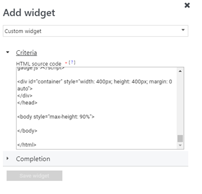
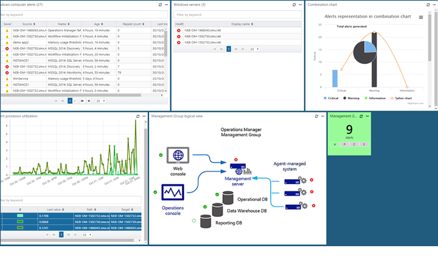

# How create a dashboard with the Custom widget in the Web console
In System Center Operations Manager, the Web console provides a monitoring interface for a management group that can be opened on any computer using any browser that has connectivity to the Web console server. The following steps describe how to add a Custom widget to a  dashboard in the new HTML5 Web console.  It executes the HTML code specified and visualizes the desired output in a variety of visualizations. 

## Script structure  
A Custom Widget script has three major sections:

1. Defining the API and its properties. This section defines what data needs to be retrieved from Operations Manager for visualization, such as alerts, state, and performance data.
2. Specify business logic to identify the results to present in the visualization, such as identifying a class or group, conditions such as severity, health state, or a specific performance object instance.
3. Third party visualization are open source libraries hosted on cloudflare.com that are required to render depending on the chart type selected.   

## Widget examples
The widget supports rendering monitoring data in the following chart types:

* Bar chart
* Pie chart and 3D Pie chart
* Donut and 3D Donut
* Combination chart
* Stacked bar chart

You can configure a chart type to present state, performance and alert data.  For each example below, alerts from the Windows Computer group are returned for any severity, matching specific resolution states.

### Bar chart
The following HTML code demonstrates rendering a bar chart with alert data.

```
<!DOCTYPE HTML>
<html>

<head>
    <script src="https://ajax.googleapis.com/ajax/libs/jquery/3.2.1/jquery.min.js"></script>
    <script type="text/javascript">
        var criticalCounter = 0;
        var informationCounter = 0;
        var warningCounter = 0;

        window.onload = function () {
            $.ajax({
                url: "/OperationsManager/data/alert",
                type: "POST",
                data: {
                    "classId": null,
                    "objectIds": { "3c8ac4f3-475e-44dd-4163-8a97af363705": -1 },
                    "criteria": "((Severity = '0') OR (Severity = '1') OR (Severity = '2') OR (Severity = '3')) AND ((Priority = '2') OR (Priority = '1') OR (Priority = '0')) AND ((ResolutionState = '0') OR (ResolutionState = '247') OR (ResolutionState = '248') OR (ResolutionState = '249') OR (ResolutionState = '250') OR (ResolutionState = '254') OR (ResolutionState = '255'))",
                    "displayColumns":
                    [
                        "severity","monitoringobjectdisplayname","name","age","repeatcount","lastModified"
                    ]
                },
                success: function (result) {
                    for (var i = 0; i < result.rows.length; i++) {
			switch(result.rows[i].severity)
			{
				case "Error":
					criticalCounter++;
					break;
				case "Information":
					informationCounter++;
					break;
				case "Warning":
	                                warningCounter++
					break;
			}
                    }
                    renderChart();
                }
            });
        }

        function renderChart() {
            var chart = new CanvasJS.Chart("chartContainer", {
                title: {
                    text: "Alerts representation in bar chart"
                },
                data: [{
                    type: "column",
                    dataPoints: [
                        { y: criticalCounter, label: "Critical" },
                        { y: warningCounter, label: "Warning" },
                        { y: informationCounter, label: "Information" }
                    ]
                }]
            });
            chart.render();
        }
    </script>
    <script src="https://cdnjs.cloudflare.com/ajax/libs/canvasjs/1.7.0/canvasjs.min.js"></script>
    <title>CanvasJS Example</title>
</head>

<body>
    <div id="chartContainer" style="height: 400px; width: 100%;"></div>
</body>

</html>
```
### Pie chart
The following HTML code demonstrates rendering a pie chart with alert data.

```
<!DOCTYPE HTML>
<html>

<head>
    <script src="https://ajax.googleapis.com/ajax/libs/jquery/3.2.1/jquery.min.js"></script>
    <script type="text/javascript">
        var criticalCounter = 0;
        var informationCounter = 0;
        var warningCounter = 0;

        window.onload = function () {
            $.ajax({
                url: "/OperationsManager/data/alert",
                type: "POST",
                data: {
                    "classId": null,
                    "objectIds": { "3c8ac4f3-475e-44dd-4163-8a97af363705": -1 },
                    "criteria": "((Severity = '0') OR (Severity = '1') OR (Severity = '2') OR (Severity = '3')) AND ((Priority = '2') OR (Priority = '1') OR (Priority = '0')) AND ((ResolutionState = '0') OR (ResolutionState = '247') OR (ResolutionState = '248') OR (ResolutionState = '249') OR (ResolutionState = '250') OR (ResolutionState = '254') OR (ResolutionState = '255'))",
                    "displayColumns":
                    [
                        "severity","monitoringobjectdisplayname","name","age","repeatcount","lastModified"
                    ]
                },
                success: function (result) {
                    for (var i = 0; i < result.rows.length; i++) {
			switch(result.rows[i].severity)
			{
				case "Error":
					criticalCounter++;
					break;
				case "Information":
					informationCounter++;
					break;
				case "Warning":
	                                warningCounter++
					break;
			}
                    }
                    renderChart();
                }
            });
        }

        function renderChart() {
            var chart = new CanvasJS.Chart("chartContainer",
                {
                    theme: "theme2",
                    title: {
                        text: "Alerts representation in Pie chart"
                    },
                    data: [
                        {
                            type: "pie",
                            showInLegend: true,
                            toolTipContent: "{y} - #percent %",
                            legendText: "{indexLabel}",
                            dataPoints: [
                                { y: criticalCounter, indexLabel: "Critical" },
                                { y: warningCounter, indexLabel: "Warning" },
                                { y: informationCounter, indexLabel: "Information" }
                            ]
                        }
                    ]
                });
            chart.render();
        }
    </script>
    <script src="https://cdnjs.cloudflare.com/ajax/libs/canvasjs/1.7.0/canvasjs.min.js"></script>
    <title>CanvasJS Example</title>
</head>

<body>
    <div id="chartContainer" style="height: 400px; width: 100%;"></div>
</body>

</html>
```

### 3D Pie chart
The following HTML code demonstrates rendering a 3D pie chart with alert data.

```
<!DOCTYPE HTML>
<html>

<head>
    <script src="https://ajax.googleapis.com/ajax/libs/jquery/3.2.1/jquery.min.js"></script>
    <script type="text/javascript">
        var criticalCounter = 0;
        var informationCounter = 0;
        var warningCounter = 0;

        window.onload = function () {
            $.ajax({
                url: "/OperationsManager/data/alert",
                type: "POST",
                data: {
                    "classId": null,
                    "objectIds": { "3c8ac4f3-475e-44dd-4163-8a97af363705": -1 },
                    "criteria": "((Severity = '0') OR (Severity = '1') OR (Severity = '2') OR (Severity = '3')) AND ((Priority = '2') OR (Priority = '1') OR (Priority = '0')) AND ((ResolutionState = '0') OR (ResolutionState = '247') OR (ResolutionState = '248') OR (ResolutionState = '249') OR (ResolutionState = '250') OR (ResolutionState = '254') OR (ResolutionState = '255'))",
                    "displayColumns":
                    [
                        "severity","monitoringobjectdisplayname","name","age","repeatcount","lastModified"
                    ]
                },
                success: function (result) {
                    for (var i = 0; i < result.rows.length; i++) {
			switch(result.rows[i].severity)
			{
				case "Error":
					criticalCounter++;
					break;
				case "Information":
					informationCounter++;
					break;
				case "Warning":
	                                warningCounter++
					break;
			}
                    }
                    renderChart();
                }
            });
        }

        function renderChart() {
            var chart = new Highcharts.chart('container', {
    chart: {
        type: 'pie',
        options3d: {
            enabled: true,
            alpha: 45,
            beta: 0
        }
    },
    title: {
        text: 'Alerts share per severity'
    },
    tooltip: {
        pointFormat: '{series.name}: <b>{point.percentage:.1f}%</b>'
    },
    plotOptions: {
        pie: {
            allowPointSelect: true,
            cursor: 'pointer',
            depth: 35,
            dataLabels: {
                enabled: true,
                format: '{point.name}'
            }
        }
    },
    series: [{
        type: 'pie',
        name: 'Alerts share',
        data: [
            {
                name: 'Critical',
                y: 48,
                sliced: true,
                selected: true
            },
            ['Warning', 39],
            ['Information', 13],
        ]
    }]
});

            chart.render();
        }
    </script>
   <script src="https://code.highcharts.com/highcharts.js"></script>
<script src="https://code.highcharts.com/highcharts-3d.js"></script>
<script src="https://code.highcharts.com/modules/exporting.js"></script>

<div id="container" style="height: 400px"></div>
</head>

<body>
    <div id="chartContainer" style="height: 400px; width: 100%;"></div>
</body>

</html>
```

### Donut chart
The following HTML code demonstrates rendering a donut chart with alert data.

```
<!DOCTYPE HTML>
<html>

<head>
    <script src="https://ajax.googleapis.com/ajax/libs/jquery/3.2.1/jquery.min.js"></script>
    <script type="text/javascript">
        var criticalCounter = 0;
        var informationCounter = 0;
        var warningCounter = 0;

        window.onload = function () {
            $.ajax({
                url: "/OperationsManager/data/alert",
                type: "POST",
                data: {
                    "classId": null,
                    "objectIds": { "3c8ac4f3-475e-44dd-4163-8a97af363705": -1 },
                    "criteria": "((Severity = '0') OR (Severity = '1') OR (Severity = '2') OR (Severity = '3')) AND ((Priority = '2') OR (Priority = '1') OR (Priority = '0')) AND ((ResolutionState = '0') OR (ResolutionState = '247') OR (ResolutionState = '248') OR (ResolutionState = '249') OR (ResolutionState = '250') OR (ResolutionState = '254') OR (ResolutionState = '255'))",
                    "displayColumns":
                    [
                        "severity","monitoringobjectdisplayname","name","age","repeatcount","lastModified"
                    ]
                },
                success: function (result) {
                    for (var i = 0; i < result.rows.length; i++) {
			switch(result.rows[i].severity)
			{
				case "Error":
					criticalCounter++;
					break;
				case "Information":
					informationCounter++;
					break;
				case "Warning":
	                                warningCounter++
					break;
			}
                    }
                    renderChart();
                }
            });
        }

        function renderChart() {
            var chart = new CanvasJS.Chart("chartContainer",
                {
                    theme: "theme2",
animationEnabled: true,
                    title: {
                        text: "Alerts representation in doughnut"
                    },
                    data: [
                        {
                            type: "doughnut",
				indexLabelFontFamily: "Garamond",       
				indexLabelFontSize: 20,
				startAngle:0,
				indexLabelFontColor: "dimgrey",       
				indexLabelLineColor: "darkgrey", 
				toolTipContent: "{y} %", 		
                            dataPoints: [
                                { y: criticalCounter, indexLabel: "Critical" },
                                { y: warningCounter, indexLabel: "Warning" },
                                { y: informationCounter, indexLabel: "Information" }
                            ]
                        }
                    ]
                });
            chart.render();
        }
    </script>
    <script src="https://cdnjs.cloudflare.com/ajax/libs/canvasjs/1.7.0/canvasjs.min.js"></script>
    <title>CanvasJS Example</title>
</head>

<body>
    <div id="chartContainer" style="height: 400px; width: 100%;"></div>
</body>

</html>
```

### 3D Donut chart
The following HTML code demonstrates rendering a 3D donut chart with alert data.

```
<!DOCTYPE HTML>
<html>

<head>
    <script src="https://ajax.googleapis.com/ajax/libs/jquery/3.2.1/jquery.min.js"></script>
    <script type="text/javascript">
        var criticalCounter = 0;
        var informationCounter = 0;
        var warningCounter = 0;

        window.onload = function () {
            $.ajax({
                url: "/OperationsManager/data/alert",
                type: "POST",
                data: {
                    "classId": null,
                    "objectIds": { "3c8ac4f3-475e-44dd-4163-8a97af363705": -1 },
                    "criteria": "((Severity = '0') OR (Severity = '1') OR (Severity = '2') OR (Severity = '3')) AND ((Priority = '2') OR (Priority = '1') OR (Priority = '0')) AND ((ResolutionState = '0') OR (ResolutionState = '247') OR (ResolutionState = '248') OR (ResolutionState = '249') OR (ResolutionState = '250') OR (ResolutionState = '254') OR (ResolutionState = '255'))",
                    "displayColumns":
                    [
                        "severity","monitoringobjectdisplayname","name","age","repeatcount","lastModified"
                    ]
                },
                success: function (result) {
                    for (var i = 0; i < result.rows.length; i++) {
			switch(result.rows[i].severity)
			{
				case "Error":
					criticalCounter++;
					break;
				case "Information":
					informationCounter++;
					break;
				case "Warning":
	                                warningCounter++
					break;
			}
                    }
                    renderChart();
                }
            });
        }

        function renderChart() {
            var chart = Highcharts.chart('container', {
    chart: {
        type: 'pie',
        options3d: {
            enabled: true,
            alpha: 45
        }
    },
    title: {
        text: 'Alerts representation in 3D donut'
    },
    subtitle: {
        text: ''
    },
    plotOptions: {
        pie: {
            innerSize: 100,
            depth: 45
        }
    },
    series: [{
        name: 'Number of alerts',
        data: [
        ['Critical', criticalCounter],
                                ['Warning', warningCounter ],
                                ['Information',  informationCounter]

        ]
    }]
});
            chart.render();
        }
    </script>
    <script src="https://code.highcharts.com/highcharts.js"></script>
<script src="https://code.highcharts.com/highcharts-3d.js"></script>
<script src="https://code.highcharts.com/modules/exporting.js"></script>

<div id="container" style="height: 400px">
</div>
</head>

<body>
    <div id="chartContainer" style="height: 400px; width: 100%;"></div>
</body>

</html>
```

### Combination chart 
The following HTML code demonstrates creating a Combination chart to display alerts in a pie and spline chart.

```
<!DOCTYPE HTML>
<html>

<head>
    <script src="https://ajax.googleapis.com/ajax/libs/jquery/3.2.1/jquery.min.js"></script>
    <script type="text/javascript">
        var criticalCounter = 0;
        var informationCounter = 0;
        var warningCounter = 0;
var totalCounter =0;

        window.onload = function () {
            $.ajax({
                url: "/OperationsManager/data/alert",
                type: "POST",
                data: {
                    "classId": null,
                    "objectIds": { "3c8ac4f3-475e-44dd-4163-8a97af363705": -1 },
                    "criteria": "((Severity = '0') OR (Severity = '1') OR (Severity = '2') OR (Severity = '3')) AND ((Priority = '2') OR (Priority = '1') OR (Priority = '0')) AND ((ResolutionState = '0') OR (ResolutionState = '247') OR (ResolutionState = '248') OR (ResolutionState = '249') OR (ResolutionState = '250') OR (ResolutionState = '254') OR (ResolutionState = '255'))",
                    "displayColumns":
                    [
                        "severity","monitoringobjectdisplayname","name","age","repeatcount","lastModified"
                    ]
                },
                success: function (result) {
                    for (var i = 0; i < result.rows.length; i++) {
			switch(result.rows[i].severity)
			{
				case "Error":
					criticalCounter++;
					break;
				case "Information":
					informationCounter++;
					break;
				case "Warning":
	                                warningCounter++
					break;
			}
                    }
                    renderChart();
                }
            });
        }

        function renderChart() {
            var chart = new Highcharts.chart('container', {
    title: {
        text: 'Alerts representation in combination chart'
    },
    xAxis: {
        categories: ['Critical', 'Warning', 'Information']
    },
    labels: {
        items: [{
            html: 'Total alerts generated',
            style: {
                left: '50px',
                top: '0px',
                color: (Highcharts.theme && Highcharts.theme.textColor) || 'black'
            }
        }]
    },
    series: [{
        type: 'column',
        name: 'Critical',
        data: [criticalCounter, 0, 0]
    }, {
        type: 'column',
        name: 'Warning',
        data: [0, warningCounter, 0]
    }, {
        type: 'column',
        name: 'Information',
        data: [0, 0, informationCounter]
    }, {
        type: 'spline',
        name: 'Spline chart',
        data: [criticalCounter, warningCounter, informationCounter],
        marker: {
            lineWidth: 2,
            lineColor: Highcharts.getOptions().colors[3],
            fillColor: 'white'
        }
    }, {
        type: 'pie',
        name: 'Total consumption',
        data: [{
            name: 'Critical',
            y: criticalCounter,
            color: Highcharts.getOptions().colors[0] // Jane's color
        }, {
            name: 'Warning',
            y: warningCounter,
            color: Highcharts.getOptions().colors[1] // John's color
        }, {
            name: 'Information',
            y: informationCounter,
            color: Highcharts.getOptions().colors[2] // Joe's color
        }],
        center: [150, 100],
        size: 100,
        showInLegend: false,
        dataLabels: {
            enabled: false
        }
    }]
});


            chart.render();
        }
    </script>
    <script src="https://code.highcharts.com/highcharts.js"></script>
<script src="https://code.highcharts.com/modules/exporting.js"></script>

<div id="container" style="min-width: 310px; height: 400px; margin: 0 auto"></div>

</head>

<body>
    <div id="chartContainer" style="height: 400px; width: 100%;"></div>
</body>

</html>
```
## Add widget to dashboard

1. Open a web browser on any computer and enter `http://<web host>/OperationsManager`, where *web host* is the name of the computer hosting the web console. 
2. From the left pane in the Web console, click **+ New dashboard**.<br><br> <br>
3. On the **Create New Dashboard** page, provide a name and description for the dashboard you want to create.<br><br> <br> 
4. You can save the dashboard in an existing unsealed management pack by selecting the management pack from the **Management Pack** drop-down list or you can save the dashboard by creating a new management pack by clicking **New** next to the **Management Pack** drop-down list and provide a name, description and optionally a version number. <br><br>  <br> 
5. When you have completed specifying where to save the new dashboard to, click **OK**.
6. Click **Save** after providing a name and description for the new dashboard. 
7. On the blank empty dashboard, you see the dashboard name, **Add Widget**, **Edit Dashboard**, **Delete dashboard** and **View in fullscreen** options on the top of the page.<br><br> <br> 
8. Select **Custom Widget** from the **Select Widget** drop-down list.
9. In the Custom widget pane, select criteria for the widget adding the HTML code using one of the earlier exmaples, to visualize monitoring data in one of the supported chart visualizations.<br><br> <br>
10. Complete the configuration by providing a **Name**, **Description** and **Widget reefresh interval** (default interval is 5 minutes) for the widget.  Click **Save Widget** to save your new dashboard.  

After the widget has been created, it displays the output of the HTLM code.<br><br> 

 