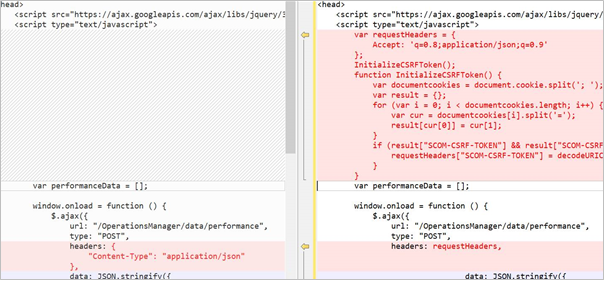

---
ms.assetid:
title: Create a dashboard with the Custom widget in the Web console
description: This article describes how to create a new HTML5 dashboard in System Center Operations Manager with the Custom widget.
author: Jeronika-MS
ms.author: v-gajeronika
ms.date: 11/01/2024
ms.custom: UpdateFrequency2, engagement-fy24
ms.service: system-center
monikerRange: '>sc-om-2016'
ms.subservice: operations-manager
ms.topic: how-to
ms.update-cycle: 1095-days
---

# Create a dashboard with the Custom widget in the Web console


In System Center Operations Manager, the Web console provides a monitoring interface for a management group that can be opened on any computer using any browser that has connectivity to the Web console server. The following steps describe how to add a Custom widget to a dashboard in the new HTML5 Web console, which is using a new API based on REST. It executes the HTML code specified and visualizes the desired output in various visualizations.

::: moniker range="sc-om-2019"

>[!NOTE]
> Operations Manager 2019 UR1 and later supports Cross-Site Request Forgery (CSRF) tokens to prevent CSRF attacks. If you're using Operations Manager 2019 UR1 or later, you must initialize the CSRF token. HTML scripts don't work without the initialization of CSRF token.

## Initialize the CSRF token

Required action, applicable for Operations Manager 2019 UR1 and later.

1. In the HTML header of the dashboard, add the following code:

```
var requestHeaders = {
            Accept: 'q=0.8;application/json;q=0.9',
            "Content-Type": "application/json"
        };
        InitializeCSRFToken();
        function InitializeCSRFToken() {
            var documentcookies = document.cookie.split('; ');
            var result = {};
            for (var i = 0; i < documentcookies.length; i++) {
                var cur = documentcookies[i].split('=');
                result[cur[0]] = cur[1];
            }
            if (result["SCOM-CSRF-TOKEN"] && result["SCOM-CSRF-TOKEN"] != null) {
                requestHeaders["SCOM-CSRF-TOKEN"] = decodeURIComponent(result["SCOM-CSRF-TOKEN"]);
            }
        }
```

2. In the onload function, change the header value to **requestHeaders**. If the header value doesn't exist, add it as shown below.

**Example:**



::: moniker-end

## Use the Operations Manager REST API reference

Use the REST API reference to learn about the available operations you can perform with the custom widget to present operational data in the dashboard. If you're new to REST API, take a look at the information on [getting started with this API](/rest/operationsmanager) if you haven't already seen it.

## Script structure

A Custom Widget script has three major sections:

1. Defining the REST API and its properties. This section defines what data needs to be retrieved from Operations Manager for visualization, such as alerts, state, or performance data.
2. Specify business logic to identify the results to present in the visualization, such as identifying a class or group, conditions such as severity, health state, or a specific performance object instance.
3. Third-party visualization, which is open-source libraries hosted on cloudflare.com that are required to render the data depending on the chart type selected.

### Widget properties

In order for the script to query and return data in the visualization, the **URL** parameter specifies the address of the Operations Manager Web console and the data type.  The URL syntax is *http://\<servername\>/operationsmanager/data/\<dataitem\>* and the value for **dataitem** is one of the following:

* *alert* represents a monitoring alert
* *state* represents monitoring health state data
* *performance* represents monitoring performance data

```
<!DOCTYPE HTML>
<html>

<head>
    <script src="https://ajax.googleapis.com/ajax/libs/jquery/3.2.1/jquery.min.js"></script>
    <script type="text/javascript">
        var criticalCounter = 0;
        var informationCounter = 0;
        var warningCounter = 0;

        window.onload = function () {
            $.ajax({
                url: "/OperationsManager/data/alert",
                type: "POST",
```

To scope the monitoring data for each data type, you can select a class to see all instances of that class, or to see only a subset of objects of the selected class, you can also include a group.  For example, to specify all objects of class Windows Server DC Computer, you would modify the property value for *classId*.

>[!NOTE]
>This is only applicable to state data, not alert or performance. For performance data, specify a group or monitored object.

```
<!DOCTYPE HTML>
<html>

<head>
    <script src="https://ajax.googleapis.com/ajax/libs/jquery/3.2.1/jquery.min.js"></script>
    <script type="text/javascript">
        var criticalCounter = 0;
        var informationCounter = 0;
        var warningCounter = 0;

        window.onload = function () {
            $.ajax({
                url: "/OperationsManager/data/alert",
                type: "POST",
                data: JSON.stringify({
                    "classId": "Microsoft.Windows.Library!Micr…ft.Windows.Server.DC.Computer",
                    "objectIds": { }),
```

To specify a group that contains a subset of objects of the same class specified for the property *classId*, modify the value *objectIds* and specify the GUID of the group. The value must be in quotes.  

```
<!DOCTYPE HTML>
<html>

<head>
    <script src="https://ajax.googleapis.com/ajax/libs/jquery/3.2.1/jquery.min.js"></script>
    <script type="text/javascript">
        var criticalCounter = 0;
        var informationCounter = 0;
        var warningCounter = 0;

        window.onload = function () {
            $.ajax({
                url: "/OperationsManager/data/alert",
                type: "POST",
                data: JSON.stringify({
                    "classId": null,
                    "objectIds": { "3c8ac4f3-475e-44dd-4163-8a97af363705": -1 }),
```

Once you've specified the target class and optionally a group to further scope the results, you can then specify the criteria to limit the type of data to display according to the values of one or more properties.

## Widget examples

The widget supports rendering monitoring data in the following chart types:

- Bar chart (state data)
- Spline chart (performance data)
- Bar chart (alert data)
- Pie chart and 3D Pie chart
- Donut and 3D Donut
- Combination chart
- Stacked bar chart

You can configure a chart type to present state, performance, and alert data. For each example below, alerts from the Windows Computer group are returned for any severity, matching specific resolution states.

Select the required tab to view the HTML code for the respective chart type:

# [Bar chart (state data)](#tab/Bar)

The following HTML code demonstrates rendering a bar chart with state data:

```html
<!DOCTYPE HTML>
<html>

<head>
    <script src="https://ajax.googleapis.com/ajax/libs/jquery/3.2.1/jquery.min.js"></script>
    <script type="text/javascript">
        var criticalCounter = 0;
        var healthyCounter = 0;
        var warningCounter = 0;
        var unmonitoredCounter = 0;

        window.onload = function () {
            $.ajax({
                url: "/OperationsManager/data/state",
                type: "POST",
                data: JSON.stringify({
                    "classId": "System.Library!System.Computer",
                    "objectIds": {
                        // Key value pairs => id: 0 (For objects)/-1 (For groups)
                        "1d62280e-f437-1369-316b-1e8659500e9a": -1
                    },
                    "criteria": "((HealthState = '0') OR (HealthState = '1') OR (HealthState = '2') OR (HealthState = '3') OR HealthState is null)",
                    "displayColumns": [
                        "healthstate",
                        "displayname",
                        "path",
                        "maintenancemode"
                    ]
                }),
                success: function (result) {
                    for (var i = 0; i < result.rows.length; i++) {
                        switch (result.rows[i].healthstate) {
                            case "critical":
                                criticalCounter++;
                                break;
                            case "healthy":
                                healthyCounter++;
                                break;
                            case "warning":
                                warningCounter++;
                                break;
                            case "unmonitored":
                                unmonitoredCounter++;
                                break;
                        }
                    }
                    renderChart();
                }
            });
        }

        function renderChart() {
            var chart = new CanvasJS.Chart("chartContainer", {
                title: {
                    text: "Health State of Windows Computers"
                },
                data: [{
                    type: "column",
                    dataPoints: [
                        { y: criticalCounter, label: "Critical", color: "Red" },
                        { y: healthyCounter, label: "Healthy", color: "Green" },
                        { y: warningCounter, label: "Warning", color: "Yellow" },
                        { y: unmonitoredCounter, label: "Unmonitored", color: "Gray" }
                    ]
                }]
            });
            chart.render();
        }
    </script>
    <script src="https://cdnjs.cloudflare.com/ajax/libs/canvasjs/1.7.0/canvasjs.min.js"></script>
    <title>CanvasJS Example</title>
</head>

<body>
    <div id="chartContainer" style="height: 400px; width: 100%;"></div>
</body>

</html>
```
# [Spline chart (performance data)](#tab/Spline)

The following HTML code demonstrates rendering a spline chart with performance data:

```html
<!DOCTYPE HTML>
<html>

<head>
    <script src="https://ajax.googleapis.com/ajax/libs/jquery/3.2.1/jquery.min.js"></script>
    <script type="text/javascript">
        var performanceData = [];

        window.onload = function () {
            $.ajax({
                url: "/OperationsManager/data/performance",
                type: "POST",
                headers: {
                    "Content-Type": "application/json"
                },
                data: JSON.stringify({
                        "id":"6f7e3306-beeb-2996-3795-7c1eafb925b8",
                        "performanceCounters":[
                            {
                                "objectname":"Health Service",
                                "countername":"agent processor utilization",
                                "instancename":""
                            }
                        ],
                        "legends":[
                            "target",
                            "path",
                            "lastvalue"
                        ],
                        "duration":4320
                    }),
                success: function (result) {
                    let dataDictionary = result.datasets[0].data;
                    let sum = new Array(24).fill(0.0);
                    let count = new Array(24).fill(0.0);
                    for (var key in dataDictionary) {
                        if(dataDictionary.hasOwnProperty(key)) {
                           var datetime = new Date(key);
                            datetime = convertUTCDateToLocalDate(datetime);
                            sum[datetime.getHours()] += dataDictionary[key];
                            count[datetime.getHours()]++;
                        }
                    }
                    let tDate = new Date();
                    tDate.setHours(0,0,0,0);
                    for(var i=0; i<24; i++) {
                        performanceData.push({
                            y: sum[i] / count[i],
                            x: new Date(tDate.getTime())
                        });
                        tDate.setHours(tDate.getHours()+1);
                    }
                    renderChart();
                }
            });
        }

        function convertUTCDateToLocalDate(date) {
            var newDate = new Date(date.getTime()+date.getTimezoneOffset()*60*1000);
            var offset = date.getTimezoneOffset() / 60;
            newDate.setMinutes(date.getMinutes() - date.getTimezoneOffset())
            return newDate;   
        }

        function renderChart() {
            var chart = new CanvasJS.Chart("chartContainer", {
                title: {
                    text: "Average Processor Utilization for Last 3 Days"
                },
                axisX: {
                    labelFormatter: function(e) {
                        return CanvasJS.formatDate(e.value, "hh:mm tt");
                    }
                },
                data: [{
                    type: "spline",
                    dataPoints: performanceData
                }]
            });
            chart.render();
        }
    </script>
    <script src="https://cdnjs.cloudflare.com/ajax/libs/canvasjs/1.7.0/canvasjs.min.js"></script>
    <title>CanvasJS Example</title>
</head>

<body>
    <div id="chartContainer" style="height: 100%; width: 100%;"></div>
</body>

</html>
```

# [Bar chart (alert data)](#tab/Alert)

The following HTML code demonstrates rendering a bar chart with alert data:

```html
<!DOCTYPE HTML>
<html>

<head>
    <script src="https://ajax.googleapis.com/ajax/libs/jquery/3.2.1/jquery.min.js"></script>
    <script type="text/javascript">
        var criticalCounter = 0;
        var informationCounter = 0;
        var warningCounter = 0;

        window.onload = function () {
            $.ajax({
                url: "/OperationsManager/data/alert",
                type: "POST",
                data: JSON.stringify({
                    "classId": null,
                    "objectIds": { "3c8ac4f3-475e-44dd-4163-8a97af363705": -1 },
                    "criteria": "((Severity = '0') OR (Severity = '1') OR (Severity = '2') OR (Severity = '3')) AND ((Priority = '2') OR (Priority = '1') OR (Priority = '0')) AND ((ResolutionState = '0') OR (ResolutionState = '247') OR (ResolutionState = '248') OR (ResolutionState = '249') OR (ResolutionState = '250') OR (ResolutionState = '254') OR (ResolutionState = '255'))",
                    "displayColumns":
                    [
                        "severity","monitoringobjectdisplayname","name","age","repeatcount","lastModified"
                    ]
                }),
                success: function (result) {
                    for (var i = 0; i < result.rows.length; i++) {
            switch(result.rows[i].severity)
            {
                case "Error":
                    criticalCounter++;
                    break;
                case "Information":
                    informationCounter++;
                    break;
                case "Warning":
                                    warningCounter++
                    break;
            }
                    }
                    renderChart();
                }
            });
        }

        function renderChart() {
            var chart = new CanvasJS.Chart("chartContainer", {
                title: {
                    text: "Alerts representation in bar chart"
                },
                data: [{
                    type: "column",
                    dataPoints: [
                        { y: criticalCounter, label: "Critical" },
                        { y: warningCounter, label: "Warning" },
                        { y: informationCounter, label: "Information" }
                    ]
                }]
            });
            chart.render();
        }
    </script>
    <script src="https://cdnjs.cloudflare.com/ajax/libs/canvasjs/1.7.0/canvasjs.min.js"></script>
    <title>CanvasJS Example</title>
</head>

<body>
    <div id="chartContainer" style="height: 400px; width: 100%;"></div>
</body>

</html>
```

# [Pie chart](#tab/Pie)

The following HTML code demonstrates rendering a pie chart with alert data:

```html
<!DOCTYPE HTML>
<html>

<head>
    <script src="https://ajax.googleapis.com/ajax/libs/jquery/3.2.1/jquery.min.js"></script>
    <script type="text/javascript">
        var criticalCounter = 0;
        var informationCounter = 0;
        var warningCounter = 0;

        window.onload = function () {
            $.ajax({
                url: "/OperationsManager/data/alert",
                type: "POST",
                data: JSON.stringify({
                    "classId": null,
                    "objectIds": { "3c8ac4f3-475e-44dd-4163-8a97af363705": -1 },
                    "criteria": "((Severity = '0') OR (Severity = '1') OR (Severity = '2') OR (Severity = '3')) AND ((Priority = '2') OR (Priority = '1') OR (Priority = '0')) AND ((ResolutionState = '0') OR (ResolutionState = '247') OR (ResolutionState = '248') OR (ResolutionState = '249') OR (ResolutionState = '250') OR (ResolutionState = '254') OR (ResolutionState = '255'))",
                    "displayColumns":
                    [
                        "severity","monitoringobjectdisplayname","name","age","repeatcount","lastModified"
                    ]
                }),
                success: function (result) {
                    for (var i = 0; i < result.rows.length; i++) {
            switch(result.rows[i].severity)
            {
                case "Error":
                    criticalCounter++;
                    break;
                case "Information":
                    informationCounter++;
                    break;
                case "Warning":
                                    warningCounter++
                    break;
            }
                    }
                    renderChart();
                }
            });
        }

        function renderChart() {
            var chart = new CanvasJS.Chart("chartContainer",
                {
                    theme: "theme2",
                    title: {
                        text: "Alerts representation in Pie chart"
                    },
                    data: [
                        {
                            type: "pie",
                            showInLegend: true,
                            toolTipContent: "{y} - #percent %",
                            legendText: "{indexLabel}",
                            dataPoints: [
                                { y: criticalCounter, indexLabel: "Critical" },
                                { y: warningCounter, indexLabel: "Warning" },
                                { y: informationCounter, indexLabel: "Information" }
                            ]
                        }
                    ]
                });
            chart.render();
        }
    </script>
    <script src="https://cdnjs.cloudflare.com/ajax/libs/canvasjs/1.7.0/canvasjs.min.js"></script>
    <title>CanvasJS Example</title>
</head>

<body>
    <div id="chartContainer" style="height: 400px; width: 100%;"></div>
</body>

</html>
```

# [3D Pie chart](#tab/3DPie)

The following HTML code demonstrates rendering a 3D pie chart with alert data:

```html
<!DOCTYPE HTML>
<html>

<head>
    <script src="https://ajax.googleapis.com/ajax/libs/jquery/3.2.1/jquery.min.js"></script>
    <script type="text/javascript">
        var criticalCounter = 0;
        var informationCounter = 0;
        var warningCounter = 0;

        window.onload = function () {
            $.ajax({
                url: "/OperationsManager/data/alert",
                type: "POST",
                data: JSON.stringify({
                    "classId": null,
                    "objectIds": { "3c8ac4f3-475e-44dd-4163-8a97af363705": -1 },
                    "criteria": "((Severity = '0') OR (Severity = '1') OR (Severity = '2') OR (Severity = '3')) AND ((Priority = '2') OR (Priority = '1') OR (Priority = '0')) AND ((ResolutionState = '0') OR (ResolutionState = '247') OR (ResolutionState = '248') OR (ResolutionState = '249') OR (ResolutionState = '250') OR (ResolutionState = '254') OR (ResolutionState = '255'))",
                    "displayColumns":
                    [
                        "severity","monitoringobjectdisplayname","name","age","repeatcount","lastModified"
                    ]
                }),
                success: function (result) {
                    for (var i = 0; i < result.rows.length; i++) {
            switch(result.rows[i].severity)
            {
                case "Error":
                    criticalCounter++;
                    break;
                case "Information":
                    informationCounter++;
                    break;
                case "Warning":
                                    warningCounter++
                    break;
            }
                    }
                    renderChart();
                }
            });
        }

        function renderChart() {
            var chart = new Highcharts.chart('container', {
    chart: {
        type: 'pie',
        options3d: {
            enabled: true,
            alpha: 45,
            beta: 0
        }
    },
    title: {
        text: 'Alerts share per severity'
    },
    tooltip: {
        pointFormat: '{series.name}: <b>{point.percentage:.1f}%</b>'
    },
    plotOptions: {
        pie: {
            allowPointSelect: true,
            cursor: 'pointer',
            depth: 35,
            dataLabels: {
                enabled: true,
                format: '{point.name}'
            }
        }
    },
    series: [{
        type: 'pie',
        name: 'Alerts share',
        data: [
            {
                name: 'Critical',
                y: 48,
                sliced: true,
                selected: true
            },
            ['Warning', 39],
            ['Information', 13],
        ]
    }]
});

            chart.render();
        }
    </script>
   <script src="https://code.highcharts.com/highcharts.js"></script>
<script src="https://code.highcharts.com/highcharts-3d.js"></script>
<script src="https://code.highcharts.com/modules/exporting.js"></script>

<div id="container" style="height: 400px"></div>
</head>

<body>
    <div id="chartContainer" style="height: 400px; width: 100%;"></div>
</body>

</html>
```

# [Donut chart](#tab/Donut)

The following HTML code demonstrates rendering a donut chart with alert data:

```html
<!DOCTYPE HTML>
<html>

<head>
    <script src="https://ajax.googleapis.com/ajax/libs/jquery/3.2.1/jquery.min.js"></script>
    <script type="text/javascript">
        var criticalCounter = 0;
        var informationCounter = 0;
        var warningCounter = 0;

        window.onload = function () {
            $.ajax({
                url: "/OperationsManager/data/alert",
                type: "POST",
                data: JSON.stringify({
                    "classId": null,
                    "objectIds": { "3c8ac4f3-475e-44dd-4163-8a97af363705": -1 },
                    "criteria": "((Severity = '0') OR (Severity = '1') OR (Severity = '2') OR (Severity = '3')) AND ((Priority = '2') OR (Priority = '1') OR (Priority = '0')) AND ((ResolutionState = '0') OR (ResolutionState = '247') OR (ResolutionState = '248') OR (ResolutionState = '249') OR (ResolutionState = '250') OR (ResolutionState = '254') OR (ResolutionState = '255'))",
                    "displayColumns":
                    [
                        "severity","monitoringobjectdisplayname","name","age","repeatcount","lastModified"
                    ]
                }),
                success: function (result) {
                    for (var i = 0; i < result.rows.length; i++) {
            switch(result.rows[i].severity)
            {
                case "Error":
                    criticalCounter++;
                    break;
                case "Information":
                    informationCounter++;
                    break;
                case "Warning":
                                    warningCounter++
                    break;
            }
                    }
                    renderChart();
                }
            });
        }

        function renderChart() {
            var chart = new CanvasJS.Chart("chartContainer",
                {
                    theme: "theme2",
animationEnabled: true,
                    title: {
                        text: "Alerts representation in doughnut"
                    },
                    data: [
                        {
                            type: "doughnut",
                indexLabelFontFamily: "Garamond",       
                indexLabelFontSize: 20,
                startAngle:0,
                indexLabelFontColor: "dimgrey",       
                indexLabelLineColor: "darkgrey",
                toolTipContent: "{y} %",        
                            dataPoints: [
                                { y: criticalCounter, indexLabel: "Critical" },
                                { y: warningCounter, indexLabel: "Warning" },
                                { y: informationCounter, indexLabel: "Information" }
                            ]
                        }
                    ]
                });
            chart.render();
        }
    </script>
    <script src="https://cdnjs.cloudflare.com/ajax/libs/canvasjs/1.7.0/canvasjs.min.js"></script>
    <title>CanvasJS Example</title>
</head>

<body>
    <div id="chartContainer" style="height: 400px; width: 100%;"></div>
</body>

</html>
```

# [3D Donut chart](#tab/3DDonut)

The following HTML code demonstrates rendering a 3D donut chart with alert data:

```html
<!DOCTYPE HTML>
<html>

<head>
    <script src="https://ajax.googleapis.com/ajax/libs/jquery/3.2.1/jquery.min.js"></script>
    <script type="text/javascript">
        var criticalCounter = 0;
        var informationCounter = 0;
        var warningCounter = 0;

        window.onload = function () {
            $.ajax({
                url: "/OperationsManager/data/alert",
                type: "POST",
                data: JSON.stringify({
                    "classId": null,
                    "objectIds": { "3c8ac4f3-475e-44dd-4163-8a97af363705": -1 },
                    "criteria": "((Severity = '0') OR (Severity = '1') OR (Severity = '2') OR (Severity = '3')) AND ((Priority = '2') OR (Priority = '1') OR (Priority = '0')) AND ((ResolutionState = '0') OR (ResolutionState = '247') OR (ResolutionState = '248') OR (ResolutionState = '249') OR (ResolutionState = '250') OR (ResolutionState = '254') OR (ResolutionState = '255'))",
                    "displayColumns":
                    [
                        "severity","monitoringobjectdisplayname","name","age","repeatcount","lastModified"
                    ]
                }),
                success: function (result) {
                    for (var i = 0; i < result.rows.length; i++) {
            switch(result.rows[i].severity)
            {
                case "Error":
                    criticalCounter++;
                    break;
                case "Information":
                    informationCounter++;
                    break;
                case "Warning":
                                    warningCounter++
                    break;
            }
                    }
                    renderChart();
                }
            });
        }

        function renderChart() {
            var chart = Highcharts.chart('container', {
    chart: {
        type: 'pie',
        options3d: {
            enabled: true,
            alpha: 45
        }
    },
    title: {
        text: 'Alerts representation in 3D donut'
    },
    subtitle: {
        text: ''
    },
    plotOptions: {
        pie: {
            innerSize: 100,
            depth: 45
        }
    },
    series: [{
        name: 'Number of alerts',
        data: [
        ['Critical', criticalCounter],
                                ['Warning', warningCounter ],
                                ['Information',  informationCounter]

        ]
    }]
});
            chart.render();
        }
    </script>
    <script src="https://code.highcharts.com/highcharts.js"></script>
<script src="https://code.highcharts.com/highcharts-3d.js"></script>
<script src="https://code.highcharts.com/modules/exporting.js"></script>

<div id="container" style="height: 400px">
</div>
</head>

<body>
    <div id="chartContainer" style="height: 400px; width: 100%;"></div>
</body>

</html>
```

# [Combination chart](#tab/Combination)

The following HTML code demonstrates creating a Combination chart to display alerts in a pie and spline chart:

```html
<!DOCTYPE HTML>
<html>

<head>
    <script src="https://ajax.googleapis.com/ajax/libs/jquery/3.2.1/jquery.min.js"></script>
    <script type="text/javascript">
        var criticalCounter = 0;
        var informationCounter = 0;
        var warningCounter = 0;
var totalCounter =0;

        window.onload = function () {
            $.ajax({
                url: "/OperationsManager/data/alert",
                type: "POST",
                data: JSON.stringify({
                    "classId": null,
                    "objectIds": { "3c8ac4f3-475e-44dd-4163-8a97af363705": -1 },
                    "criteria": "((Severity = '0') OR (Severity = '1') OR (Severity = '2') OR (Severity = '3')) AND ((Priority = '2') OR (Priority = '1') OR (Priority = '0')) AND ((ResolutionState = '0') OR (ResolutionState = '247') OR (ResolutionState = '248') OR (ResolutionState = '249') OR (ResolutionState = '250') OR (ResolutionState = '254') OR (ResolutionState = '255'))",
                    "displayColumns":
                    [
                        "severity","monitoringobjectdisplayname","name","age","repeatcount","lastModified"
                    ]
                }),
                success: function (result) {
                    for (var i = 0; i < result.rows.length; i++) {
            switch(result.rows[i].severity)
            {
                case "Error":
                    criticalCounter++;
                    break;
                case "Information":
                    informationCounter++;
                    break;
                case "Warning":
                                    warningCounter++
                    break;
            }
                    }
                    renderChart();
                }
            });
        }

        function renderChart() {
            var chart = new Highcharts.chart('container', {
    title: {
        text: 'Alerts representation in combination chart'
    },
    xAxis: {
        categories: ['Critical', 'Warning', 'Information']
    },
    labels: {
        items: [{
            html: 'Total alerts generated',
            style: {
                left: '50px',
                top: '0px',
                color: (Highcharts.theme && Highcharts.theme.textColor) || 'black'
            }
        }]
    },
    series: [{
        type: 'column',
        name: 'Critical',
        data: [criticalCounter, 0, 0]
    }, {
        type: 'column',
        name: 'Warning',
        data: [0, warningCounter, 0]
    }, {
        type: 'column',
        name: 'Information',
        data: [0, 0, informationCounter]
    }, {
        type: 'spline',
        name: 'Spline chart',
        data: [criticalCounter, warningCounter, informationCounter],
        marker: {
            lineWidth: 2,
            lineColor: Highcharts.getOptions().colors[3],
            fillColor: 'white'
        }
    }, {
        type: 'pie',
        name: 'Total consumption',
        data: [{
            name: 'Critical',
            y: criticalCounter,
            color: Highcharts.getOptions().colors[0] // Jane's color
        }, {
            name: 'Warning',
            y: warningCounter,
            color: Highcharts.getOptions().colors[1] // John's color
        }, {
            name: 'Information',
            y: informationCounter,
            color: Highcharts.getOptions().colors[2] // Joe's color
        }],
        center: [150, 100],
        size: 100,
        showInLegend: false,
        dataLabels: {
            enabled: false
        }
    }]
});


            chart.render();
        }
    </script>
    <script src="https://code.highcharts.com/highcharts.js"></script>
<script src="https://code.highcharts.com/modules/exporting.js"></script>

<div id="container" style="min-width: 310px; height: 400px; margin: 0 auto"></div>

</head>

<body>
    <div id="chartContainer" style="height: 400px; width: 100%;"></div>
</body>

</html>
```
---

## Add widget to dashboard

1. Open a web browser on any computer and enter `http://<web host>/OperationsManager`, where *web host* is the name of the computer hosting the web console.
2. From the left pane in the Web console, select **+ New dashboard**.

    :::image type="content" source="./media/create-web-dashboard-alerts/web-console-new-dashboard-01-inline.png" alt-text="Screenshot showing select New Dashboard in Web console." lightbox="./media/create-web-dashboard-alerts/web-console-new-dashboard-01-expanded.png":::

3. On the **Create New Dashboard** page, provide a name and description for the dashboard you want to create.

    :::image type="content" source="./media/create-web-dashboard-alerts/web-console-new-dashboard-02-inline.png" alt-text="Screenshot showing specify name and description for new dashboard." lightbox="./media/create-web-dashboard-alerts/web-console-new-dashboard-02-expanded.png":::

4. You can save the dashboard in an existing unsealed management pack by selecting the management pack from the **Management Pack** dropdown list or you can save the dashboard by creating a new management pack by selecting **New** next to the **Management Pack** dropdown list and provide a name, description, and optionally a version number.

    

5. After you've specified where to save the new dashboard, select **OK**.
6. Select **Save** after providing a name and description for the new dashboard.
7. On the blank empty dashboard, you see the dashboard name, **Add Widget**, **Edit Dashboard**, **Delete dashboard**, and **View in fullscreen** options at the top of the page.

    :::image type="content" source="./media/create-web-dashboard-alerts/web-console-new-dashboard-04-inline.png" alt-text="Screenshot showing New dashboard canvas." lightbox="./media/create-web-dashboard-alerts/web-console-new-dashboard-04-expanded.png":::

8. Select **Custom Widget** from the **Select Widget** dropdown list.
9. In the Custom widget pane, select criteria for the widget adding the HTML code using one of the earlier examples to visualize monitoring data in one of the supported chart visualizations.

    :::image type="content" source="./media/create-web-dashboard-custom/web-console-new-dashboard-custom.png" alt-text="Screenshot showing Configure the Custom widget for dashboard.":::

10. Complete the configuration by providing a **Name**, **Description**, and **Widget refresh interval** (default interval is 5 minutes) for the widget. Select **Save Widget** to save your new dashboard.  

After the widget has been created, it displays the output of the HTML code.

:::image type="content" source="./media/create-web-dashboard-custom/web-console-new-dashboard-custom-01-inline.png" alt-text="Screenshot showing Completed example of Tile widget in dashboard." lightbox="./media/create-web-dashboard-custom/web-console-new-dashboard-custom-01-expanded.png":::
