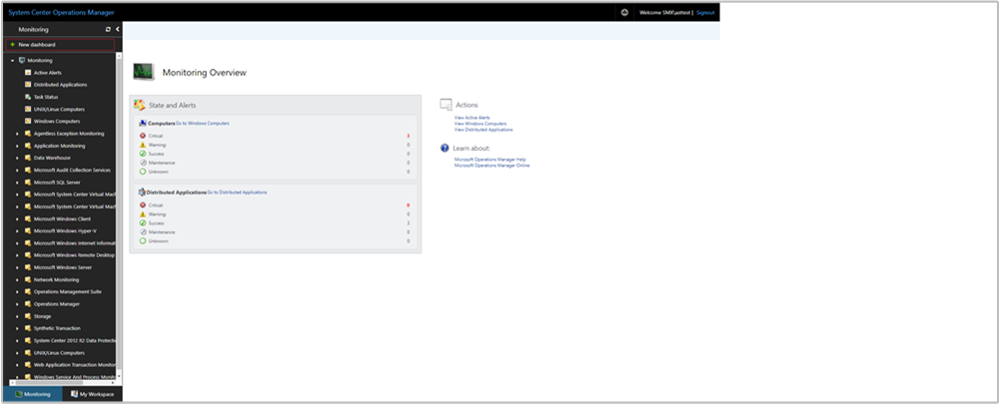
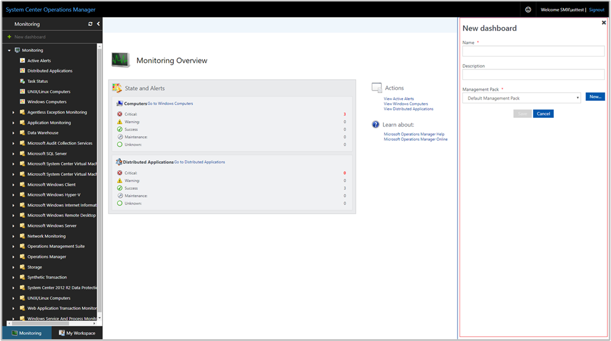
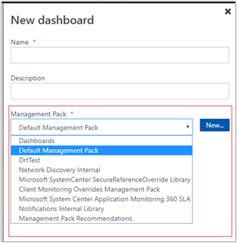
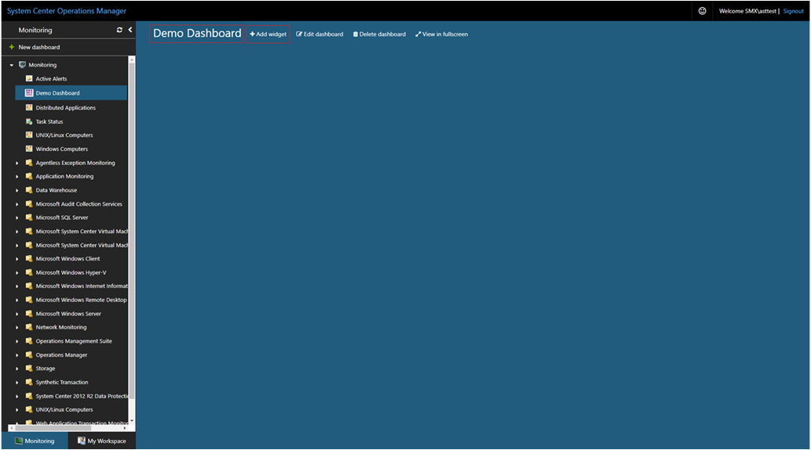
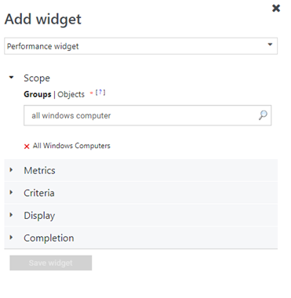
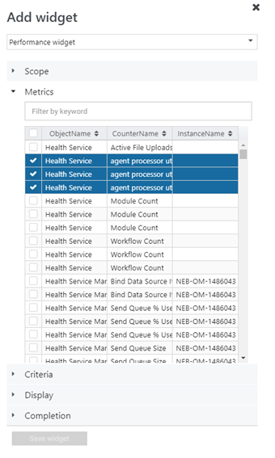
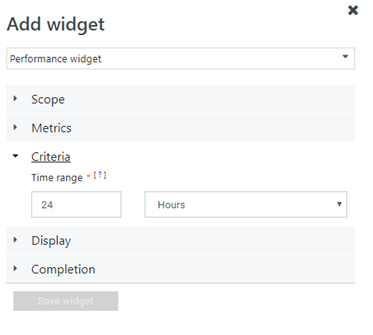
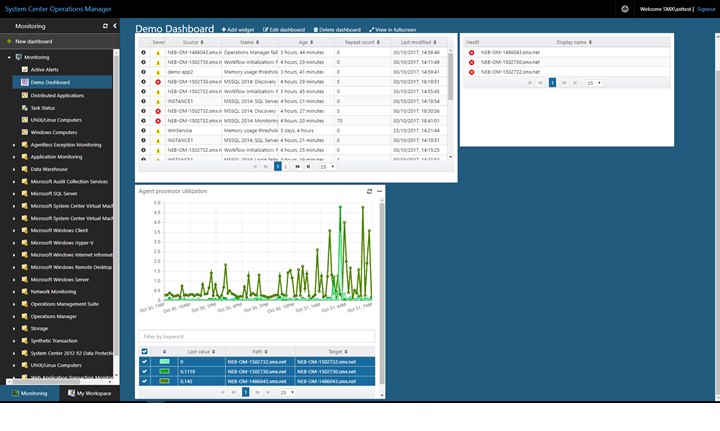

# How create a dashboard with the Performance widget in the Web console
In System Center Operations Manager, the Web console provides a monitoring interface for a management group that can be opened on any computer using any browser that has connectivity to the Web console server. The following steps describe how to create a dashboard in the new HTML5 Web console with the Performance widget.

## Add widget to dashboard

1. Open a web browser on any computer and enter `http://<web host>/OperationsManager`, where *web host* is the name of the computer hosting the web console. 
2. From the left pane in the Web console, click **+ New dashboard**.    
3. On the **Create New Dashboard** page, provide a name and description for the dashboard you want to create.     
4. You can save the dashboard in an existing unsealed management pack by selecting the management pack from the **Management Pack** drop-down list or you can save the dashboard by creating a new management pack by clicking **New** next to the **Management Pack** drop-down list and provide a name, description and optionally a version number.       
5. When you have completed specifying where to save the new dashboard to, click **OK**.
6. Click **Save** after providing a name and description for the new dashboard. 
7. On the blank empty dashboard, you see the dashboard name, **Add Widget**, **Edit Dashboard**, **Delete dashboard** and **View in fullscreen** options on the top of the page.     
8. Select **Performance Widget** from the **Select Widget** drop-down list.
9. In the Performance widget pane, select scope for the widget by clicking either **Groups** or **Class**.      For either option selected, you can search by keyword in the list.  As you begin typing, the list filters based on your input.  You can select an individual group or class or multiple from the returned results.
10. Under **Metrics**, search for the performance objects and counters in the search box.  For the results returned, select the object and counter.  If there are multiple instances for the counter, you can select the counter instances from the drop-down list.  This will only be visible if there are multiple instances for the selected counter.      
11. Set the criteria to identify the widget to display.  To narrow the results, you can filter by selecting a time range. 

    Data matching the defined criteria will only be displayed in the widget.    
  
12. Select **Display** to choose the columns to be displayed in the dashboard.  You can select or search for the columns from the drop-down list. 
13. The widget can also be visualized as **Objects by performance widget**.  If you would wish to visualize object by performance widget then select **Visualize objects by performance**.
14. Complete the configuration by providing a **Name**, **Description** and **Widget reefresh interval** (default interval is 5 minutes) for the widget.  Click **Save Widget** to save your new dashboard.  

After the widget has been created, it displays a performance graph with the selected objects based on the scope and criteria defined. You see the name of the performance widget along with the number of objects in the header of the widget.   

## Actions on Performance widget 
With a performance widget, you can perform such actions as:

1. Specify the minimum and maximum vertical axis values 
2. Export the alerts to Excel for further analysis 
3. Modify your selection of legend or to enable/disable “Visualize objects by performance”, customized to your personal needs 