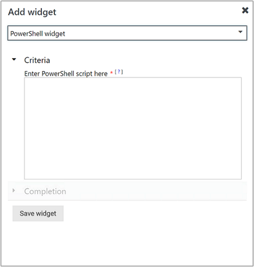

# How create a dashboard with the PowerShell widget in the Web console
In System Center Operations Manager version 1807, the Web console provides a monitoring interface for a management group that can be opened on any computer using any browser that has connectivity to the Web console server. The following steps describe how to create a dashboard in the new HTML5 Web console with the PowerShell widget.

The script will typically use the Operations Manager cmdlets to retrieve information from the management group.  It must then use the ScriptContext object to create a Data Object and then add that object to the ReturnCollection property.

## Add widget to dashboard

1. Open a web browser on any computer and enter `http://<web host>/OperationsManager`, where *web host* is the name of the computer hosting the web console. 
2. From the left pane in the Web console, click **+ New dashboard**.    
3. On the **Create New Dashboard** page, provide a name and description for the dashboard you want to create.     
4. You can save the dashboard in an existing unsealed management pack by selecting the management pack from the **Management Pack** drop-down list or you can save the dashboard by creating a new management pack by clicking **New** next to the **Management Pack** drop-down list and provide a name, description and optionally a version number.       
5. When you have completed specifying where to save the new dashboard to, click **OK**.
6. Click **Save** after providing a name and description for the new dashboard. 
7. On the blank empty dashboard, you see the dashboard name, **Add Widget**, **Edit Dashboard**, **Delete dashboard** and **View in fullscreen** options on the top of the page.  Select **Add Widget**.     
8. Select **PowerShell Widget** from the **Select Widget** drop-down list.
9. In the PowerShell widget pane, write or copy and paste your PowerShell script into the textbox.      
10. Complete the configuration by providing a **Name**, **Description** and **Widget reefresh interval** (default interval is 5 minutes) for the widget.  Click **Save Widget** to save your new dashboard.  

After the widget has been created, it displays the results of your script.  

## Actions with PowerShell widget 
With a PowerShell widget, you can perform such actions as:

1. Specify the minimum and maximum vertical axis values 
2. Export the alerts to Excel for further analysis 
3. Modify your selection of legend or to enable/disable “Visualize objects by performance”, customized to your personal needs 

## Next steps
To learn how to create a dashboard in the new web console with the State widget, see [How create a dashboard with the State widget in the Web console](manage-create-web-dashboard-state.md)