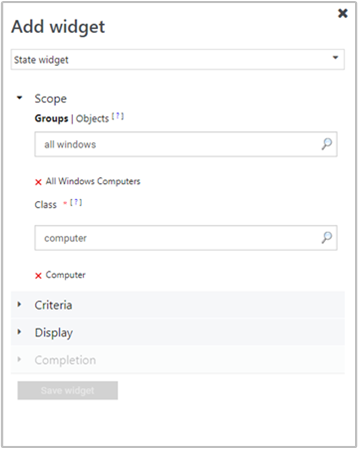
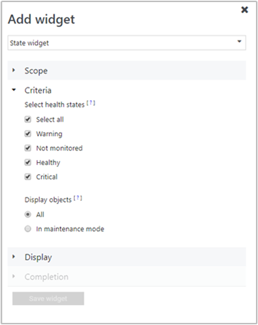
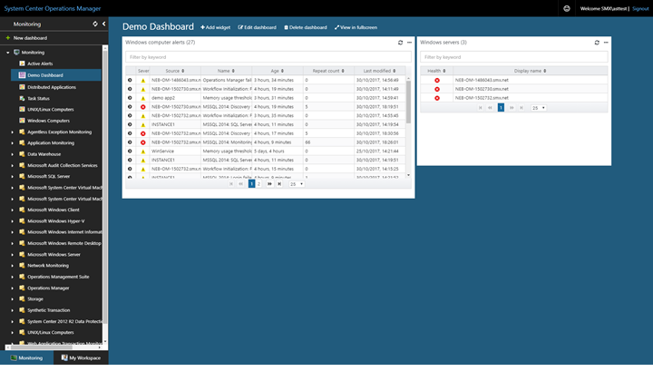
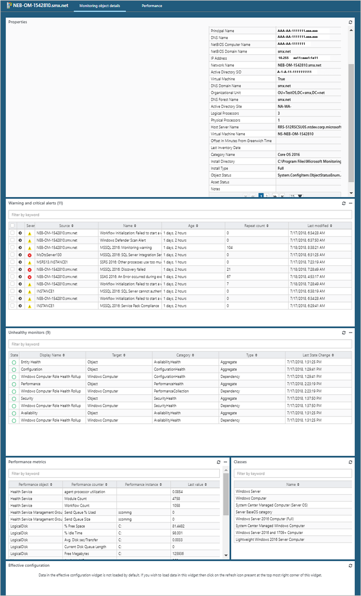

---
ms.assetid:
title: Create a Dashboard with the State widget in the Web console
description: This article describes how to create a new HTML5 dashboard in System Center Operations Manager with the Health State widget.
author: jyothisuri
ms.author: jsuri
ms.date: 04/02/2025
ms.custom: UpdateFrequency2
ms.service: system-center
monikerRange: '>sc-om-2016'
ms.subservice: operations-manager
ms.topic: how-to
---

# Create a dashboard with the State widget in the Web console

::: moniker range=">=sc-om-2019"
System Center Operations Manager Web console provides a monitoring interface for a management group that can be opened on any computer using any browser that has connectivity to the Web console server. The following steps describe how to create a dashboard in the new HTML5 web console with the Health State widget.
::: moniker-end

## Add widget to dashboard

To create a dashboard and add a widget, follow these steps:

1. Open a web browser on any computer and enter `http://<web host>/OperationsManager`, where *web host* is the name of the computer hosting the web console.
2. From the left pane in the Web console, select **+ New dashboard**.

    :::image type="content" source="./media/create-web-dashboard-alerts/web-console-new-dashboard-01-inline.png" alt-text="Screenshot showing select New Dashboard in Web console." lightbox="./media/create-web-dashboard-alerts/web-console-new-dashboard-01-expanded.png":::

3. On the **Create New Dashboard** page, provide a name and description for the dashboard you want to create.

    :::image type="content" source="./media/create-web-dashboard-alerts/web-console-new-dashboard-02-inline.png" alt-text="Screenshot showing specify name and description for new dashboard." lightbox="./media/create-web-dashboard-alerts/web-console-new-dashboard-02-expanded.png":::

4. You can save the dashboard in an existing unsealed management pack by selecting the management pack from the **Management Pack** dropdown list or you can save the dashboard by creating a new management pack by selecting **New** next to the **Management Pack** dropdown list and provide a name, description, and optionally a version number.

    

5. When you've completed specifying where to save the new dashboard to, select **OK**.
6. Select **Save** after providing a name and description for the new dashboard.
7. On the blank empty dashboard, you see the dashboard name, **Add Widget**, **Edit Dashboard**, **Delete dashboard**, and **View in fullscreen** options on the top of the page.

    :::image type="content" source="./media/create-web-dashboard-alerts/web-console-new-dashboard-04-inline.png" alt-text="Screenshot showing New dashboard canvas." lightbox="./media/create-web-dashboard-alerts/web-console-new-dashboard-04-expanded.png":::

8. Select **State Widget** from the **Select Widget** dropdown list.
9. In the State widget pane, select scope for the widget by selecting either **Groups** or **Class**.

    

    For either option selected, you can search by keyword in the list. As you begin typing, the list filters based on your input.  You can select an individual group or class or multiple from the returned results.

10. Set the criteria to identify the health state to display.  To narrow the results, you can filter by selecting the following:
    * By all health states or a specific state
    * Display all objects or only those in maintenance mode  

    Data matching the defined criteria will only be displayed in the widget.

    

11. Select **Display** to choose the columns to be displayed in the dashboard.  You can select or search for the columns from the dropdown list.  
12. Complete the configuration by providing a **Name**, **Description**, and **Widget refresh interval** (default interval is 5 minutes) for the widget. Select **Save Widget** to save your new dashboard.  

After the widget has been created, it displays health state of the objects based on the scope and criteria defined. You see the name of the state widget along with the number of objects in the header of the widget. Objects can also be filtered in the widget by searching for a keyword in the filter box.

When you select an object in the widget, it presents the Monitoring Object details page and from here you can view:

* Discovered inventory reported for the object instance
* Alerts generated
* Performance metrics
* Classes
* Effective configuration of the rules and monitors running on the target device or system

To learn more about the effective configuration feature, see [View configuration of a monitored object](manage-view-effective-configuration.md).

## Actions on State widget

For one or more monitored objects selected in the widget, you can perform such actions as:

- Export the alerts to Excel for further analysis
- Modify how the alerts are presented by included or excluding columns or how to group alerts, customized to your personal needs

To perform these actions, hover your mouse over the widget and select the ellipsis **...** on the top right corner of the widget.

This will display the following actions available for the widget: 

* Select **Export to Excel** to export the alert data to an Excel file.
* Select **Personalize** to change your selection of columns to be displayed or to group alerts.  Select **Save personalization** when you have completed making your changes.  

:::moniker range="sc-om-2019"

## Additional view options in State widget

> [!NOTE]
> This feature is applicable for 2019 UR3 and later.

State widget now supports sort by option.

In earlier releases, this feature isn't available for State widget, and on all H5 dashboard personalization but is available on all views of operations console of Operations Manager 2019.

With Operations Manager 2019 UR3 and later, you can sort the results columns in the State widget, and also group the columns. For more information, see [Support for Sort by option](manage-create-web-dashboard-alerts.md#support-for-sort-by-option).

::: moniker-end

:::moniker range=">=sc-om-2022"

## View options in State widget

State widget supports sort by option.

You can sort the results columns in the State widget, and also group the columns. For more information, see [Support for Sort by option](manage-create-web-dashboard-alerts.md#support-for-sort-by-option).

::: moniker-end

## Next steps

To learn how to create a dashboard in the new web console with the Topology widget, see [How create a dashboard with the Topology widget in the Web console](manage-create-web-dashboard-topology.md).
