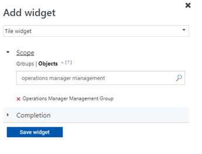
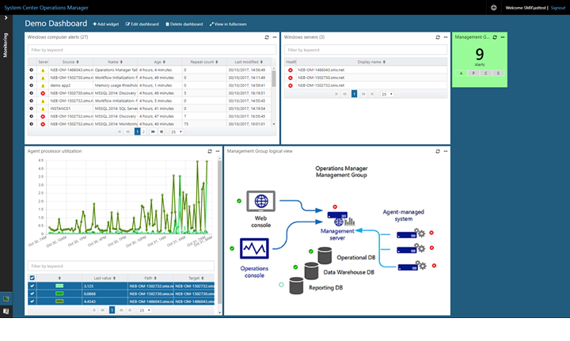

---
ms.assetid:
title: Create a Dashboard with the Tile Widget in the Web console
description: This article describes how to create a new HTML5 dashboard in System Center Operations Manager with the Tile widget.
ms.date: 04/22/2025
author: Jeronika-MS
ms.author: v-gajeronika
ms.custom: UpdateFrequency2, engagement-fy24
ms.service: system-center
monikerRange: '>sc-om-2016'
ms.subservice: operations-manager
ms.topic: how-to
---

# Create a dashboard with the Tile widget in the Web console

This article describes how to create a new HTML5 dashboard in System Center Operations Manager with the Tile widget.

In System Center Operations Manager version 2019 and later, the Web console provides a monitoring interface for a management group that can be opened on any computer using any browser that has connectivity to the Web console server. The following steps describe how to add a Tile widget to a dashboard in the new HTML5 Web console.  It displays a summary tile showing the health and number of alerts for the object that match a criteria.

## Add widget to dashboard

To add a widget to the dashboard, follow these steps: 

1. Open a web browser on any computer and enter `http://<web host>/OperationsManager`, where *web host* is the name of the computer hosting the web console.

2. From the left pane in the Web console, select **+ New dashboard**.

    :::image type="content" source="./media/create-web-dashboard-alerts/web-console-new-dashboard-01-inline.png" alt-text="Screenshot showing select New Dashboard in Web console." lightbox="./media/create-web-dashboard-alerts/web-console-new-dashboard-01-expanded.png":::

3. On the **Create New Dashboard** page, provide a name and description for the dashboard you want to create.

    :::image type="content" source="./media/create-web-dashboard-alerts/web-console-new-dashboard-02-inline.png" alt-text="Screenshot showing specify name and description for new dashboard." lightbox="./media/create-web-dashboard-alerts/web-console-new-dashboard-02-expanded.png":::

4. You can save the dashboard in an existing unsealed management pack by selecting the management pack from the **Management Pack** dropdown list or you can save the dashboard by creating a new management pack by selecting **New** next to the **Management Pack** dropdown list and provide a name, description, and optionally a version number.

    

5. When you've completed specifying where to save the new dashboard to, select **OK**.

6. Select **Save** after providing a name and description for the new dashboard.

7. On the blank empty dashboard, you see the dashboard name, **Add Widget**, **Edit Dashboard**, **Delete dashboard**, and **View in fullscreen** options on the top of the page.

    :::image type="content" source="./media/create-web-dashboard-alerts/web-console-new-dashboard-04-inline.png" alt-text="Screenshot showing New dashboard canvas." lightbox="./media/create-web-dashboard-alerts/web-console-new-dashboard-04-expanded.png":::

8. Select **Tile Widget** from the **Select Widget** dropdown list.

9. In the Tile widget pane, select scope for the widget by selecting either **Groups** or **Class**.

    

    For either option selected, you can search by keyword in the list. As you begin typing, the list filters based on your input. You can select an individual group or class or multiple from the returned results.

10. Complete the configuration by providing a **Name**, **Description**, and **Widget refresh interval** (default interval is 5 minutes) for the widget. Select **Save Widget** to save your new dashboard.  

After the widget has been created, it displays a summary tile showing the health and number of alerts for the object that match a defined criteria. The tile represents health information into the following categories - *A* for availability, *P* for performance, *C* for configuration, and *S* for security. The color for each category represents the overall health of all the monitors under that category for the specified object.

  

Select the object name in the Tile widget to launch Health Explorer for the specific object.

## Next steps

To learn how to create a dashboard in the new web console with the Custom widget, see [How create a dashboard with the Custom widget in the Web console](manage-create-web-dashboard-custom.md).
