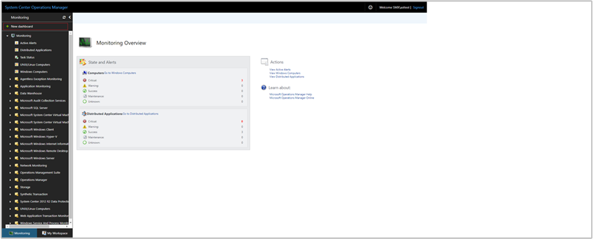
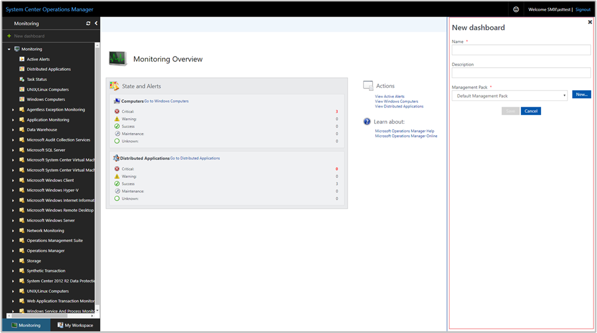
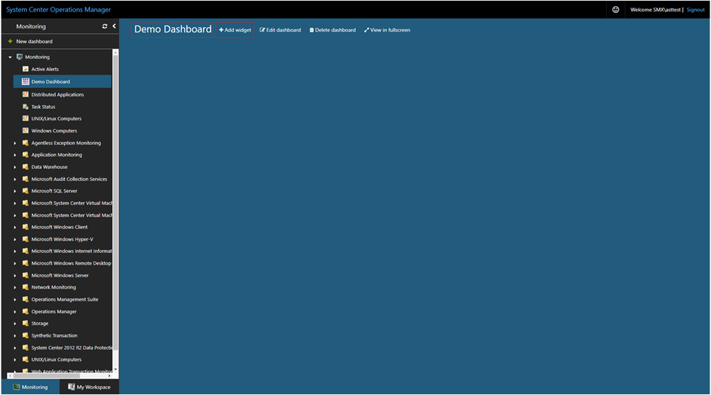

# How to create a dashboard with the Tile widget in the Web console
In System Center Operations Manager version 1801 and higher, the Web console provides a monitoring interface for a management group that can be opened on any computer using any browser that has connectivity to the Web console server. The following steps describe how to add a Tile widget to a  dashboard in the new HTML5 Web console.  It displays a summary tile showing the health and number of alerts for the object that match a criteria. 

## Add widget to dashboard

1. Open a web browser on any computer and enter `http://<web host>/OperationsManager`, where *web host* is the name of the computer hosting the web console. 

2. From the left pane in the Web console, click **+ New dashboard**.

    

3. On the **Create New Dashboard** page, provide a name and description for the dashboard you want to create.

    

4. You can save the dashboard in an existing unsealed management pack by selecting the management pack from the **Management Pack** drop-down list or you can save the dashboard by creating a new management pack by clicking **New** next to the **Management Pack** drop-down list and provide a name, description and optionally a version number. 

    
 
5. When you have completed specifying where to save the new dashboard to, click **OK**.

6. Click **Save** after providing a name and description for the new dashboard. 

7. On the blank empty dashboard, you see the dashboard name, **Add Widget**, **Edit Dashboard**, **Delete dashboard** and **View in fullscreen** options on the top of the page.

    

8. Select **Tile Widget** from the **Select Widget** drop-down list.

9. In the Tile widget pane, select scope for the widget by clicking either **Groups** or **Class**.

    

    For either option selected, you can search by keyword in the list.  As you begin typing, the list filters based on your input.  You can select an individual group or class or multiple from the returned results.

10. Complete the configuration by providing a **Name**, **Description** and **Widget reefresh interval** (default interval is 5 minutes) for the widget.  Click **Save Widget** to save your new dashboard.  

After the widget has been created, it displays a summary tile showing the health and number of alerts for the object that match a criteria defined. The tile represents health information into the following categories - *A* for availability, *P* for performance, *C* for configuration, and *S* for security.  The color for each category represents the overall health of all the monitors under that category for the specified object.

    

Click on the object name in the Tile widget to launch Health Explorer for the specific object.

## Next steps
To learn how to create a dashboard in the new web console with the Custom widget, see [How create a dashboard with the Custom widget in the Web console](manage-create-web-dashboard-custom.md)
