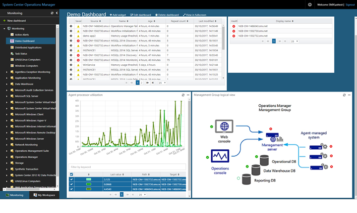

---
ms.assetid:
title: Create a dashboard with the Topology widget in the Web console
description: This article describes how to create a new HTML5 dashboard in System Center Operations Manager with the Topology widget.
author: Jeronika-MS
ms.author: v-gajeronika
ms.date: 04/15/2025
ms.custom: UpdateFrequency2, engagement-fy24
ms.service: system-center
monikerRange: '>sc-om-2016'
ms.subservice: operations-manager
ms.topic: how-to
---

# Create a dashboard with the Topology widget in the Web console

In System Center Operations Manager version 2019 and later, the Web console provides a monitoring interface for a management group that can be opened on any computer using any browser that has connectivity to the Web console server. The following steps describe how to create dashboard in the new HTML5 Web console with the Topology widget.

## Add widget to dashboard

When created for the first time, the health state icons for the selected objects are displayed at the left-top section of the topology widget. These icons have to be placed manually in the appropriate position on the image by performing the following steps:

1. Select on the ellipsis **…** next to the **X** on the right-most side of the widget crown, which is displayed when you hover over the widget.

2. Select **Edit icons layout** action to reposition the health state icons for the selected objects on the selected image. While editing the icon layout, the health state icons will also display the object name of the specific object.

3. Once the selected object icons have been repositioned appropriately, select **Go** under **Save icons layout** to save reconfigured positioning of the icons.

Now your topology dashboard visualizes the health of objects positioned on the selected image.

## Actions on Topology widget

For a topology diagram that includes monitored object health state in the widget, you can reposition the icons of the selected objects on the selected image.

To reposition the icons, follow these steps:

1. Hover your mouse over the widget and select on the ellipsis **...** on the top right corner of the widget.  This will display actions available for the widget.

2. Select the **Edit state indicator layout** action.

3. In the **Edit state indicator layout** mode, the health state icons will also display the object name of the specific object.

4. After moving the object icons to their new position on the image, select **Save** to save the updated layout.

## Next steps

To learn how to create a dashboard in the new web console with the Custom widget, see [How to create a dashboard with the Custom widget in the Web console](manage-create-web-dashboard-custom.md).
