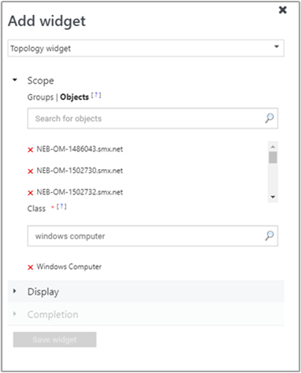
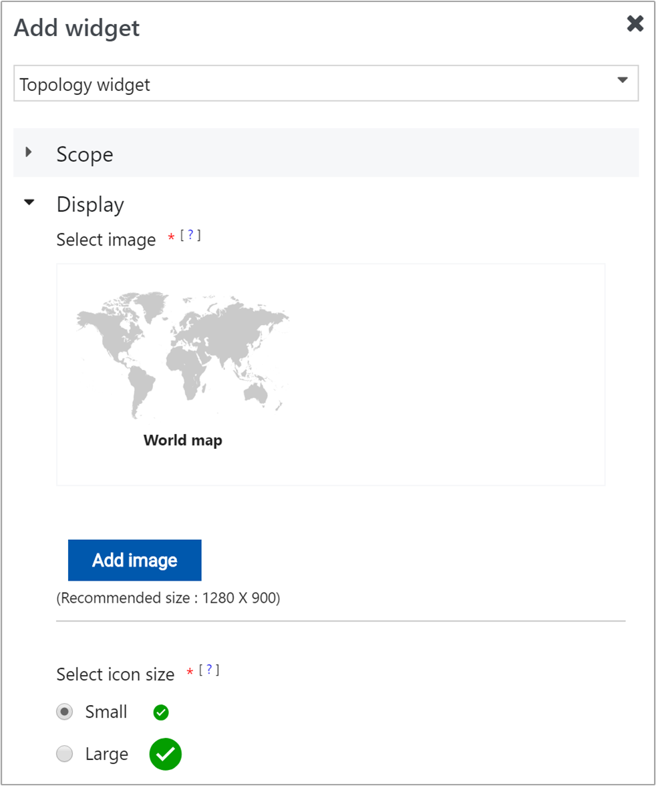

# How to create a dashboard with the Topology widget in the Web console
In System Center Operations Manager version 1801 and higher, the Web console provides a monitoring interface for a management group that can be opened on any computer using any browser that has connectivity to the Web console server. The following steps describe how to create dashboard in the new HTML5 Web console with the Topology widget.

## Add widget to dashboard

::: moniker range="sc-om-1807"

1. Open a web browser on any computer and enter `http://<web host>/OperationsManager`, where *web host* is the name of the computer hosting the web console. 

2. From the left pane in the Web console, click **+ New dashboard**.

    

3. On the **Create New Dashboard** page, provide a name and description for the dashboard you want to create.

    

4. You can save the dashboard in an existing unsealed management pack by selecting the management pack from the **Management Pack** drop-down list or you can save the dashboard by creating a new management pack by clicking **New** next to the **Management Pack** drop-down list and provide a name, description and optionally a version number. 

    

5. When you have completed specifying where to save the new dashboard to, click **OK**.

6. Click **Save** after providing a name and description for the new dashboard. 

7. On the blank empty dashboard, you see the dashboard name, **Add Widget**, **Edit Dashboard**, **Delete dashboard** and **View in fullscreen** options on the top of the page.

    

8. Select **Topology Widget** from the **Select Widget** drop-down list.

9. In the Topology widget pane, select scope for the widget by clicking either **Groups** or **Class**.

      
    
    For either option selected, you can search by keyword in the list.  As you begin typing, the list filters based on your input.  You can select an individual group or class or multiple from the returned results.

10. Select **Display** to choose an image for the topology widget to display in the authoring pane.  If you already added a custom image by performing these steps earlier, then select an image shown in the pane.

     

    Otherwise, click **Add image** and navigate to where the file is located.
   
11. After selecting the file, click **Open** and the image will be uploaded and presented in the pane.  

12. To change the size of the state icon, select either **Small** or **Large**.

13. Complete the configuration by providing a **Name**, **Description** and **Widget refresh interval** (default interval is 5 minutes) for the widget.  Click **Save Widget** to save your new dashboard.  

::: moniker-end

::: moniker range="sc-om-1801"

1. Open a web browser on any computer and enter `http://<web host>/OperationsManager`, where *web host* is the name of the computer hosting the web console. 

2. From the left pane in the Web console, click **+ New dashboard**.

    

3. On the **Create New Dashboard** page, provide a name and description for the dashboard you want to create.

    
 
4. You can save the dashboard in an existing unsealed management pack by selecting the management pack from the **Management Pack** drop-down list or you can save the dashboard by creating a new management pack by clicking **New** next to the **Management Pack** drop-down list and provide a name, description and optionally a version number. 

    

5. When you have completed specifying where to save the new dashboard to, click **OK**.

6. Click **Save** after providing a name and description for the new dashboard. 

7. On the blank empty dashboard, you see the dashboard name, **Add Widget**, **Edit Dashboard**, **Delete dashboard** and **View in fullscreen** options on the top of the page.

    
 
8. Select **Topology Widget** from the **Select Widget** drop-down list.

9. In the Topology widget pane, select scope for the widget by clicking either **Groups** or **Class**.

     

    For either option selected, you can search by keyword in the list.  As you begin typing, the list filters based on your input.  You can select an individual group or class or multiple from the returned results.

10. Select **Display** to choose an image for the topology widget to display in the authoring pane.  Click **Select Image**, and on the **Select Image** pane if you already added a custom image earlier, then select an image from the list. Otherwise, click **Add custom image** and navigate to where the file is located.

11. After selecting the file, click **Open** and the image will be uploaded and presented in the **Select Image** pane.  Click **Done** to complete. 

12. Complete the configuration by providing a **Name**, **Description** and **Widget refresh interval** (default interval is 5 minutes) for the widget.  Click **Save Widget** to save your new dashboard.  

::: moniker-end

When created for the first time, the health state icons for the selected objects are displayed at the left-top section of the topology widget. These icons have to be placed manually in the appropriate position on the image by performing the following steps:

1. Click on the ellipse **…** next to the **X** on the right most side of the widget crown, which is displayed when you hover over the widget.

2. Click **Edit icons layout** action to re-position the health state icons for the selected objects on the selected image. While editing the icon layout, the health state icons will also display the object name of the specific object.

3. Once the selected object icons have been re-positioned appropriately, click **Go** under **Save icons layout** to save reconfigured positioning of the icons.

Now your topology dashboard visualizes the health of objects positioned on the selected image.

## Actions on Topology widget
For a topology diagram which includes monitored object health state in the widget, you can re-position the icons of the selected objects on the selected image.

1. Hover your mouse over the widget and click on the ellipse **...** on the top right corner of the widget.  This will display actions available for the widget. 

2. Select the **Edit state indicator layout** action.

3. In the **Edit state indicator layout** mode, the health state icons will also display the object name of the specific object.

4. After moving the object icons to their new position on the image, click **Save** to save the updated layout.

## Next steps
To learn how to create a dashboard in the new web console with the Custom widget, see [How create a dashboard with the Custom widget in the Web console](manage-create-web-dashboard-custom.md)
