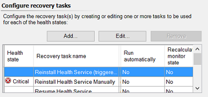

# How to enable recovery and diagnostic tasks

::: moniker range=">= sc-om-1801 <= sc-om-1807"

[!INCLUDE [eos-notes-operations-manager.md](../includes/eos-notes-operations-manager.md)]

::: moniker-end

Monitors in System Center - Operations Manager can do more than notify you of problems by sending an alert. Some monitors also provide diagnostic and recovery tasks to help investigate and resolve those problems.  

A task is a script or other executable code that runs either on the computer running the Operations console or on the server, client, or device that's being managed. Tasks can potentially perform any kind of activity, including restarting a failed application and deleting files.  

Monitors can have two kinds of tasks associated with them: diagnostic tasks that try to discover the cause of a problem or provide you with additional information to assist with that diagnosis, and recovery tasks that try to fix the problem.  

Diagnostic and recovery tasks can only be created for a specific monitor. A diagnostic or recovery task that you create for one monitor can't be shared or associated with a different monitor; you must recreate the task for each monitor. In addition, tasks that you create in the **Authoring** workspace using the **Create Task Wizard** can't be used as a diagnostic or recovery for a monitor.

Some monitors have diagnostic or recovery tasks that are disabled by default. You can enable any of these tasks that you want the monitor to run. For example, in the following image, you see that some recovery tasks for the **Health Service Heartbeat Failure** monitor aren't configured to run automatically.  

  

On this tab, you can also add or edit tasks that you've added previously. For more information on how to add diagnostic and recovery tasks, see [Diagnostics and Recoveries](/previous-versions/system-center/system-center-2012-R2/hh705258(v=sc.12)) in the Author's Guide. Tasks that are configured by a sealed management pack can only be modified by using overrides.

## To enable a diagnostic or recovery task  

1.  In the Operations console, in the **Authoring** workspace, right\-click a monitor and select **Properties**.  

2.  Select the **Diagnostic and Recovery** tab.  

3.  On the **Diagnostic and Recovery** tab, in the **Configure diagnostic tasks** or **Configure recovery tasks** section, ensure the desired task is selected and then select **Edit**.  

4.  On the **Overrides** tab, select **Override**. You can choose to override this monitor for objects of a specific type or for all objects within a group. After you choose which group or object type to override, the **Override Properties** dialog opens. For more information about applying an override, see [Using Classes and Groups for Overrides in Operations Manager](~/scom/manage-mp-overview-override-targets.md).  

5.  In the **Override\-controlled parameters** section, select **Enabled** and set the override value to **True**.  

6.  Either select a management pack from the **Select destination management pack** list or create a new unsealed management pack by selecting **New**. For more information about selecting a destination management pack, see [Creating a Management Pack for Overrides](manage-mp-create-unsealed-mp.md).  

7.  Select **OK**, and close the open properties windows.  

## Next steps

- To understand the differences between classes and groups in Operations Manage and how workflows apply to each, review [Using Classes and Groups for Overrides in Operations Manager](~/scom/manage-mp-overview-override-targets.md).

- To learn how to create a custom writeable management pack to store your overrides, see [How to Create a Management Pack for Overrides](manage-mp-create-unsealed-mp.md).

- Before making changes to the monitoring settings defined in an Operations Manager management pack, review [How to Override a Rule or Monitor](~/scom/manage-mp-override-rule-monitor.md) to understand how to configure the change.
