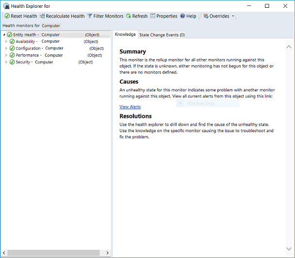

# Use Health Explorer to investigate problems

Use Health Explorer to find out which monitor is reflecting a health state issue and review knowledge about the monitor and possible causes for actions related to it. In the **Active Alerts** view, select the alert to highlight it. The Health Explorer link under **Alert Actions** in the **Tasks** pane becomes active.  Health Explorer is also accessible when selecting a monitored object from any health state view in the console.  

By default, when the Health Explorer window opens, all monitors in a failed state are expanded. If a monitor contains other monitors, as in the case of a roll-up monitor, Health Explorer shows all child monitors in a hierarchical layout, displaying monitoring data for all dependent services and applications. To view more information about any dependent monitor, you can right-click that monitor, and select **Monitor Properties** to open another Health Explorer window.  

## Monitor health states

The following illustration shows monitors in a healthy state:  

  

The following illustration shows some monitors in a critical state:  

  

Select a monitor to view more information about the monitor in the **Details** pane. The **State Change Events** tab in the **Details** pane shows you when the state for the monitor changed, and the details give you information for the context of the state change:  

  

## Next steps

- Before changing the number of missed heartbeats allowed, first review [How Heartbeats Work in Operations Manager](manage-agent-heartbeat-overview.md).  

- To learn more about how to investigate an agent heartbeat failure and ways to resolve them, review [Resolving Heartbeat Alerts](manage-agent-resolve-heartbeat.md).  

- When an alert is generated, you can [View Active Alerts and Details](manage-alert-view-alerts-details.md) in the Operations and Web console to identify possible issues and help identify next steps towards resolving them.
