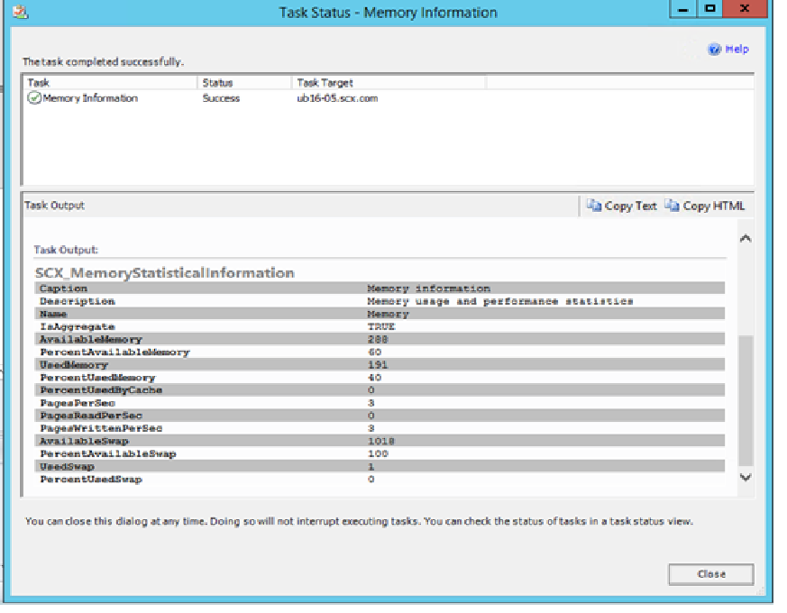

# Kerberos Authentication Support for Unix and Linux computers

System Center Preview 1711 - Operations Manager communicates with UNIX and Linux computers using the Secure Shell (SSH) protocol and Web Services for Management (WS-Management). Agent actions such as agent install, uninstall, and update occur over SSH and require a privileged account. Agent discovery and Monitoring utilize WS-Management and only require a low privileged account.

Operations Manager can now support Kerberos authentication wherever the WS-Management protocol is used by the Management Server to communicate with UNIX and Linux computers. Adding Kerberos support for UNIX and Linux computers provides greater security by allowing the Management Server to no longer need to enable basic authentication for Windows Remote Management (WinRM). 

## Operations Manager Unix and Linux Kerberos Support by Activity

| Activity | Protocol | Support for Kerberos |
|----------|:---------|:---------------------|
| **Agent Install** | SSH | No |
| **Agent Uninstall** | SSH | No |
| **Agent Update** | SSH | No |
| **Agent Recovery** | SSH | No |
| **Agent Monitoring** |WS-Man| **Yes** |
| **Agent Discovery** | WS-Man | **Yes** |

## Prerequisites

UNIX and Linux Monitoring with Operations Manager is [supported on a number of operating systems.](https://docs.microsoft.com/en-us/system-center/scom/plan-supported-crossplat-os)

The following subset of those operating systems now support WS-Management communication over Kerberos: (Only the most recently released version of each distribution will be supported.)

| Operating System | Version |
|------------------|:---------|
| Red Hat Enterprise Linux Server | 6 |
| Red Hat Enterprise Linux Server | 7 |
| CentOS | 6 |
| CentOS | 7 |
| UBUNTU Server | 14 |
| UBUNTU Server | 15 |

- UNIX or Linux agent must be domain joined.

- Run as accounts must be configured to use domain-based accounts that are associated with the appropriate [Unix/Linux Run As Profile.](https://docs.microsoft.com/en-us/system-center/scom/plan-security-crossplat-credentials)

- Enabling Kerberos authentication assumes all UNIX and Linux agents communicating with the management server support Kerberos. Mixed mode authentication where some agents use basic authentication and others leverage Kerberos is not supported.

## Steps to enable Kerberos Authentication on a management server 
1. Open the Operations console with an account that is a member of the Operations Manager Administrators role.

2. Select **Monitoring** > **Data Warehouse** > **Collection Servers** > **Management Server         Name**.

3. In the right-hand task pane, select **Enable Linux Authentication Type**

   This task will enable/disable Kerberos authentication for Linux monitoring on the management server.

4. Click **Run**.

> [!NOTE]
> The task sets the registry entry **Authentication** at the following location:
>
> HKLM:\Software\Microsoft\Microsoft Operations Manager\3.0\Setup\Linux Auth to **Kerberos**.
>
> **Repeat the above steps on all management servers that communicate with UNIX or Linux agents.**

## Verify Kerberos Authentication via Console

To validate that Kerberos authentication is working successfully from the Operations Manager console:

1. Click **Monitoring** > **UNIX/Linux Computers** > Select a UNIX or Linux computer

2. In the right-hand Task pane, select **Memory Information**.

3. Confirm that the task runs successfully.

   

## Verify Kerberos Authentication from the Command Line

To validate Kerberos authentication between a management server and a UNIX or Linux agent from the command line, perform the following:

1. Launch a command prompt as administrator from the management server, and run the script below while substituting the applicable information for **servername**, **username**, and **password**.

   ```PowerShell
   winrm e http://schemas.microsoft.com/wbem/wscim/1/cim-schema/2/SCX_Agent?__cimnamespace=root/scx -r:https://<UNIX/Linux servername>:1270 -u:<username@contoso.com> -p:<password> -auth:Kerberos -skipcacheck -skipcncheck -encoding:utf-8
   ```

2. Verify the output indicates the command was successful.  

