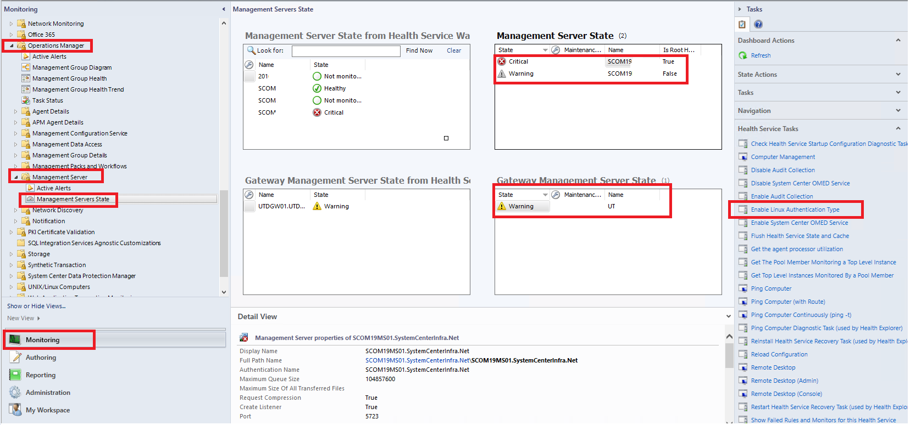

---
ms.assetid:
title: Kerberos Authentication Support for UNIX and Linux
description: This article describes how to enable Kerberos Authentication with Unix and Linux Computers in System Center Operations Manager.
author: Jeronika-MS
ms.author: v-gajeronika
ms.date: 11/01/2024
ms.custom: engagement-fy24
ms.service: system-center
monikerRange: '>=sc-om-2019'
ms.subservice: operations-manager
ms.topic: concept-article
---

# Kerberos Authentication Support for Unix and Linux computers

System Center Operations Manager version 2019 and later communicates with UNIX and Linux computers using the Secure Shell (SSH) protocol and Web Services for Management (WS-Management). Agent actions such as agent install, uninstall, and update occur over SSH and require a privileged account. Agent discovery and Monitoring utilize WS-Management and only require a low privileged account.

Operations Manager can now support Kerberos authentication wherever the WS-Management protocol is used by the Management Server to communicate with UNIX and Linux computers. Adding Kerberos support for UNIX and Linux computers provides greater security by allowing the Management Server to no longer need to enable basic authentication for Windows Remote Management (WinRM).

>[!NOTE]
> Don't disable basic authentication for WinRM if you aren't using Windows Kerberos authentication.

## Operations Manager Unix and Linux Kerberos Support by Activity

| Activity | Protocol | Support for Kerberos |
|----------|:---------|:---------------------|
| **Agent Install** | SSH | No |
| **Agent Uninstall** | SSH | No |
| **Agent Update** | SSH | No |
| **Agent Recovery** | SSH | No |
| **Agent Monitoring** |WS-Man| **Yes** |
| **Agent Discovery** | WS-Man | **Yes** |

## Prerequisites

UNIX and Linux Monitoring with Operations Manager is [supported on many operating systems](./plan-supported-crossplat-os.md).

The following subset of those operating systems now supports WS-Management communication over Kerberos: (Only the most recently released version of each distribution will be supported.)

::: moniker range="sc-om-2019"

| Operating System | Version |
|------------------|:---------|
| Red Hat Enterprise Linux Server | 6 |
| Red Hat Enterprise Linux Server | 7 |
| Red Hat Enterprise Linux Server | 8 |
| Rocky Linux | 8 |
| Alma Linux | 8 |
| SLES | 12 |
| SLES | 15 |
| Debian | 9 |
| Debian | 10 |
| Debian | 11 |
| Oracle Linux | 7 |
| Oracle Linux | 8 |
| Ubuntu Server | 16 |
| Ubuntu Server | 18 |
| Ubuntu Server | 20 |

::: moniker-end

::: moniker range=">=sc-om-2022"

| Operating System | Version |
|------------------|:---------|
| Red Hat Enterprise Linux Server | 7 |
| Red Hat Enterprise Linux Server | 8 |
| Rocky Linux | 8 |
| Alma Linux | 8 |
| SLES | 12 |
| SLES | 15 |
| Debian | 9 |
| Debian | 10 |
| Debian | 11 |
| Oracle Linux | 7 |
| Oracle Linux | 8 |
| Ubuntu Server | 16 |
| Ubuntu Server | 18 |
| Ubuntu Server | 20 |

::: moniker-end

- UNIX or Linux agent must be domain joined.

- Run as accounts must be configured to use domain-based accounts that are associated with the appropriate [Unix/Linux Run As Profile](./plan-security-crossplat-credentials.md).

- Enabling Kerberos authentication assumes all UNIX and Linux agents communicating with the management server support Kerberos. Mixed mode authentication where some agents use basic authentication and others use Kerberos isn't supported. Instead use separate Resource Pools and Management Servers to achieve this.

## Enable or disable Kerberos Authentication on a management or a gateway server

Use the following procedure to enable/disable Kerberos authentication on a management server or a gateway server.

1. Open the Operations console with an account that is a member of the Operations Manager Administrators role.

2. Select *Management Server State* or *Gateway Server State*, as below:
    - For Management Servers, select **Monitoring** > **Operations Manager** > **Management Server**  > **Management Server State** > **Management Server State**.
    - For Gateway Management Servers, Select **Monitoring** > **Operations Manager** > **Management Server**  > **Management Server State** > **Gateway Management Server State**.

     

3. In the right-hand task pane, select **Enable Linux Authentication Type**.

   This task will enable/disable Kerberos authentication for Linux monitoring on the management server or gateway server.

4. Select **Run**.

> [!NOTE]
> The task sets the registry entry **Authentication** at the following location:
>
> `HKLM:\Software\Microsoft\Microsoft Operations Manager\3.0\Setup\Linux Auth` to **Kerberos**.
>
> **Repeat the above steps on all management servers in the UNIX and Linux resource pool for which you want Kerberos authentication to occur on the SCX Agents.**

## Verify Kerberos Authentication via Console

To validate that Kerberos authentication is working successfully from the Operations Manager console:

1. Select **Monitoring** > **UNIX/Linux Computers** > Select a UNIX or Linux computer

2. In the right-hand Task pane, select **Memory Information**.

3. Confirm that the task runs successfully.

   

## Verify Kerberos Authentication from the Command Line

To validate Kerberos authentication between a management server and a UNIX or Linux agent from the command line, perform the following:

1. Launch a command prompt as administrator from the management server and run the script below while substituting the applicable information for **servername**, **username**, and **password**.

   ```PowerShell
   winrm e http://schemas.microsoft.com/wbem/wscim/1/cim-schema/2/SCX_Agent?__cimnamespace=root/scx -r:https://<UNIX/Linux servername>:1270 -u:<username@contoso.com> -p:<password> -auth:Kerberos -skipcacheck -skipcncheck -encoding:utf-8
   ```

2. Ensure that the output indicates the command was successful.
