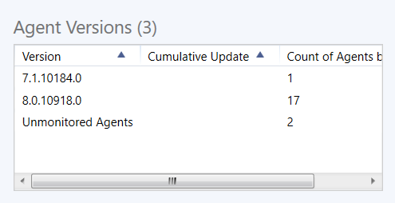

# Monitoring the Health of the Management Group

System Center Operations Manager introduces a new dashboard view that provides a comprehensive picture of the health of your management group. The dashboard tries to answer the question, "do I need to do anything?"  

The **Management Group Health** view under the **Operations Manager** folder, allows you to see at a glance the health state of all management group functions, such as resource pools, and the management group infrastructure, such as management servers. It also shows you recent agent health state including gray agents, agent configuration for agents pending management, and agent versions.  

You can display **Management Group Health** on a SharePoint site by integrating with Operations Manager, giving all authorized users a useful summary of management group status. For more information, see [Using SharePoint to view Operations Manager data](manage-console-sharepoint-integration.md).  

**Management Group Health** automatically refreshes every 15 minutes by default. To manually refresh the view, right-click the view and select **Refresh**. It might take some time before the dashboard starts to show data. The agent data is recalculated every 15 minutes, and not when you refresh the dashboard.  

This article describes the specific information that you see in each cell of the **Management Group Health** dashboard view.  

## Management Group Functions  
  

**Management Group Functions** shows you the health state of any of the following functions that are installed in your management group:  

-   Agentless exception monitoring  

-   Audit collection services  

-   System Center Data Access service group  

-   System Center Management service group  

-   Network discovery  

-   Resource pools  

-   Web user interfaces (web console and reporting web site)  

You can open Health Explorer, alert view, diagram view, event view, performance view, and state view for any of the functions listed. To open a different view, right-click the display name for the function, and select **Health Explorer** or **Navigation**.  

## Management Group Infrastructure  
  

**Management Group Infrastructure** shows you the health state of any of the following infrastructure features that are installed in your management group:  

-   Operational database  

-   Data warehouse database  

-   Management group  

-   Management servers  

-   Gateway servers  

-   Agents  

You can open Health Explorer, alert view, diagram view, event view, performance view, and state view for any of the features listed. To open a different view, right-click the display name for the feature, and select **Health Explorer** or **Navigation**.  

## Active Alerts  
  

**Active Alerts** displays all alerts generated by management group components installed in your management group.

## Agent Configuration  
  

In **Agent Configuration**, you can see how the status of agents in the **Pending Management** folder in the **Administration** workspace. Agents can be pending management for the following reasons:  

-   Manual agent install  

-   Installation in progress  

-   Agent update in progress  

-   Repair in progress  

-   Agent license limit exceeded  

-   Failed agent installation  

-   Agent requires update  

-   Repair failed  

## Agent Versions  
  

**Agent Versions** lists the number of agents running each agent version number, including cumulative updates.  

## Next steps

- To understand how to clear the Operations console and agent health service cache, see [How to clear the cache](manage-clear-healthservice-cache.md).

- To understand how it can help you review alerts that have been generated by rules and monitors that are still active, review [Viewing Active Alerts and Details](manage-alert-view-alerts-details.md).
