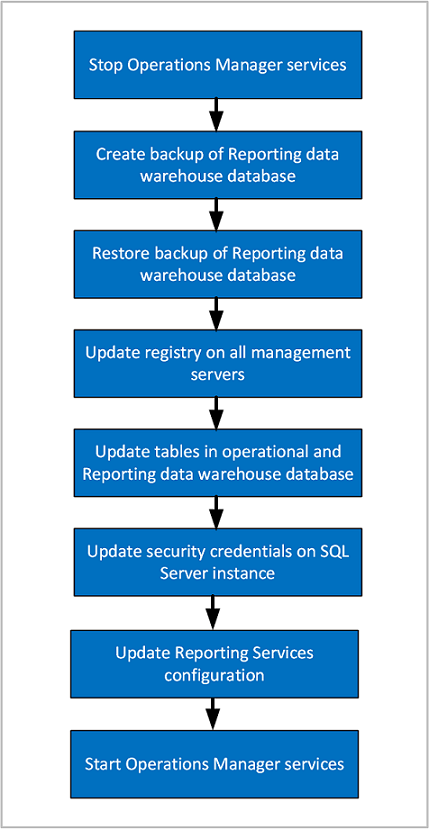

# Move the Reporting data warehouse database

After the initial deployment of System Center Operations Manager, you might need to move the Reporting data warehouse database from one Microsoft SQL Server-based computer to another.

During the move, you need to stop services on your management servers, back up the database, restore the database, update the registry on management servers, update database tables, add new Logins, and modify User Mapping settings for Logins. For more information, see [SQL Server documentation](/sql/sql-server/).

> [!NOTE]
> This procedure can result in data loss if it isn't performed correctly and within a reasonable length of time of the failure. Ensure that you follow all the steps precisely, without unnecessary delays between the steps.

## Summary of steps

 

## Move the Reporting data warehouse database

### Stop the Operations Manager services

On all the management servers in the management group, stop the Operations Manager services:

- System Center Data Access
- Microsoft Monitoring Agent
- System Center Management Configuration

### Back up the Reporting data warehouse database on the old SQL Server instance

1. On the original SQL Server instance hosting the Reporting data warehouse database, use Microsoft SQL Server Management Studio to create a full backup of the database. The default name is OperationsManagerDW.

    For more information, see [How to: Back Up a Database (SQL Server Management Studio)](/sql/relational-databases/backup-restore/create-a-full-database-backup-sql-server).

2. Copy the backup file to a local drive of the new SQL Server instance.

### Update the GlobalSettings table

In the OperationsManager DB, manually update the **GlobalSettings** table to reflect the host\Instance, where the data warehouse has been moved to.

For more information, see [How to configure the Operations Manager Reporting data warehouse database](manage-sqlserver-communication.md#configure-settings-for-the-data-warehouse-database).

### Restore the Reporting data warehouse database on the new SQL Server instance

1. Use Microsoft SQL Server Management Studio to restore the Reporting data warehouse database. (In the previous step, you moved the database backup file to a local drive of the new SQL Server instance.) In this step, you can change the name of the database and choose the file location.

    For more information, see [How to: Restore a Database Backup (SQL Server Management Studio)](/sql/relational-databases/backup-restore/restore-a-database-backup-using-ssms).

2. In SQL Server Management Studio, verify that the database is online.

### Update the registry on the management servers and Reporting data warehouse database

After moving the Operations Manager Reporting data warehouse database to a different SQL Server instance, you'll need to follow the steps below to reconfigure all management servers in the management group to reference the new computer name and instance. This requires modifying the registry, the configuration service configuration file, and several tables in the operational database. The steps are detailed in the [How to configure Operations Manager to communicate with SQL Server](manage-sqlserver-communication.md#configure-settings-for-the-data-warehouse-database).

### Update Reporting server

On the reporting server, you'll need to change the connection string to reference the new computer name and instance of the SQL Server instance hosting the Reporting data warehouse database. The steps are detailed in the [How to configure Operations Manager to communicate with SQL Server](manage-sqlserver-communication.md#update-reporting-server).  

### Update security credentials on the new SQL Server instance hosting the Reporting data warehouse database

1. On the new SQL Server instance hosting the Reporting data warehouse database, open SQL Management Studio.  

2. Expand **Security**, expand **Logins**, and then add the data writer account. For more information, see [How to Create a SQL Server Login](/sql/relational-databases/security/authentication-access/create-a-login).

3. Under **Logins**, add the data reader account.

4. Under **Logins**, add the Data Access Service user account using the form "domain\user".

5. For the Data Access Service (DAS) user account, add the following user mappings:
   - db_datareader
   - OpsMgrReader
   - apm_datareader

6. If an account hasn't existed before in the SQL instance in which you're adding it, the mapping will be picked up by SID automatically from the restored data warehouse database. If the account has existed in that SQL instance before, you receive an error indicating failure for that login, although the account appears under Logins. If you're creating a new login, ensure the User Mapping for that login and database are set to the same values as the previous login as follows:

    | Login | Database|
    |-------|----------|
    | DW Data Writer | - db_owner - OpsMgrWriter - apm_datareader - apm_datawriter|
    | DW Data Reader| - db_datareader - OpsMgrReader - apm_datareader|
    | DAS/Config account | - db_datareader - OpsMgrReader - apm_datareader|

    > [!NOTE]
    > If the DAS/Configuration account uses the LocalSystem account, specify computer account in the form \<domain\>\<computername>$.

### Start the Operations Manager services

1. On all the management servers in the management group, start the Operations Manager services:
   - System Center Data Access
   - Microsoft Monitoring Agent
   - System Center Management Configuration

### Update Service Principal Name for Kerberos Connections

To update Kerberos authentication with SQL Server, you should review [Register a Service Principal Name for Kerberos Connections](/sql/database-engine/configure-windows/register-a-service-principal-name-for-kerberos-connections#Manual) in order for management servers to authenticate with the SQL Server using the Kerberos protocol.  

## Verify a successful move of the data warehouse database

1. Verify that you can successfully run a report from the console.

2. Ensure that the health states of all management servers in the management group are Healthy. If the health state of any management server is Critical, open Health Explorer, expand Availability - \<server name\>, and then continue to expand until you can navigate to Data Warehouse SQL RS Deployed Management Pack List Request State. Check the associated events to determine if there's an issue accessing the data warehouse database.

3. Check operating system events.

    a. Open the Event Viewer and navigate to Applications and Services Logs and Operations Manager.
    b. In the Operations Manager log, search for events with a Source of Health Service Module and a Category of Data Warehouse. If the move was successful, event number 31570, 31558, or 31554 should exist.  
    c. If there's an issue accessing the data warehouse database, event numbers 31563, 31551, 31569, or 31552 will exist.

4. Check events in Operations Manager:  

    a. In the Operations console, select Monitoring.  
    b. In the Monitoring workspace, navigate to Monitoring, Operations Manager, Health Service Module Events, and then to Performance Data Source Module Events.  
    c. Search the Performance Data Source Module Events pane for events with a Date and Time that is later than the move.  
    d. If there's a problem with the data warehouse database, events that have a Source of Health Service Module and an Event Number of 10103 should exist.

## Next steps

- To understand the sequence and steps for moving the Operations Manager operational database to a new SQL Server instance, see [How to move the Operational database](manage-move-opsdb.md).
