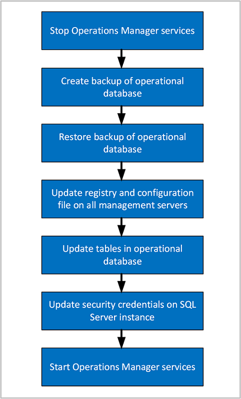

# Move the Operational database

After the initial deployment of System Center Operations Manager, you might need to move the operational database from one Microsoft SQL Server-based computer to another.

During the move, you need to stop services on your management servers, back up the database, restore the database, update the registry and configuration file on management servers, update database tables, add new Logins, and modify User Mapping settings for Logins. For more information, see [SQL Server documentation](/sql/sql-server/).

> [!NOTE]
> This procedure can result in data loss if it isn't performed correctly and within a reasonable length of time of the failure. Ensure that you follow all the steps precisely, without unnecessary delays between the steps.

## Summary of steps

<br>

### Stop the Operations Manager services

On all the management servers in the management group, stop the Operations Manager services:
  
- System Center Data Access (omsdk)
- Microsoft Monitoring Agent (HealthService)
- System Center Management Configuration (cshost)

### Back up the Operational database on the old SQL Server instance

1. On the original SQL Server instance hosting the operational database, use Microsoft SQL Server Management Studio to create a full backup of the database. The default name is OperationsManager.

    For more information, see [How to: Back Up a Database (SQL Server Management Studio)](/sql/relational-databases/backup-restore/create-a-full-database-backup-sql-server).

2. Copy the backup file to a local drive of the new SQL Server instance.

### Restore the Operational database on the new SQL Server instance

::: moniker range=">=sc-om-2019"

> [!NOTE]
> After deploying Operations Manager on the SQL server nodes participating in SQL Always On, to enable [CLR strict security](/sql/database-engine/configure-windows/clr-strict-security?preserve-view=true&view=sql-server-2017), run the [SQL script](upgrade-sqlserver-2019-operations-manager.md#optional---enable-clr-strict-security) on each Operations Manager database.

::: moniker-end

1. Use Microsoft SQL Server Management Studio to restore the operational database. (In the previous step, you moved the database backup file to a local drive of the new SQL Server instance.) In this step, you can change the name of the database and choose the file location.

    For more information, see [How to: Restore a Database Backup (SQL Server Management Studio)](/sql/relational-databases/backup-restore/restore-a-database-backup-using-ssms).

2. In SQL Server Management Studio, verify that the database is online.

### Update the registry and configuration files on the management servers, and Operational database

After moving the Operations Manager operational database to a different SQL Server instance, you will need to follow the steps below to reconfigure all management servers in the management group to reference the new computer name and instance.  This requires modifying the registry, the configuration service configuration file, and several tables in the operational database.  The steps are detailed in the [How to configure Operations Manager to communicate with SQL Server](manage-sqlserver-communication.md#configure-settings-for-the-operational-database).

### Update security credentials on the new SQL Server instance hosting the operational database

1. On the new SQL Server instance hosting the operational database, open SQL Management Studio.  
2. Expand **Security**, then expand **Logins**, and add the data writer account name.
3. Under **Logins**, add the data writer account. For more information, see [How to Create a SQL Server Login](/sql/relational-databases/security/authentication-access/create-a-login).
4. Under **Logins**, add the management server action account.  
5. Under **Logins**, add the Data Access Service (DAS) user account using the format "domain\user".
6. For the DAS user account, add the following user mappings:
   - ConfigService
   - db_accessadmin
   - db_datareader
   - db_datawriter
   - db_ddladmin
   - db_securityadmin
   - sdk_users
   - sql_dependency_subscriber

7. If an account hasn't existed before in the SQL Server instance in which you're adding it, the mapping will be picked up by SID automatically from the restored operational database. If the account has existed in that SQL Server instance before, you receive an error indicating failure for that login, although the account appears under **Logins**. If you're creating a new login, ensure the User Mapping for that log in, and database are set to the same values as the previous login as follows:

    | Login | Database|
    |-------|----------|
    | DW Data Writer | - apm_datareader<br>- apm_datawriter<br>- db_datareader<br>-  dwsynch_users|
    | Action account | - db_datareader<br>- db_datawriter<br>- db_ddladmin<br>- dbmodule_users|
    | DAS/Configuration account | - ConfigService<br>- db_accessadmin<br>- db_datareader<br>- db_datawriter<br>- db_ddladmin<br>- db_securityadmin<br>- sdk_users<br>- sql_dependency_subscriber|

    > [!NOTE]
    > If the DAS/Configuration account uses the LocalSystem account, specify the computer account in the form \<domain\>\<computername>$.

### Update SQL configuration on the new SQL Server instance hosting the operational database

In the below steps your database name may be different from the default. You may modify the query to your Operations Manager operational database name. 

1. CLR must be enabled. To do this, run the following queries on the new SQL Server instance hosting the Operations Manager operational database:
   ```sql
   sp_configure 'show advanced options', 1;
   GO
   RECONFIGURE;
   GO
   sp_configure 'clr enabled', 1;
   GO
   RECONFIGURE;
   GO
   ```

2. SQL Service Broker must be enabled. Run the following SQL query to check if it is enabled:
   ```sql
   SELECT is_broker_enabled FROM sys.databases WHERE name='OperationsManager'
   ```

    If the result of this query was an is_broker_enabled value of 1, skip this step. Otherwise, run the following SQL queries:

    ```sql
    ALTER DATABASE OperationsManager SET SINGLE_USER WITH ROLLBACK IMMEDIATE
    ALTER DATABASE OperationsManager SET ENABLE_BROKER
    ALTER DATABASE OperationsManager SET MULTI_USER
    ```
    
3. FullText must be enabled. Run the following SQL query to check if FullText is enabled:
   ```sql
   SELECT is_fulltext_enabled FROM sys.databases WHERE name='OperationsManager'
   ```

    If the result of this query was an is_fulltext_enabled value of 1, skip this step. Otherwise, run the following SQL queries:
    ```sql
    EXEC sp_fulltext_database 'enable'
    ```

### Start the Operations Manager services

1. On all the management servers in the management group, start the Operations Manager services:
   - System Center Data Access (omsdk)
   - Microsoft Monitoring Agent (HealthService)
   - System Center Management Configuration (cshost)

### Update Service Principal Name for Kerberos Connections

To update Kerberos authentication with SQL Server, you should review [Register a Service Principal Name for Kerberos Connections](/sql/database-engine/configure-windows/register-a-service-principal-name-for-kerberos-connections?preserve-view=true&view=sql-server-2017#Manual) in order for management servers to authenticate with the SQL Server using the Kerberos protocol.  

## Next steps

- To understand the sequence and steps for moving the Operations Manager Reporting data warehouse database to a new SQL Server instance, see [How to move the Reporting data warehouse database](manage-move-omdwdb.md).
