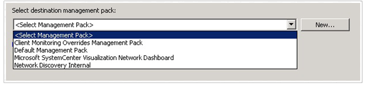
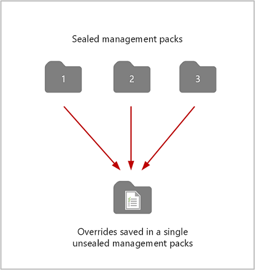
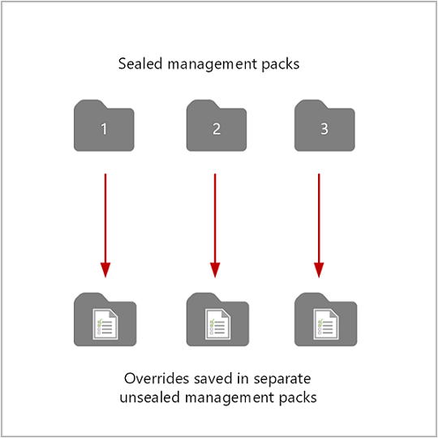

# How to create a management pack for overrides

In System Center 2016 - Operations Manager, in a number of wizards and dialog boxes, you select a destination management pack in which to store the settings. You can select any unsealed management pack file in your management group or create a new one.  
  
Management packs can be sealed or unsealed. A sealed management pack cannot be modified directly. Any changes to the workflows in the sealed management pack, such as an override for a monitor, must be saved to an unsealed management pack. The unsealed management pack references the sealed management pack that it modifies.  
  
The following illustration shows the unsealed management packs that are installed with Operations Manager.  
  
  
  
Never use the management packs that are installed with Operations Manager to save any settings that you change or elements that you create. When you have to select a destination management pack, always select a management pack that you create.  
  
You select a destination management pack when you create an override or disable a rule, monitor, or object discovery. You also select a destination management pack when you create or configure the following elements:  
  
-   A folder in the **Monitoring** workspace  
  
-   A unit, aggregate, or dependency monitor  
  
-   An attribute  
  
-   A group  
  
-   A rule  
  
-   A task  
  
-   A Run As profile  
  
-   Monitoring by using a management pack template  
  
-   Monitoring of a distributed application  
  
-   Tracking of service level objectives  
  
## Saving overrides  

As a best practice, save all overrides for each sealed management pack to an unsealed management pack that is named *ManagementPack*\_Override, where *ManagementPack* is the name of the sealed management pack to which the overrides apply. For example, overrides to the management pack Microsoft.SQLServer.2012.Monitoring.mp would be saved to Microsoft.SQLServer.2012.Monitoring\_Overrides.xml.  
  
When you want to remove a sealed management pack, you must first remove any other management packs that reference it. If the unsealed management packs that reference the sealed management pack also contain overrides or elements that apply to a different sealed management pack, you lose those overrides and elements when you remove the unsealed management pack.  
  
In the following image, overrides for management packs 1, 2, and 3 are all saved to a single unsealed management pack. If you want to remove management pack 1, you first must remove the unsealed management pack. As you can see, you would also remove all overrides for management packs 2 and 3.  
  
  
  
The recommended method is to create an unsealed management pack for each sealed management pack that you want to override, as shown in the following image. Removing management pack 1 and its unsealed management pack does not affect the other management packs.  
  
  
  
## How to create a management pack for overrides  
You can create a management pack for overrides before you configure an override or as part of the override procedure.  
  
### To create a management pack  
  
-   In the **Administration** workspace, in the navigation pane, right\-click, and then click **Create Management Pack**.  
  
    \-or\-  
  
-   In the **Override Properties** dialog box for a rule or monitor, in the **Select destination management pack** section, click **New**.  
  
## Next steps

- To understand what an Operations Manager management pack is and how it helps you proactively monitor your services and applications, see [What Is in an Operations Manager Management Pack?](manage-overview-management-pack.md)  

- See [How to Import, Export, and Remove an Operations Manager Management Pack](manage-mp-import-remove-delete.md) to perform common administrative tasks with management packs in your management group.

- If you want to create your own custom knowledge for specific alerts generated by rules or monitors from a sealed management pack, review [How to Add Knowledge to a Management Pack](manage-mp-add-knowledge.md)  
