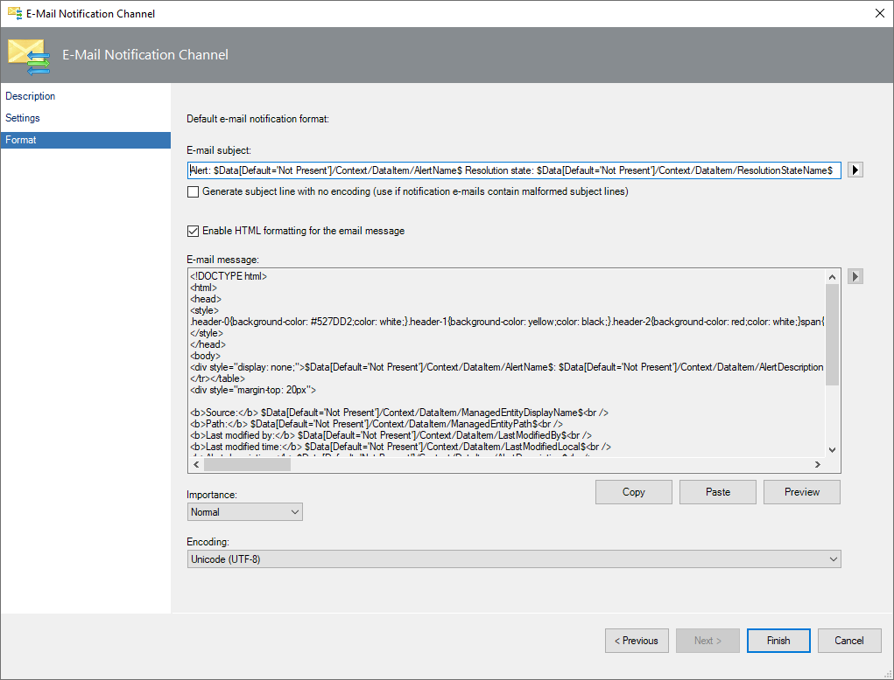
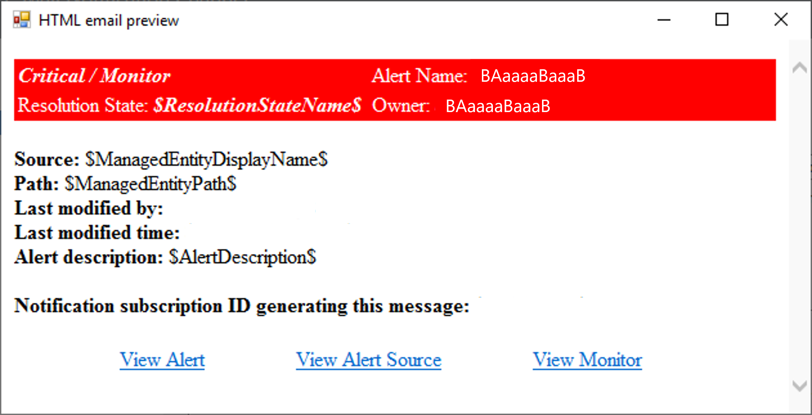
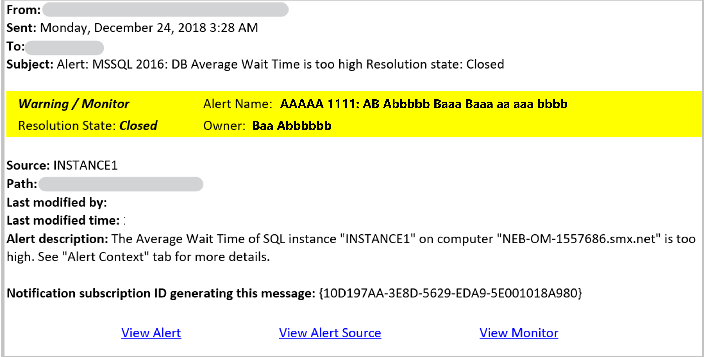

# How to enable an email notification channel

To configure alert notifications for System Center - Operations Manager, your first task is to enable a notification channel. This article describes how to configure a channel that will send alert notifications to subscribers from an email server either within the domain of the organization or external email authentication.  

Before you begin, gather the following information:  

-   SMTP server information  

    -   Fully qualified domain name (FQDN).  

    -   Port number for the SMTP server.  

    -   Authentication method for the SMTP server. You have three choices:
        -  Anonymous
        -  Windows Integrated
        -  External Email Authentication  

    > [!NOTE]
    > Operations Manager supports configuration of any external email account to send the notifications through External Email Authentication. You've the flexibility in terms of which email account is to be used for sending out the notification emails.  

-   Return email address. This address is used for all email notifications on this channel and will receive any replies to notifications.  
    - For internal email server, any return address that is within the domain can be specified.  Multiple internal servers can be added to the subscription channel.
    - For an external email server, the email account used for creating the Run As profile must match the return address. To avoid coexistence issues with other email servers, a subscription channel with an external email account must contain only that email server.  

-   Email subject and body text that you want subscribers to receive. For more information, see [How to customize message content for notifications](manage-notificiations-customize-message.md).  

## To enable an email notification channel  

1.  Sign in to the computer with a user account that is a member of the Operations Manager Administrators role.  

2.  In the Operations console, select **Administration**.  

3.  In the navigation pane, under **Notifications**, right-click **Channels**. Select **New channel** and select **E-mail (SMTP)**.  

4.  Enter a name for the channel, such as **SMTP channel**, and optionally provide a description. Select **Next**.  

5.  In the **SMTP servers** area, select **Add**.  

6.  In the **Add SMTP Server** dialog, enter the fully qualified domain name (FQDN) of a Simple Mail Transfer Protocol (SMTP) server, enter the port number, select the authentication method used by the SMTP server, and select **OK**.  

    > [!NOTE]  
    > You can add one or more additional servers to act as backup servers. If the primary SMTP server is unavailable, notifications are sent through the secondary server.  

7.  Enter the **Return Address** that should appear on email notifications, and then in the **Retry interval** list, select the number of minutes to wait before trying to resend a notification to the primary SMTP server. Select **Next**.  

    > [!NOTE]  
    > If you've only one SMTP server and it's unavailable, the Retry interval has no effect. The Retry interval is used when you have a secondary server and mail sending to the primary server fails. When this happens, Operations Manager switches to the secondary server and checks the Retry interval time. If the Retry interval time has passed, Operations Manager tries to use the primary server.  

8.  In the **Default e-mail notification format** area, specify the **E-mail subject** and **E-mail message** text or leave the default selections, select the **Importance** level that you want the emails sent with, and then specify the **Encoding** type. You can click the right arrow next to the **E-mail subject** and **E-mail message** boxes for a full list of available variables. For more information, see [How to customize message content for notifications](manage-notificiations-customize-message.md).  

9. Select **Finish**, and select **Close**.  

::: moniker range=">=sc-om-2019"

## Create an email notification in HTML format

Operations Manager has the ability to create and send email notifications in HTML format.

With this feature, an administrator would be able to configure an email in HTML format for sending notifications to subscribers. The administrators can use the existing default HTML email template, edit it, or create a new HTML message. With HTML email format, subscribers get easy access to relevant information about the alert, alert source, and the rule/monitor that generated the alert. They can view these details through the drill-down links available at the end of the email.

To create an email in HTML format, perform the following steps:

1.	Use the procedure in the above section for creating the email notification channel.
2.	While configuring the format of the email notifications, select **Enable HTML formatting** as shown in the image below:

    

3. To edit or change the default content:
   - Copy the content by selecting **Copy**.
   - Edit or change the content in any HTML editor.
   - Paste the modified content back by selecting **Paste**.
   - Select **Preview** to view a preview of the edited text.

   While editing the HTML email content, you can add the required alert property or the web console link by using the applicable variable in the appropriate position of your HTML content.

   The following table highlights the variables to use for various properties of the alert or links to the HTML content.

   | Alert property of the link | Variable |  
   |-------------|---|-------------|  
   |Alert Source  |$Data[Default='Not Present']/Context/DataItem/ManagedEntityPath$\$Data[Default='Not Present']/Context/DataItem/ManagedEntityDisplayName$ |
   | Alert Name  |$Data[Default='Not Present']/Context/DataItem/AlertName$ |
   |Alert Description   |$Data[Default='Not Present']/Context/DataItem/AlertDescription$  |
   | Alert Severity   |$Data[Default='Not Present']/Context/DataItem/Severity$   |
   | Alert Priority  | $Data[Default='Not Present']/Context/DataItem/Priority$  |
   | Alert Category   |$Data[Default='Not Present']/Context/DataItem/Category$  |
   | Alert Owner    | $Data[Default='Not Present']/Context/DataItem/AlertOwner$ |
   | Alert Resolved By    |$Data[Default='Not Present']/Context/DataItem/ResolvedBy$  |
   | Alert Raised Time   |$Data[Default='Not Present']/Context/DataItem/TimeRaisedLocal$  |
   | Alert Last Modified Time | $Data[Default='Not Present']/Context/DataItem/LastModifiedLocal$  |
   | Alert Last Modified By | $Data[Default='Not Present']/Context/DataItem/LastModifiedBy$ |
   | Custom FieldN (N varies from 1 to 10) | $Data[Default='Not Present']/Context/DataItem/CustomN$   |
   | WebConsole Alert Link | $Target/Property[Type=\"Notification!Microsoft.SystemCenter.AlertNotificationSubscriptionServer\"]/WebConsoleUrl$/#/monitoring/drilldown/alert/$UrlEncodeData/Context/DataItem/AlertId$ |
   | WebConsole Alert Source Link | $Target/Property[Type=\"Notification!Microsoft.SystemCenter.AlertNotificationSubscriptionServer\"]/WebConsoleUrl$/#/monitoring/drilldown/object/$UrlEncodeData/Context/DataItem/ManagedEntity$ |

The following example is created from a critical severity alert:

The following example is created from a warning severity alert:

::: moniker-end

## Next steps

* To designate when to send notifications and the addresses to which the notifications should be sent, review [How to create notification subscribers](manage-notifications-create-subscribers.md).

* To define the criteria, notification channel, and subscribers that will receive the notification, create a [notification subscription](manage-notifications-create-subscriptions.md).  
