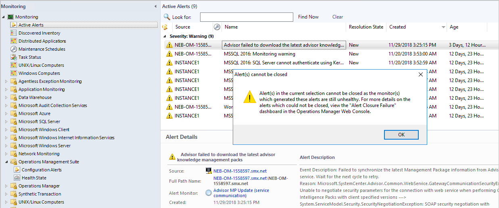
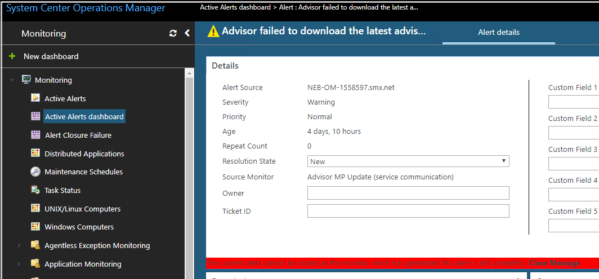
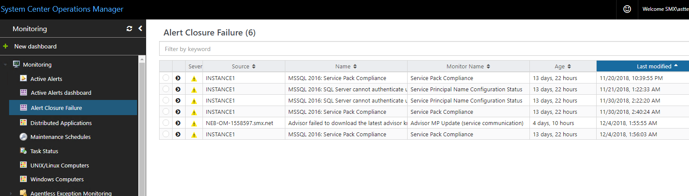

#  Rest Monitor health for alerts closure
In earlier releases of System Center Operations Manager, an alert which has been generated by a monitor cannot be closed unless the health state of the corresponding monitor is **healthy**. OM 2019 allows you to manually reset the health status of a monitor for a specific alert, by using the new **Alert Closure Failure** dashboard, and close it.  

Use the following procedure to view the status of closed alerts without the monitor status healthy:  

## 	Operations console
1.	Open the OM console and click **Monitoring**

**Monitoring Overview** displays a summary of health statuses of the monitor and the current alerts.
2.	Click **Active Alerts** in the navigation pane.
3.	Right-click an alert, which is generated by a monitor.
4.	Set the resolution state as **Closed**

    The following prompt, conveying the reason for non-closure of the alert appears:

    

##  Web Console
1.	Open the Web Console and click **Monitoring**.
    The Monitoring Overview displays a summary of health statuses of the monitor and the current alerts.
2. Close the alerts.

    You can chose any of the following options to close the alerts.

    Close alerts from *Active Alerts*

   1. Click **Active Alerts** in the navigation pane.
   2. Right-click an alert, which has been generated by a monitor.
   3. Set the resolution state as **Closed**.

   Close alerts from *Active Alerts Dashboard*

    1. Click **Active Alerts Dashboard** in the navigation pane.
    2. Open an alert, which has been generated by a monitor.
    3. Set the resolution state as **Closed** and **Save** changes.

    The following prompt, conveying the reason for non-closure of the alert appears:

    

## Reset the health status of a monitor for a specific alert

Use the following steps:

1. Click **Alert Closure Failure** dashboard in the navigation pane.
The listed alerts are the ones, which OM was unable to close because the monitor which has generated the alert is still **unhealthy**.
2.	You can reset the health status of the monitor for the corresponding alert, in following two ways:
 -  Select an alert in the dashboard and then select the dashboard action **Reset Health for Alert** or
 -  Click an alert in this dashboard to navigate to the alerts drill-down page (where you can visualize all the relevant information for an alert), select the **Reset Health task** in the task pane.

        

## Next steps
[How to reset monitors heath](manage-health-reset-health)
