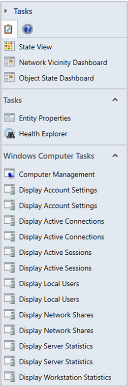
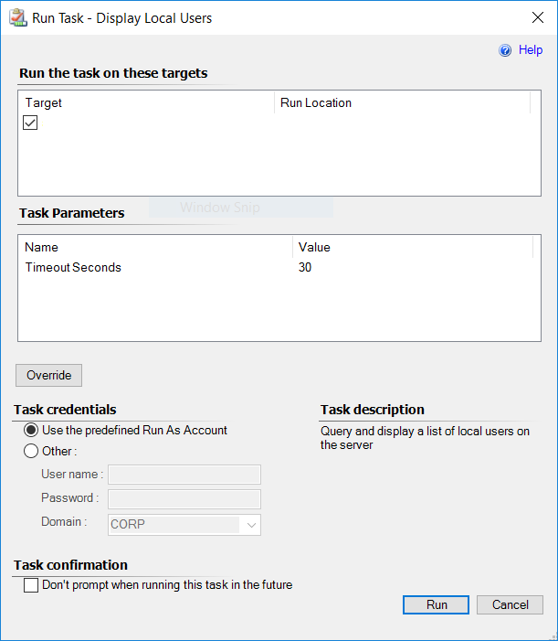
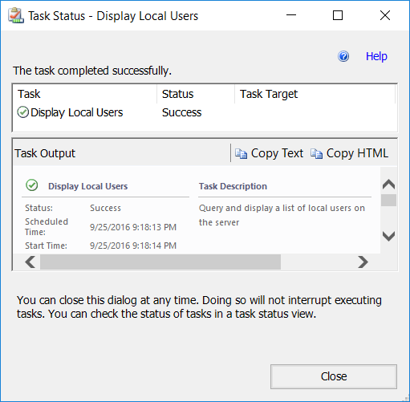

# Running tasks in Operations Manager

In the System Center Operations Manager Operations console, the **Tasks** pane provides links to tasks. A task is a user-initiated action from the Operations console that is run on an Operations Manager agent or on the computer where the Operations console is launched from. The tasks that are available depend on the management packs that are installed. For example, Operations Manager comes with a core set of functionality that provides the ping task. When you install the SQL Server management pack, it adds SQL-specific tasks, such as a task to start or stop the SQL Server agent.  

> [!NOTE]  
> If the **Tasks** pane isn't displayed, select **Tasks** on the toolbar to display it.  

Select an alert or object to see tasks for that alert or object. Select a task to run the task.  

  

In the example above, if you select the task **Display Local Users**, you see a **Run Task** dialog:  

  

Tasks use the default action account, unless you specify other credentials in this dialog. Tasks can also be configured by a management pack author to use a specific Run As profile.  

Generally, you should accept the defaults and select **Run**. You'll then see a **Task Status** window:  

  

In this instance, the task completed successfully. **Task Output** provides you with the results of the task. In this case, it will return all the user accounts defined on the server.

## Next steps

- To stop monitoring a computer, group of computers, or monitored object temporarily during planned maintenance using a schedule, or to stop monitoring while troubleshooting an issue, see [How to Suspend Monitoring Temporarily by Using Maintenance Mode](manage-maintenance-mode-overview.md).

- Groups help categorize, classify, or arrange one or more monitored objects to manage targeting of visualized data, overrides, reports, and more. To learn how to create groups and common uses for groups, see [Creating and Managing Groups](manage-create-manage-groups.md).

- Operations Manager extends the PowerShell command-line environment and task-based scripting technology to automate most Operations Manager administrative tasks. See [Using Operations Manager Shell](manage-using-omcmdlets.md).  
