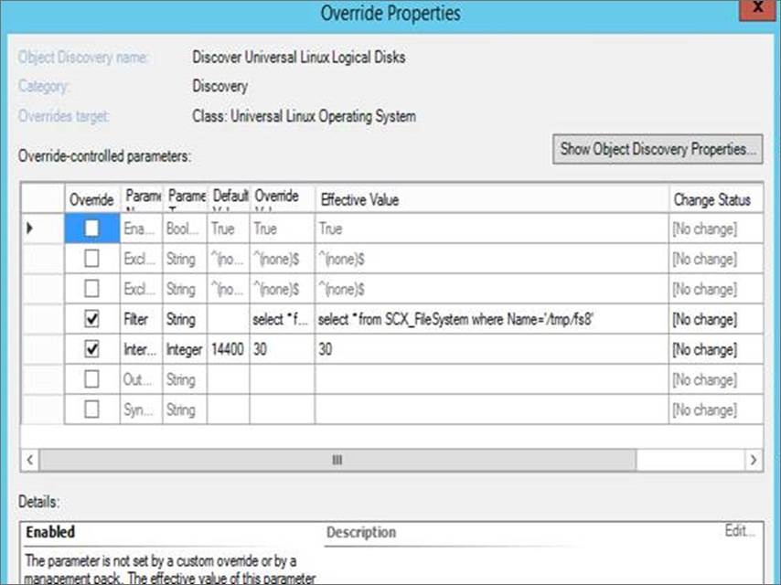
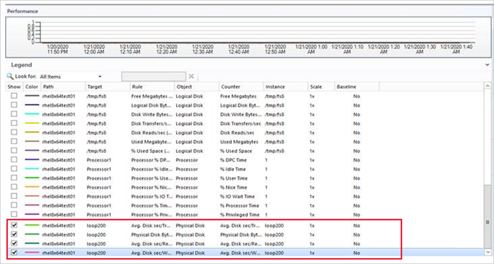

# Administer and configure the UNIX - Linux agent

This article describes options to administer and configure the UNIX/Linux agent for System Center - Operations Manager.  

## Agent directories  

- Open Management Infrastructure (OMI) is installed to the directory: `/opt/omi`

- The UNIX/Linux agent installs to the directory: `/opt/microsoft/scx/`

- The UNIX/Linux agent maintains log files in the directory: `/var/opt/microsoft/scx/log/`

- OMI maintains log files in the directory: `/var/opt/omi/log/`

- Agent configuration files, including certificates, are stored in the directory: `/etc/opt/microsoft/scx/`

- OMI configuration files are stored in the directory: `/etc/opt/omi`

## Agent administration tools  

In this section, tools to administer and configure the UNIX\/Linux agent are described.  

### Run the agent administration tools  

The tools for configuring the UNIX/Linux Agent are located in the directory:  

```  
/opt/microsoft/scx/bin/tools  
```    

## Scxadmin  

The **scxadmin** tool is used to control the state of the UNIX/Linux agent (start, stop, or restart) and control logging performed by the agent. The usage of the tool can be displayed with the following command: `scxadmin -?`  

```  

  # /opt/microsoft/scx/bin/tools/scxadmin -?  

Usage: scxadmin  
Generic options (for all commands)  
  [-quiet]      Set quiet mode (no output)  

        General Options  
scxadmin -version  

        Service Management  
scxadmin {-start|-stop|-restart|-status}  [all|cimom|provider]  

        Providers Management  
scxadmin -config-list {RunAs}  
scxadmin -config-set {RunAs} {CWD=<directory>|ChRootPath=<directory>|AllowRoot={true|false}}  
scxadmin -config-reset {RunAs} [CWD|ChRootPath|AllowRoot]  

        Log Configuration Management  
scxadmin {-log-list|-log-rotate|-log-reset} [all|cimom|provider]  
scxadmin -log-set [all|cimom|provider] {verbose|intermediate|errors}  
scxadmin -log-set provider {{FILE:<path>|STDOUT}:<module-id>={SUPPRESS|ERROR|WARNING|INFO|TRACE|HYSTERICAL}}  
scxadmin {-log-reset|-log-remove} provider [{FILE:<path>|STDOUT}]  
```  

### Examples  

**Restart the agent:**  

```  
cd /opt/microsoft/scx/bin/tools/
./scxadmin -restart
```  

**Increase all logging to the Intermediate level:**  

```  
cd /opt/microsoft/scx/bin/tools/
./scxadmin –log-set all intermediate
```  

## scxsslconfig  

The **scxsslconfig** tool is used to generate the certificate in `/etc/opt/Microsoft/scx/ssl/`. This tool is useful in correcting issues in which the fully qualified domain name can't be determined from the UNIX or Linux host itself, or the FQDN known to the UNIX\/Linux host doesn't match the FQDN used by the management server to reach the host.  

> [!NOTE]  
> The generated certificate must be signed by Operations Manager management server in order to be used in WS-Management communication. Overwriting a previously signed certificate will require that the certificate be signed again.  

Usage for the **scxsslconfig** tool can be displayed with the following command: `scxsslconfig -?`  

```  
# /opt/microsoft/scx/bin/tools/scxsslconfig -?  
Usage: /opt/microsoft/scx/bin/tools/.scxsslconfig [-v] [-s days] [-e days] [-d domain] [-h host] [-g targetpath]  

-v             - toggle debug flag  
-g targetpath  - generate certificates in targetpath  
-s days        - days to offset valid start date with (0)  
-e days        - days to offset valid end date with (3650)  
-f             - force certificate to be generated even if one exists  
-d domain      - domain name  
-h host        - host name  
-b bits        - number of key bits  
-?             - this help message  
```  

### Examples

**Regenerate the certificate, forcing overwrite of an existing certificate, with verbose output:**  

```  
cd /opt/microsoft/scx/bin/tools/  
. setup.sh  
/opt/microsoft/scx/bin/tools/scxsslconfig -f -v  
```  

**Regenerate the certificate, forcing overwrite of an existing certificate, with a specified hostname and DNS domain name:**  

```  
cd /opt/microsoft/scx/bin/tools/  
. setup.sh  
/opt/microsoft/scx/bin/tools/scxsslconfig -f -h myserver -d contoso.com  
```  

## Additional configuration topics  

### SSL ciphers

If required, the SSL cipher list used by the UNIX/Linux agent can be customized. For more information about this configuration, see the [Configuring SSL Ciphers](manage-security-crossplat-config-sslcipher.md) article.  

### Specify an alternate temporary path for scripts

If you create a UNIX/Linux Script rule or monitor in a custom management pack, the script contents will be written to a file in /tmp on the agent computer before being run. You may wish to specify an alternate directory for script execution. To specify an alternate directory, overwrite the symbolic link at: `/etc/opt/microsoft/scx/conf/tmpdir` to point to another directory. The destination of this symbolic link must be writeable by the user account defined in the UNIX/Linux Action Account and/or UNIX/Linux Privileged Account RunAs Profiles.

### Universal Linux - operating system name/version  

The Universal Linux Agent, which supports Linux operating systems such as Debian GNU\/Linux, Oracle Linux, and Ubuntu Server, parses release files to determine the host's operating system name and version. If required, these properties can be customized. To customize the operating system properties presented to Operations Manager for a Universal Linux Agent host, use the following procedure:  

Create the file `disablereleasefileupdates` in the directory: `/etc/opt/microsoft/scx/conf/`.  

```  
touch /etc/opt/microsoft/scx/conf/disablereleasefileupdates  
```  

If this file exists, the agent won't attempt to update the operating system properties that are returned to Operations Manager. This ensures that the customizations are preserved.  

Edit the file `scx-release` in the directory: `/etc/opt/microsoft/scx/conf`. This file has the format:  

```  
OSName=Ubuntu  
OSVersion=24.04
OSFullName=Ubuntu 24.04 (x86_64)
OSAlias=UniversalR  
OSManufacturer=  
```  

The values of the **OSName**, **OSVersion**, and **OSFullName** properties can be edited to reflect customized values.  

> [!NOTE]  
> The OSAlias property shouldn't be edited. All the properties in this file (except for OSManufacturer) are mandatory and shouldn't be null.  

::: moniker range="sc-om-2019"

>[!NOTE]
> The following update is applicable for Operations Manager 2019 UR1 and later.

::: moniker-end

::: moniker range=">=sc-om-2019"

## Performance and reliability improvements in the Linux agent  

::: moniker-end

::: moniker range="=sc-om-2019"

With Operations Manager 2019 UR1 and later, to improve the reliability, a separate process is introduced to send the heartbeat. Earlier, the performance and heartbeat collection threads used to run under the same process context. Due to this, any delay in performance data collection was affecting the system availability.

With this change, during heartbeat collection, you can now see an additional *omiagent* process running under *omi* user.

::: moniker-end

::: moniker range="=sc-om-2022"

To improve the reliability, a separate process is used to send the heartbeat. During heartbeat collection, you can see an additional *omiagent* process running under *omi* user.

::: moniker-end

::: moniker range=">=sc-om-2019"

To improve the performance, X-Plat Filter variable is introduced in override. You may override discovery/monitor behavior for X-Plat management pack by introducing WQL queries in *Filter* parameter. This helps in restricting the monitoring to entities of interest.

Also, to avoid quick filling of disk space, SCX logging is decreased from *Information* to *Warning*.


Here's an example of how you may configure an override by using the **Filter** variable:

If you wish to get only the data for *loop200*, then use the following query in the Filter variable:

select * from SCX_DiskDrive where DeviceID=loop200



Now, you will see data only for the disk ‘loop200’ in the performance view.



::: moniker-end

::: moniker range="sc-om-2019"
>[!NOTE]
> The following update is applicable for Operations Manager 2019 UR3 and later.
> In earlier releases of Operations Manager, changes to log-level settings of OMI processes required an agent restart.
With Operations Manager 2019 UR3, log-level settings can be changed without the need for restarting the agent.

::: moniker-end

::: moniker range=">=sc-om-2019"

## Dynamic changes in log-level settings without agent restart

You can change the log-level settings without the need for restarting the agent.

Use the following steps:

1. Modify the **omiserver.conf** file and update the new loglevel:

   ```

    loglevel = INFO

   ```

2. Apply this log-level while running the below command:
   ```
   $sudo /opt/omi/bin/omiconfigeditor –reconfig
   ```

::: moniker-end

## Next steps

- For more information on how to install the agent and understand the steps for signing the agent certificate, see [Install Agent and Certificate on UNIX and Linux Computers Using the Command Line](manage-install-crossplat-agent-cmdline.md).

- To understand how to perform agent maintenance on UNIX and Linux computers, see [Upgrading and Uninstalling Agents on UNIX and Linux Computers](manage-upgrade-uninstall-crossplat-agent.md).
