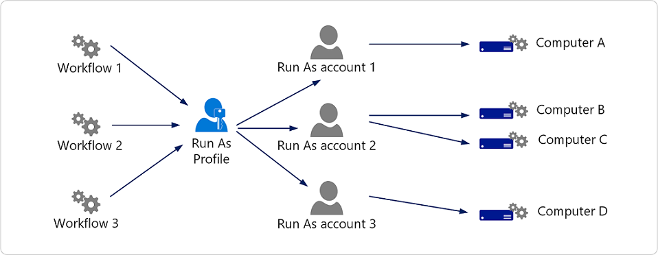

# Managing Run As accounts and profiles

>Applies To: System Center 2016 - Operations Manager

System Center 2016 - Operations Manager workflows, such as rules, tasks, monitors, and discoveries, require credentials to run on a targeted agent or computer. By default, workflows use the default action account for the agent or computer. The credentials for the default action account are configured when Operations Manager is installed.  
  
When a workflow requires rights and privileges that the default action account cannot provide, the workflow can be written to use a Run As profile. A Run As profile can have multiple Run As accounts associated with it. The Run As accounts allow you to specify the necessary credentials for specific computers. Multiple workflows can use the same Run As profile. The following image illustrates the relationship between workflows, Run As profiles, and Run As accounts.  
  
  
  
In the image, three workflows use the same Run As profile. The Run As profile has three associated Run As accounts. In this example, each workflow that uses the Run As profile will run on Computer A using the credentials for Run As account 1, on Computer B and C using the credentials for Run As account 2, and on Computer D using the credentials for Run As account 3.  
  
Run As profiles are defined in management packs by the management pack author. A Run As profile is used wherever its parent management pack is active. For example, the SQL Server 2014 management pack contains the SQL Run As profile, so the SQL Run As profile would be active on all servers running SQL Server 2014 that are monitored by the SQL Server 2014 management pack. The Run As profile is an association of one or more Run As accounts and the managed objects that the Run As accounts should be applied to.  
  
In some cases, the Run As profile is imported into Operations Manager when the management pack that contains it is imported. In other cases, you may need to create it manually. In all cases, Run As profiles must be manually associated with a Run As account.  
  
A Run As account contains a single set of credentials which are stored in the Operations Manager operational database. Each Run As account has a security classification (more secure or less secure) that controls how the credentials are distributed for use. If you elect more secure credential distribution, you must configure the mapping of which computers the credentials are distributed to.  
  
## Next steps
  
-   [Distribution and Targeting for Run As Accounts and Profiles](manage-security-dist-target-runas-profiles.md)  
  
    This topic explains the difference between distribution and targeting, the options for distributing Run As accounts, and the options for selecting targets for Run As profiles.  
  
-   [How to Create a Run As Account and Associate with a Run As Profile](../om/manage/how-to-create-a-run-as-account-and-associate-to-a-profile.md)  
  
    This topic explains how to create a Run As account, how to modify an existing Run As account, and how to configure a Run As profile to use a Run As account.  

- [How to Create a New Action Account](manage-security-create-runas-actionaccount.md)

    This topic explains how to create a new Run As action account that will be used by management servers in the management group.  
  
  
  

  

