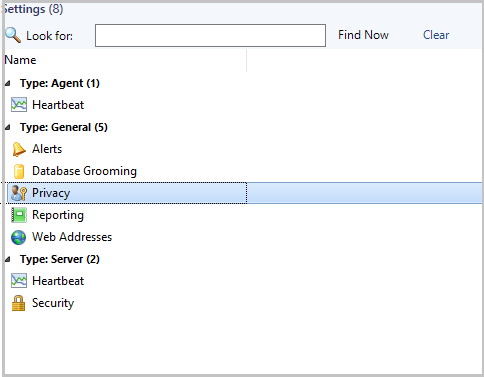
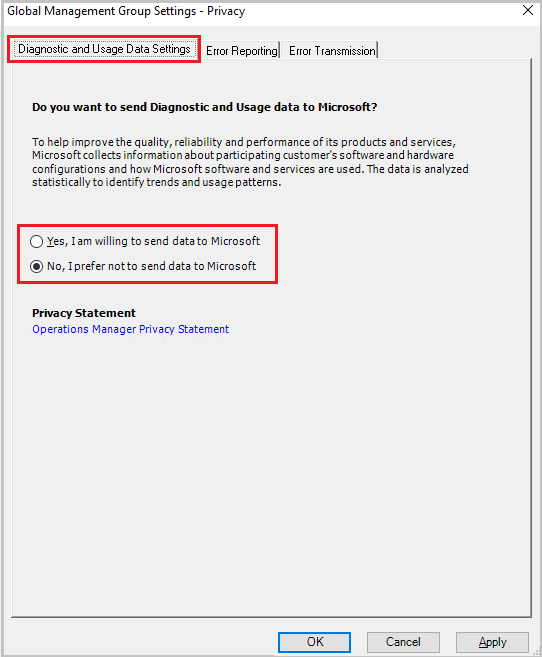

# Manage telemetry settings in Operations Manager

This article provides information about how to manage the telemetry (Diagnostics and utility data) settings in System Center - Operations Manager.

By default, Operations Manager sends diagnostic and connectivity data to Microsoft. Microsoft uses this data to provide and improve the quality, security, and integrity of Microsoft products and services.

Administrators can turn off this feature at any point of time. Learn more about [data collected by Operations Manager](#telemetry-data-collected).

## Turn on/off telemetry from console

1. In the Operations Manager console, select **Settings** in the Administration pane.

2. Under **Type: General**, double-click **Privacy**.

   

   **Diagnostic and Usage Data Settings** options page appears.

   

3. Select the diagnostic and usage data sharing preference from the options displayed, and select **OK**.

   > [!NOTE]
   > We recommend you to read the Privacy Statement before you select the option.
   > - To turn on telemetry, select **Yes, I am willing to send data to Microsoft**.
   > - To turn off telemetry, select **No, I prefer not to send data to Microsoft**.

## Telemetry data collected

The following table details the telemetry data that is collected by Operations Manager:  

| Data related To | Data collected |
| --- | --- |
| **Setup** | Version of installed System Center - Operations Manager    Version of the  installed System Center - Operations Manager update rollup on different System Center - Operations Manager core components   System Center - Operations Manager management group identifier (To weed out duplicates)    Unique machine identifier     Operating system on which different System Center - Operations Manager core components are launched    Language of the System Center - Operations Manager installation    CPU and memory values of different System Center - Operations Manager servers    Number of System Center - Operations Manager web servers installed     Is reporting server installed     Is ACS installed     Number of gateways in the System Center - Operations Manager environment     Number of management servers in the System Center - Operations Manager environment    Is Operational Insights account set up  
| **Device monitoring** |  Number of Unix/Linux computers monitored   Number of Windows computers monitored   Number of network devices monitored   Unix/Linux flavors monitored   Network devices being monitored - their type, model number, and certification status    Number of applications for which APM is active    Type of workloads for which APM is enabled   Number of distributed applications   Number of computers on which ACS is implemented   Maximum number of concurrent Web console sessions   Number of new SSRS reports present   Number of uncanned SSRS reports present   Frequency of canned reports use   Frequency of each PowerShell command use     Features used in the administration console     Complete Heatmap    Report Status |
| **Management packs** |	Number of management packs in the System Center - Operations Manager environment    Number of non-Microsoft signed packs    	Management packs installed/version/manufacturer (Microsoft and Non-Microsoft)    	Table names and row counts in the operational database    	Table names and row counts in the data warehouse database    	Details of partner products installed   	Details of the Microsoft MP import failures and error involved    Details of the Top used management packs deployed with Operations Manager
| **SCOM Console** |  Time taken for the windows console to launch    	Time taken for each of the monitoring screens to launch    	Time taken for each of the administration screens to launch    	Number of times network vicinity dashboard is launched    	Number of times the data warehouse jobs are failing    	Number of times the web console is being launched    	Number of times the Maintenance mode task and SMM SDK calls are made for create and edit to determine adoption of new feature
| **Updates and recommendations** |	Number of times the Updates and Recommendations link clicked/refreshed   	Number of times the online catalog was down while loading Updates and Recommendations view   	Time taken to load the Updates and Recommendations view    	Number of workloads in Updates and Recommendations view has Updates available status    	Number of workloads in Updates and Recommendations view have Not installedstatus    	Number of workloads in Updates and Recommendations view has Partially installed status    	Number of workloads shown in Updates and Recommendation     Number of times  Get MP link is clicked in Updates and Recommendations view    	Number of times Get All MPs link is clicked in Updates and Recommendations view    	Number of times View Guide link is clicked in Updates and Recommendations view    	Workload selected in Get MP call in Updates and Recommendations view    	Workloads selected in Get All MPs call in Updates and Recommendations view    	Workload install status in Get MP call in Updates and Recommendations view    	Workloads install status in Get All MPs call in Updates and Recommendations view   	Time taken to install workload in Get MP call in Updates and Recommendationsview   	Time taken to install workloads in Get All MPs call in *Updates and Recommendations* view    Is the installation fresh or upgrade    	TotalSetuptimeInMinutes    	Is setup silent     	Is error reporting enabled    	Is the Microsoft update true or false    	Is the setup 64 bit    	SetupDefaultInstallPath    	Install result - success or failure
| **Database** | 	Whether the management server installation is fresh or upgrade   	Whether the database (DB) installation is fresh or upgrade   	Whether the data warehouse (DW) installation is fresh or upgrade    	Default DB Name    	DB Size in MB   	DB Port   	Is DB Local    	DW Port    	Is DW local    	Is the SDK service using the local system account    	Is the agent using the local system account   
| **Console Settings** |	Web console default website   	Web console authorization mode   	Web console SSL enabled   	Count of maintenance schedules    	Count of active alerts   	User role    	Console version    	If users are enabling daily health report    	If users are enabling computer discovery    	If users are discovering entire domain, or the selected one   	If users are enabling Auto-Select for updates   	Telemetry on/off notifications   	Click count on Tune Management Pack View   	Click count, total days, minimum alert count, and total result set    	Click count, MP name, alert name, and alert count    	Click count of View or edit the settings of this monitor    	Click count of View or override sources    	Click count, source MP name and override MP name     Nano servers count    	Alert view click count    	Health explorer click count on alert view action menu    	Open command window click count on alert view action menu    	Start maintenance mode click count on alert view action menu    	End maintenance mode click count on alert view action menu    	Edit maintenance mode click count on alert view action menu    	Time spent on alert view    	Total number of items displayed on alert view    	Performance view click count    	Time spent on performance view  	State view click count    	Time spent on state view    	Total number of items displayed on state view    Overrides being used    If notification channels & subscriptions are set up    Type of notification channels configured

::: moniker range="sc-om-2016"

 In addition to the data in the above table, Operations Manager 2016 UR10 also collects the information about **the platform the setup is hosted on** as part of the data collected under **Setup**.

::: moniker-end

### Data collected through UTC

- SQL configuration of the System Center - Operations Manager environment (version/SP version/SQL Always ON/Cluster)
- Microsoft alerts that are marked as not useful and the reason
- Number of widgets, views, and dashboards created in *Monitoring* pane
- Number of dashboards in *My Workspace*
- Time taken to load the Scheduled Maintenance summary screen
- Average number of entities that are set to maintenance mode through Maintenance mode task and Scheduled Maintenance mode screen
- System Center ID the System Center - Operations Manager environment resides in
- Selected features

### HTML5 dashboards data collected through App Insights

- All API exceptions
- User feedback
- Edited widget
- Authored widget
- launched widget
- Action clicked
- Personalized widget
- Instances when action *View in Full Screen* is clicked
- Dashboard edits
- Instances of drill-down page launch
- Instances of task pane launch
- Instances of *My Workspace*  launch
- Usage of *Windows Authentication*
- Usage of  *Alternate Credentials*
- Instances of  *Add to MyWorkspace* action
- Count of alerts per widget
- Count of performance legends per widget
- Count of rows per state widget  
- Count of icons in topology widget
- Widget count in a dashboard

## Next steps

See [Plan agent deployment](plan-planning-agent-deployment.md)
