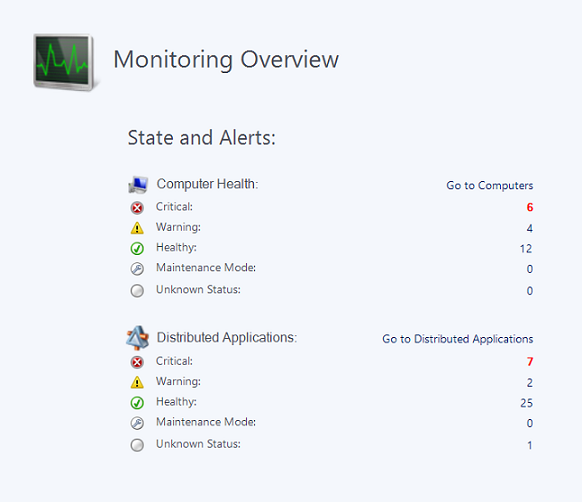

---
title: Using the Operations Manager Operations console
description: This article describes how to use the Operations Manager Operations console to view operational data from monitored objects in the environment.  
author: mgoedtel
ms.author: magoedte
manager: carmonm
ms.date: 11/10/2017
ms.custom: na
ms.prod: system-center-2016
ms.technology: operations-manager
ms.topic: article
ms.assetid: 83921ac3-655e-4279-8f16-88818c88349f
---  

# Using the Operations Manager Operations console

In System Center - Operations Manager, the Monitoring workspace is the primary workspace for operators, network and system engineers, and service desk. The Monitoring workspace is basically the same in both the Operations and Web consoles.  
  
When you open the Monitoring workspace, you see an overview that summarizes the health of distributed applications and computers, as well as the objects that are in maintenance mode, as shown in the following image.  
  
  

In the **State and Alerts** overview, click any of the numbers to see a detailed view. For example, if you click the number shown for **Maintenance Mode**, a state view of all computers in maintenance mode opens.  
  
The health states that are summarized in the overview only tell you part of what is going on in your environment. You will also want to review the alerts that have been generated. In the navigation pane, click **Active Alerts** to see all alerts. For more information about dealing with alerts, see [Managing Alerts](manage-alert-generation-overview.md).  
  
There are number of views and dashboards in the **Monitoring** workspace that allow you to view the status of your environment. For information on each view, see [Standard Views in Operations Manager](manage-console-standard-views.md). Dashboards allow you to consolidate and visualize operational data from different perspectives to make meaningful decisions. For more information, see [Dashboards in Operations Manager](manage-dashboards-overview.md).  You can also change the display options of a view and save it as a personalized view. For more information, see [How to Personalize a View in Operations Manager](manage-console-personalize-views.md).  
  
As you work with Operations Manager, you may discover that there are specific views that you frequently access. You can create a customized workspace that displays your favorite views and searches. For more information, see [Using My Workspace in Operations Manager](manage-consoles-my-workspace.md).  
  
## Next steps

* To filter your view of monitoring data so that you can find the exact monitoring object or group of objects that you need, see [Finding Data and Objects in the Operations Manager Consoles](manage-console-finding-data.md).

* Learn how to use Health Explorer to understand the state of monitored objects in your environment by reviewing [Using Health Explorer to Investigate Problems](manage-consoles-overview-healthexplorer.md). 