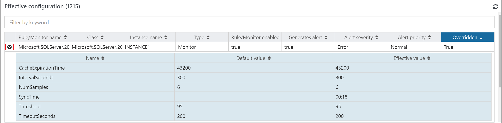

# How to view the effective configuration of a monitored object

 In System Center Operations Manager, the Web console allows an operator to view the monitoring details for a selected object and show all the rules and monitors that target it.

From the results, you're able to see the following details:

* Monitor/Rule name
* Target class
* Instance - the instance of the monitored object
* Type - Value is either Rule or Monitor
* Rule/Monitored enabled - Value is either True or False
* Generates alert - Value is either True or False  
* Alert severity
* Alert priority
* Overridden - Value is True or False value indicating if an override is applied  

Rules or monitors with an override applied can be expanded to review the default and modified setting.  

## How to launch effective configuration
From the Health State widget, select a monitored object in the table and the **Monitored Object details** page is shown.  Scroll down to the bottom of the page and in the Effective Configuration pane, click on the refresh icon in the upper right-hand corner of the pane.  

When the pane refreshes, it returns all the workflows that are running on the monitored object.  The total number of rules and monitors is reflected in the upper left-hand corner of the pane.  

All the columns in the table support sorting and text entries will sort in alphabetical order, and the numbers will sort from smallest to largest (or vice versa).  You can use the filter textbox when you want to search on a specific word, and the filter is case insensitive.  

If a rule or monitor has an override applied, which is reflected by the workflow showing a value of **True** in the Overridden column, you can view the override values applied by clicking on the expand icon in the first column, and the row will expand to show the default settings and modified values for the rule or monitor.

## Next steps

Before making changes to the monitoring settings defined in an Operations Manager management pack, review [How to Override a Rule or Monitor](manage-mp-override-rule-monitor.md) to understand how to configure the change.
