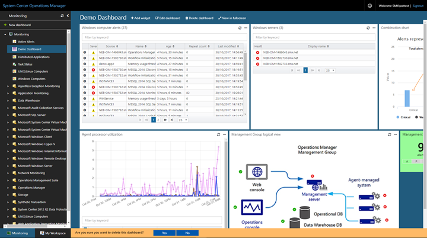

# Manage dashboard and widget configuration in the Web console

## Delete a dahsobard

To delete dashboard, click **Delete dashboard** option available from the top banner of the dashboard.    You are prompted to confirm you wish to proceed with deleting the dashboard.  This notification appears at the bottom of the page.  Click **Yes** to continue or **No** to cancel the operation.   

## Modify widget configuration

To edit the widget, perform the following steps.

1. Hover your mouse over the widget and click on the ellipse **…** at the top right corner of the widget. 
2. The options pane for the widget appears, it displays all the possible actions available for the selected widget.  Select **Edit** to launch the authoring pane for the widget.
3. Perform changes to the available settings for the widget and then click **Update Widget**.  

After you update the widget, the changes are saved and the message **updating widget…** is displayed at the bottom of the page.

## Delete a widget from the dashboard 

To delete a widget on your dashboard, perform the following steps.

1. Hover your mouse over the widget. 
2. Click **Delete Widget**
3. You are prompted to confirm **Are you sure you want to delete this widget?** at the bottom of the page.  Click **Yes** to continue or **No** to cancel the operation.

## Refresh widget 
Each widget is automatically refreshed based on the specified refresh interval.  By default,   widgets update every five minutes. To manually refresh it, then click refresh icon in the upper right-hand corner of the widget.

## Edit a dashboard
You can change the presentation layout of the dashboard by resizing or repositioning the widgets to present the information in a more attractive or meaningful way.   

### Reposition widget

To move the widget to a different location on the dashboard, click **Edit Dashboard** and hover your mouse over the widget. You will see the cursor change appearance.  Hold down the left mouse button and drag the widget to the desired location on the dashboard.   

### Resize the widget
Move your cursor to the bottom right or right border of the widget. You will see the cursor change appearance. Hold down the left mouse button and drag the window to the size you want.

To save the changes you want to keep, click **Save Changes**.  If you want to cancel all your changes then click **Undo changes**.

  