# Automatic monitoring template with Managed Identity

Automatic monitoring template allows you to configure monitoring by discovering all managed instances in the specified Azure subscription automatically. This article describes the automatic monitoring template using the Managed Identity options of choice: system-assigned managed identity and user-assigned managed identity.

## System-assigned managed identity

### Prerequisites

1. Enable system-assigned managed identity for management server VM in Azure Portal.

   Go to the Virtual Machine -> Security -> Identity.

   Switch **System-assigned status** to **On** and click **Save**.

   For more details, got to [Configure managed identities on Azure virtual machines](/entra/identity/managed-identities-azure-resources/how-to-configure-managed-identities?pivots=qs-configure-portal-windows-vm#system-assigned-managed-identity)

2. Grant Reader permission to the system-assigned identity for the subscription or specific resource group where your System Center Operations Manager and Azure SQL Managed Instances reside.

    Go to subscription or resource group -> **Access Control (IAM)** and click **Add**.

    Click **Add Role-assignment** and Select **Reader** permission in the Role tab.

    Assign-access to the managed identity in the Member tab and select your identity by name.

    Save the updates by clicking **Review + assign** button.

   For more details, check the [Adding permissions to the identity](/entra/identity/managed-identities-azure-resources/overview-for-developers?tabs=portal%2Cdotnet#adding-permissions-to-the-identity)

### Add Monitoring Wizard and create a destination management pack

To configure monitoring using the automatic monitoring template, perform the following steps:

1. In the System Center Operations Manager console, navigate to **Authoring | Management Pack Templates**, right-click **Azure SQL MI - Automatic**, and select **Add Monitoring Wizard**.

    

2. At the **Monitoring Type** step, select **Azure SQL MI - Automatic**, and select **Next**.

    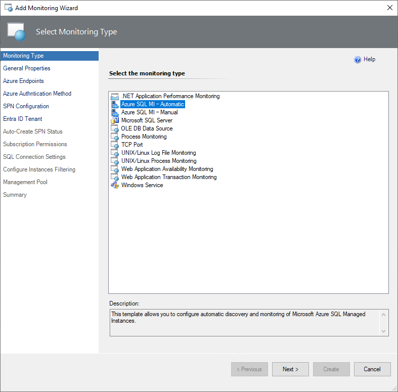

3. At the **General Properties** step, enter a name and description, and from the **Select destination management pack** dropdown list, select a management pack that you want to use to store the template.

    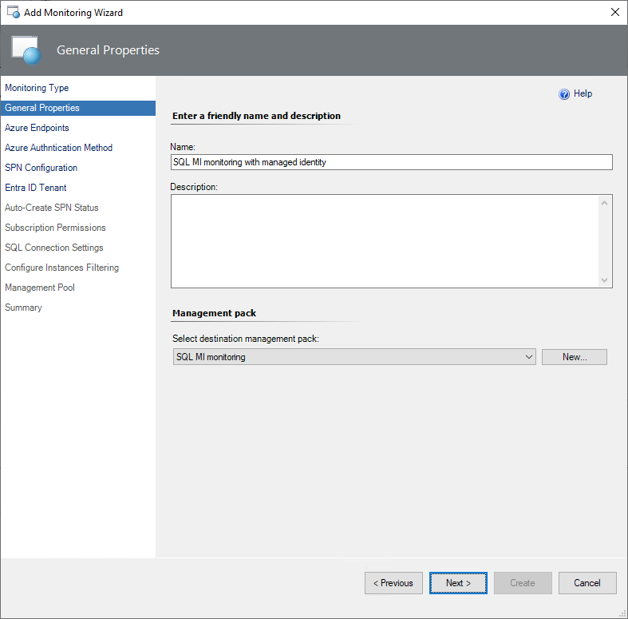

### Azure endpoints

At this step, select the **Enable checkbox if you want to change default Azure Endpoints** checkbox, and modify the default Azure endpoints, if necessary. The default endpoints for creating Azure Service Principal Name are as follows:

- Authority URI: `https://login.microsoftonline.com`
- Management Service URI: `https://management.azure.com`
- Database Resource URI: `https://database.windows.net`  
- Graph API Resource URI: `https://graph.windows.net`

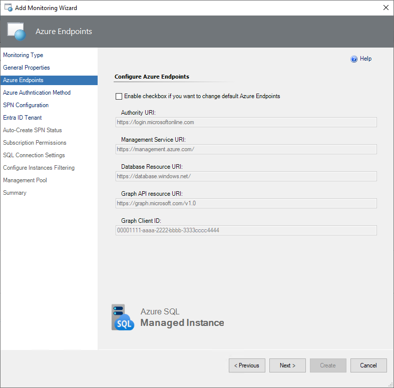

### Select Authentication Method

At this step, select a system-assigned managed identity from the list. This means that your management server will use the system-assigned identity from its VM to connect to the Azure SQL Managed Instance.

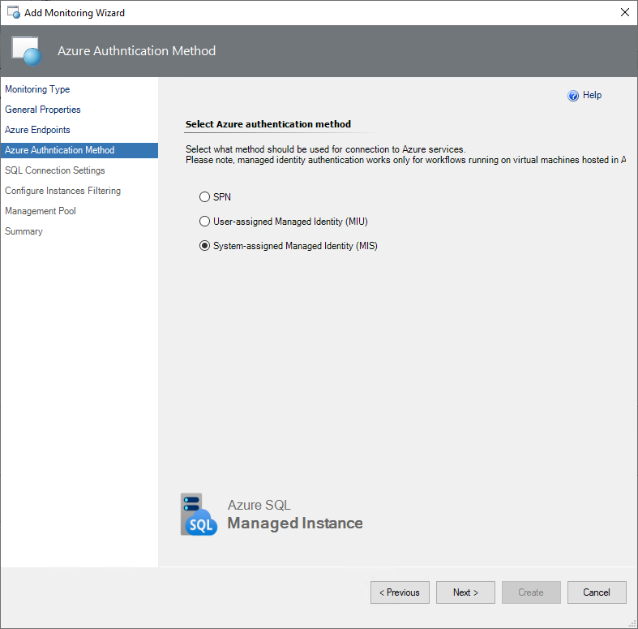

### SQL connection settings

At this step, select an authentication method that you want to use to connect to your managed instances.

There are two options:

- **Microsoft Entra ID**. Azure SQL Managed Instance must have enabled Entra ID Admin for this connection.
  
  Go to Azure SQL Managed Instance in Azure Portal -> Settings -> Microsoft Entra ID.

  Click **Set Admin** and specify an account. Save changes.

  Grant permissions for the Azure SQL Managed Instance to access Entra ID.

  > [!WARNING]
  > You need to be a Company Administrator or Global Administrator to Grant Read permission to the principal that represents Managed Instance identity.

- **SQL Credentials**. Create a new Run As account by selecting **New** and specifying an account name and connection credentials to access the managed instance.

    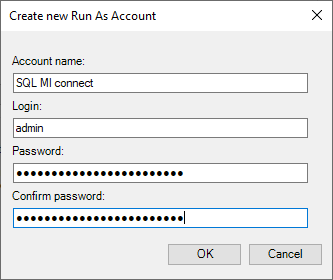

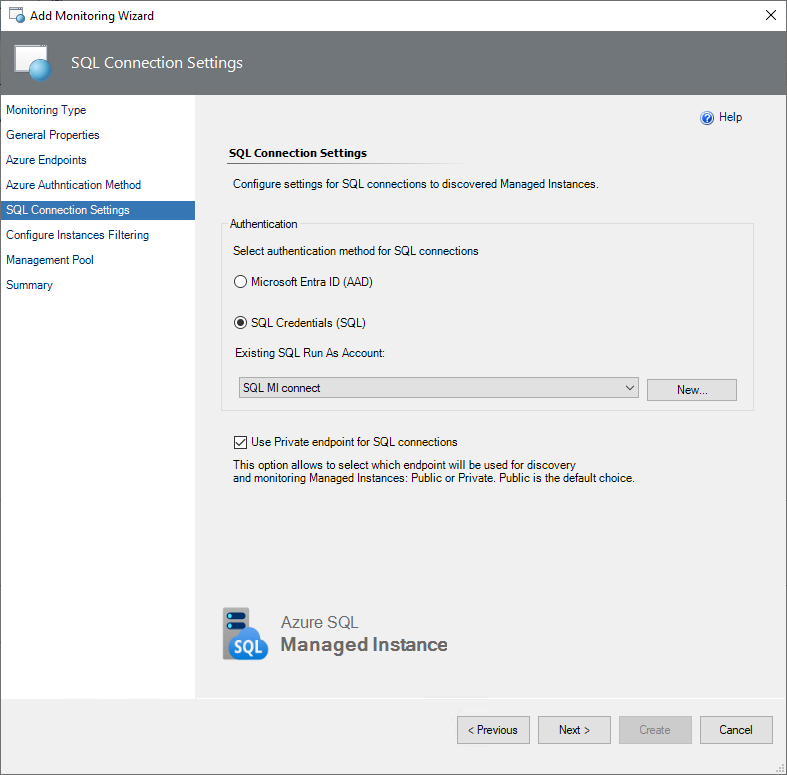

> [!IMPORTANT]
> The public endpoint is the default option for discovery and monitoring Managed Instances. Make sure that you have the appropriate security options configured for the connection. The private endpoint is also supported.

### Instances filtering

[Optionally] At the **Configure Instances Filtering** step, select filtering mode, which can be either **Exclude** or **Include**, and select filtering masks type, which can be either **Wildcard** or **Regular Expression**, enter filtering masks that should match Managed Instance names that you want to exclude from or include to the monitoring list, select **Add**, then select **Next**.

**Wildcard** filtering mask type can contain a server name only lowercase letters, numbers, and the '-' character, but can't start from or end with the '\\' character or contain more than 63 characters. A server exclude list filter mask ignores whitespaces.

**Regular Expression** filtering mask type supports [.NET regular expressions patterns](/dotnet/standard/base-types/regular-expressions).

If you want to remove an existing mask, select it and select **Delete**.

### Management pool

At this step, specify the Management Server pool which will be used for discovery and monitoring purposes. For more information, see [Azure SQL Managed Instance Monitoring Pool](managed-instance-management-pack-monitoring-pool.md).

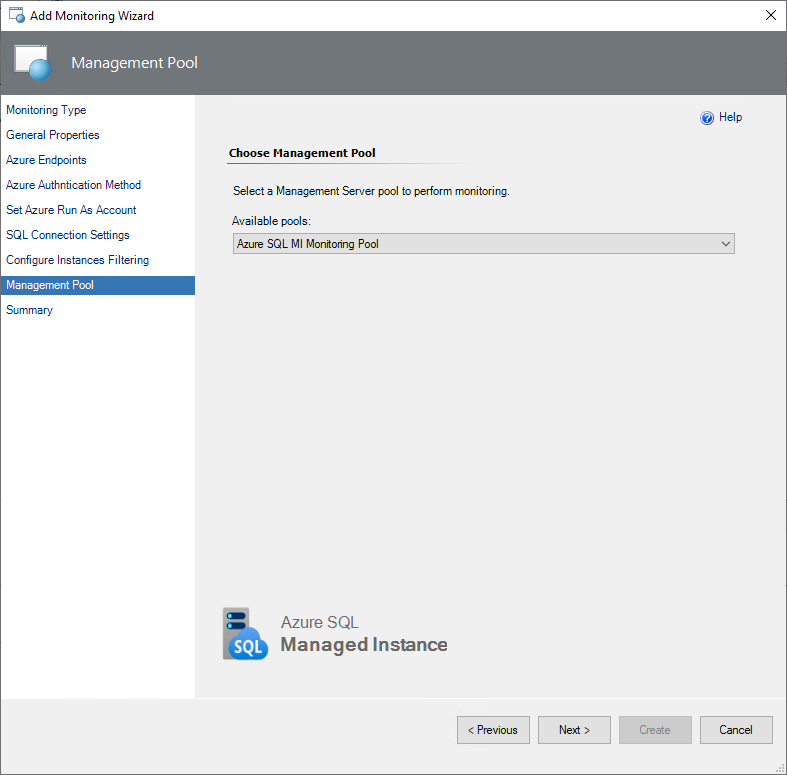

Confirm Run As account distribution to the selected management pool by completing the Summary step.

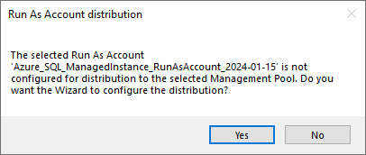

### Summary

At this step, review all the configuration and connection settings and select **Create**.

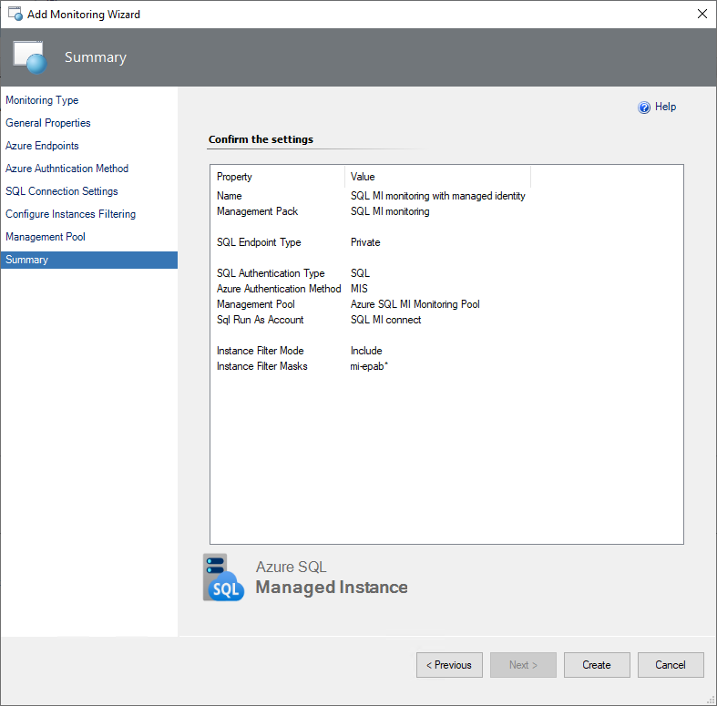

## User-assigned managed identity

### Prerequisites

1. Create user-assigned managed identity in Azure Portal

   Go to **Managed Identities** -> **Create** -> Specify the information and click **Review + Create**.

   For more details, got to [Creating a user-assigned managed identity](/entra/identity/managed-identities-azure-resources/overview-for-developers?tabs=portal%2Cdotnet#creating-a-user-assigned-managed-identity)

2. Assign identity to virtual machine with Management Server.

   Go to specified VM -> **Security** -> **Identity**.

   Click **Add** and select created user-assigned identity. Save the changes.

3. Grant Reader permission to the user-assigned identity for the subscription or specific resource group where your System Center Operations Manager and Azure SQL Managed Instances reside.

    Go to subscription or resource group -> **Access Control (IAM)** and click **Add**.

    Click **Add Role-assignment** and Select **Reader** permission in the Role tab.

    Assign-access to the managed identity in the Member tab and select your identity by the name.

    Save changes by clicking **Review + assign** button.

   For more details, check the [Adding permissions to the identity](/entra/identity/managed-identities-azure-resources/overview-for-developers?tabs=portal%2Cdotnet#adding-permissions-to-the-identity)

### Add Monitoring Wizard and create a destination management pack

To configure monitoring using the automatic monitoring template, perform the following steps:

1. In the System Center Operations Manager console, navigate to **Authoring | Management Pack Templates**, right-click **Azure SQL MI - Automatic**, and select **Add Monitoring Wizard**.

    

2. At the **Monitoring Type** step, select **Azure SQL MI - Automatic**, and select **Next**.

    

3. At the **General Properties** step, enter a name and description, and from the **Select destination management pack** dropdown list, select a management pack that you want to use to store the template.

    

### Azure endpoints

At this step, select the **Enable checkbox if you want to change default Azure Endpoints** checkbox, and modify the default Azure endpoints, if necessary. The default endpoints for creating Azure Service Principal Name are as follows:

- Authority URI: `https://login.microsoftonline.com`
- Management Service URI: `https://management.azure.com`
- Database Resource URI: `https://database.windows.net`  
- Graph API Resource URI: `https://graph.windows.net`

### Select Authentication Method

At this step, select user-assigned managed identity in the list. It means your management server will use user-assigned identity from its VM to connect to Azure SQL Managed Instance.

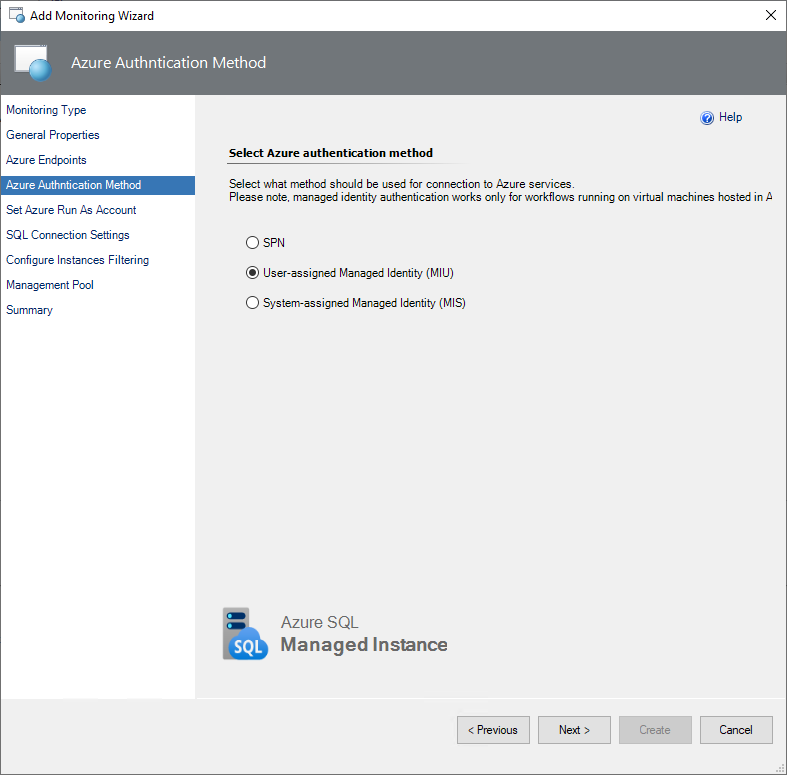

### Set Azure Run As Account

Create a new Run As account by selecting **New** and specifying an account name and user-assigned client ID to access the managed instance with managed identity.

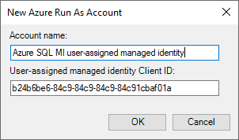

Once you've created the Run As Account associated with the managed identity, select it from the drop-down list, then select **Next**. This Run As Account will be used for authentication in Azure Cloud.

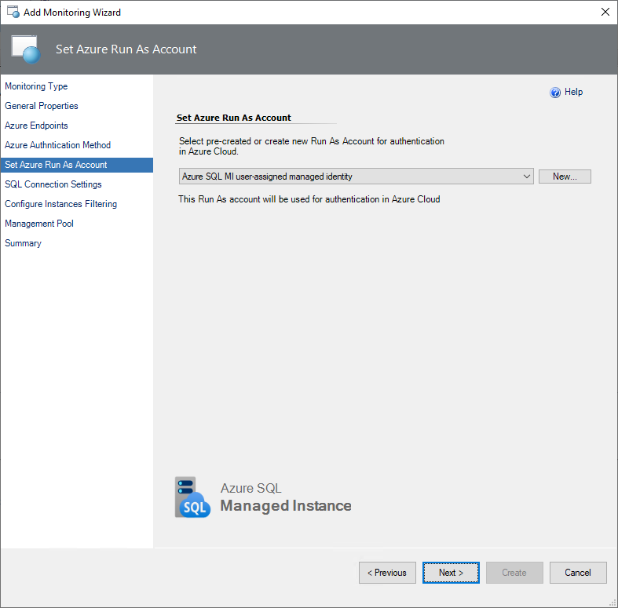

Next time you can just use created Run As Account with the user-assigned managed identity to fill in the new automatic monitoring template.

### SQL connection settings

At this step, select an authentication method that you want to use to connect to your managed instances.

There are two options:

- **Microsoft Entra ID**. Azure SQL Managed Instance must have enabled Entra ID Admin for this connection.
  
  Go to Azure SQL Managed Instance in Azure Portal -> Settings -> Microsoft Entra ID.

  Click **Set Admin** and specify an account. Save changes.

  Grant permissions for the Azure SQL Managed Instance to access Entra ID.

  > [!WARNING]
  > You need to be a Company Administrator or Global Administrator to Grant Read permission to the principal that represents Managed Instance identity.

- **SQL Credentials**. Create a new Run As account by selecting **New** and specifying an account name and connection credentials to access the managed instance.

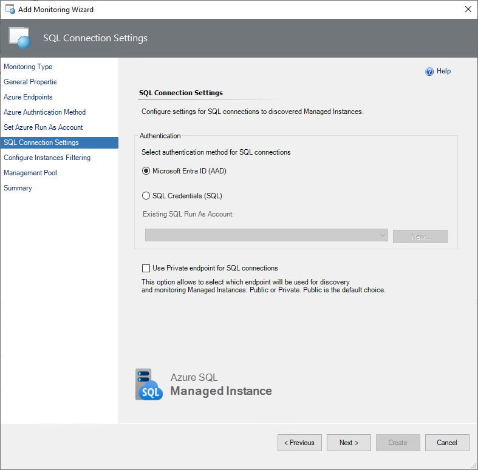

> [!IMPORTANT]
> The public endpoint is the default option for discovery and monitoring Managed Instances. Make sure that you have the appropriate security options configured for the connection. The private endpoint is also supported.

### Instances filtering

[Optionally] At the **Configure Instances Filtering** step, select filtering mode, which can be either **Exclude** or **Include**, and select filtering masks type, which can be either **Wildcard** or **Regular Expression**, enter filtering masks that should match Managed Instance names that you want to exclude from or include to the monitoring list, select **Add**, then select **Next**.

**Wildcard** filtering mask type can contain a server name only lowercase letters, numbers, and the '-' character, but can't start from or end with the '\\' character or contain more than 63 characters. A server exclude list filter mask ignores whitespaces.

**Regular Expression** filtering mask type supports [.NET regular expressions patterns](/dotnet/standard/base-types/regular-expressions).

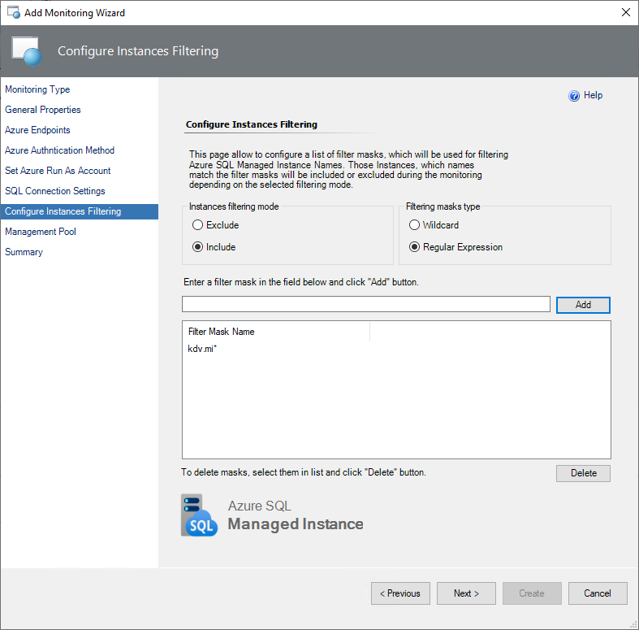

If you want to remove an existing mask, select it and select **Delete**.

### Management pool

At this step, specify the Management Server pool which will be used for discovery and monitoring purposes. For more information, see [Azure SQL Managed Instance Monitoring Pool](managed-instance-management-pack-monitoring-pool.md).

Confirm Run As account distribution to the selected management pool by completing the Summary step.

### Summary

At this step, review all the configuration and connection settings and select **Create**.

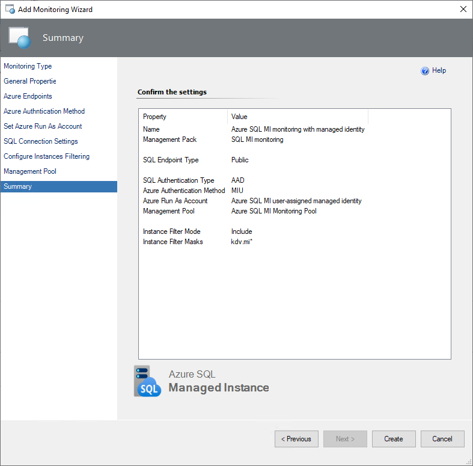