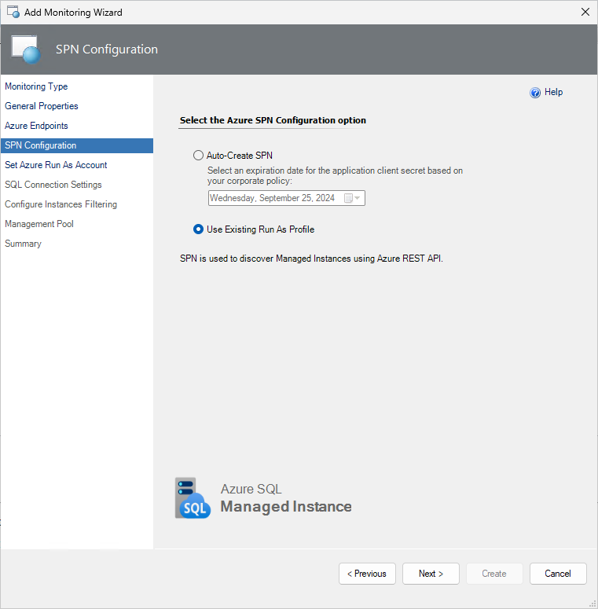
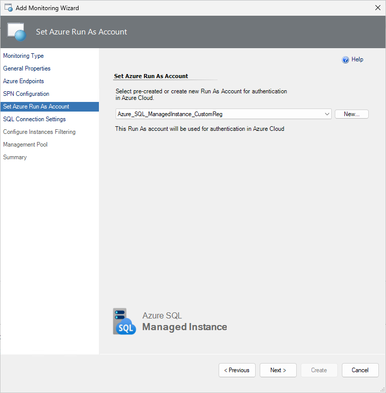
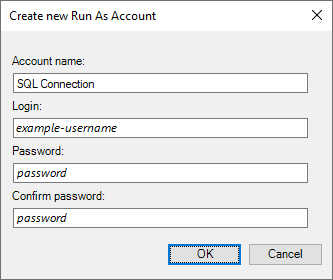
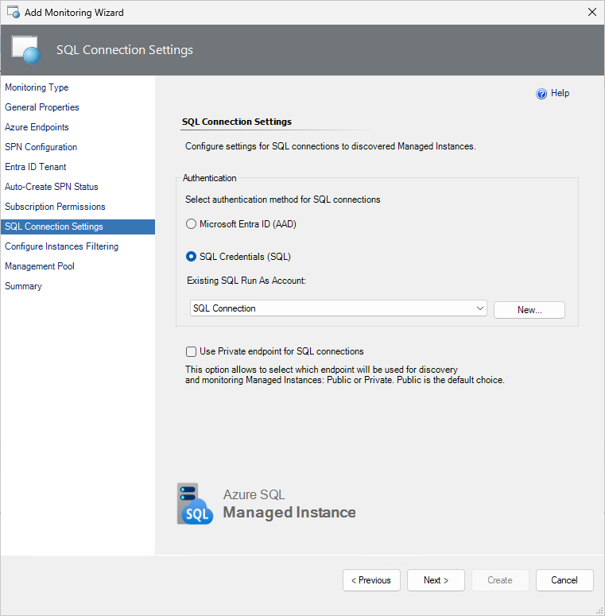
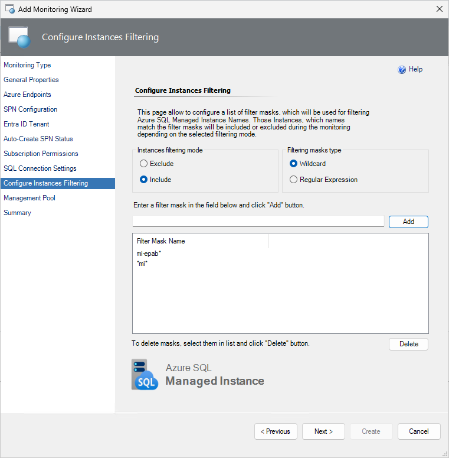
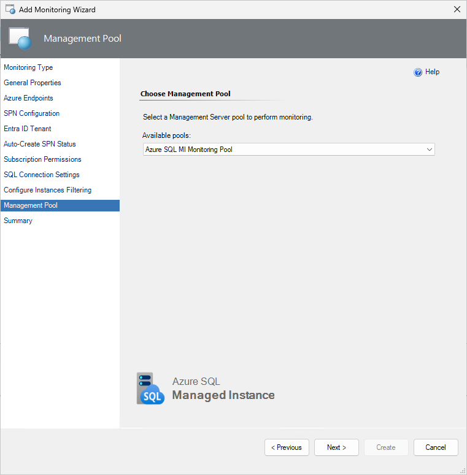

# Automatic monitoring template with Service Principal Name

Automatic monitoring template allows to configure monitoring by discovering all Azure SQL Managed Instances in the specified Azure subscription automatically. This article describes the automatic monitoring template creation using Service Principal Name (SPN). 

The Azure SQL Managed Instance management pack creates an SPN with the required permissions for the selected subscription when the automated template is populated.

The permission for a manually created SPN must be assigned using Azure Portal. For more information, see [Assign a role to the application](managed-instance-management-pack-service-principal.md#assign-a-role-to-the-application).

## Add Monitoring Wizard and create a destination management pack

To configure monitoring using the automatic monitoring template, perform the following steps:

1. In the System Center Operations Manager console, navigate to **Authoring | Management Pack Templates**, right-click **Azure SQL MI - Automatic**, and select **Add Monitoring Wizard**.

    

2. At the **Monitoring Type** step, select **Azure SQL MI - Automatic**, and select **Next**.

    

3. At the **General Properties** step, enter a name and description, and from the **Select destination management pack** dropdown list, select a management pack that you want to use to store the template.

    

## Azure endpoints

At this step, select the **Enable checkbox if you want to change default Azure Endpoints** checkbox, and modify the default Azure endpoints, if necessary. The default endpoints for creating Azure Service Principal Name are as follows:

- Authority URI: `https://login.microsoftonline.com`
- Management Service URI: `https://management.azure.com`
- Database Resource URI: `https://database.windows.net`  
- Graph API Resource URI: `https://graph.windows.net`

## SPN configuration

At this step, select the configuration option that corresponds to authentication in Azure Cloud.

### Auto-create SPN

Select this option if you want your Azure Service Principal Name to be created automatically by the Azure SQL MI MP library using the Azure REST API.

Ensure that the account that you use must have either the **Owner** role (or higher), **Active Directory Administrator**, **Service Administrator**, or **Сo-Administrator**.

Select an expiration date for the new application client secret based on your corporate policy, then select **Next**.

If you select the **Auto-Create SPN** option, the **Microsoft Azure sign-in** window will be displayed. In this window, enter your work, school, or personal Microsoft account credentials, select **Next**, and complete the form.

Specify the desired Microsoft Entra ID tenant with a specific SQL Managed Instance.

Upon the successful creation of the Azure AD application, at the **Auto-Create SPN Status** step, authentication data will be displayed.

> [!TIP]
> This information is available only once. Ensure to save this information to a secure location for reuse.

### Use existing Run As profile

If you want to use your own Azure Service Principal Name, at the **SPN Configuration** step, select the **Use Existing Run As Profile** option, then select **Next**.

For more information on how to create a Microsoft Entra application and service principal that can access resources, see [Create a Service Principal](managed-instance-management-pack-service-principal.md).

Once you've created the Run As Account associated with the Azure service principal name, select it from the drop-down list, then select **Next**. This Run As Account will be used for authentication in Azure Cloud.

## Subscription permissions

At this step, select the Azure subscriptions that you want to monitor, multiple subscriptions select is also supported.

## SQL connection settings

At this step, select an authentication method that you want to use to connect to your SQL Managed Instances.

> [!IMPORTANT]
> The public endpoint is the default option for discovery and monitoring Managed Instances. Make sure that you have the appropriate security options configured for the connection. The private endpoint is also supported.

You can also create a new Run As account by selecting **New** and specifying an account name and connection credentials to access the SQL Managed Instance.

Regardless of the selected option, ensure to grant required SQL permissions to the selected monitoring account for all the SQL Managed Instances. For more information, see [Security Configuration](managed-instance-management-pack-security-configuration.md).

## Instances filtering

[Optionally] At the **Configure Instances Filtering** step, select filtering mode, which can be either **Exclude** or **Include**, and select filtering masks type, which can be either **Wildcard** or **Regular Expression**, enter filtering masks that should match SQL Managed Instance names that you want to exclude from or include to the monitoring list, select **Add**, then select **Next**.

**Wildcard** filtering mask type can contain a server name only lowercase letters, numbers, and the '-' character, but can't start from or end with the '\\' character or contain more than 63 characters. A server exclude list filter mask ignores whitespaces.

**Regular Expression** filtering mask type supports [.NET regular expressions patterns](/dotnet/standard/base-types/regular-expressions).

If you want to remove an existing mask, select it and select **Delete**.

## Management pool

At this step, specify the Management Server pool which will be used for discovery and monitoring purposes. For more information, see [Azure SQL Managed Instance Monitoring Pool](managed-instance-management-pack-monitoring-pool.md).

Confirm Run As account distribution to the selected management pool by completing the Summary step.

## Summary

At this step, review all the configuration and connection settings and select **Create**.

