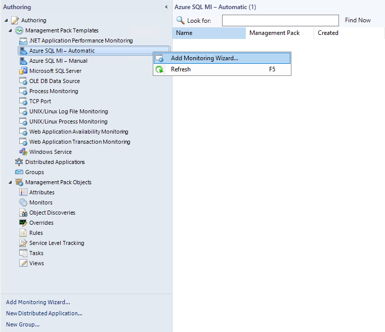
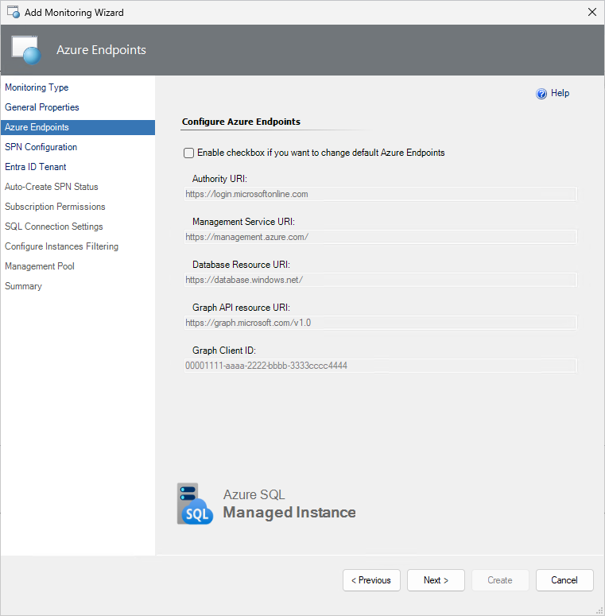
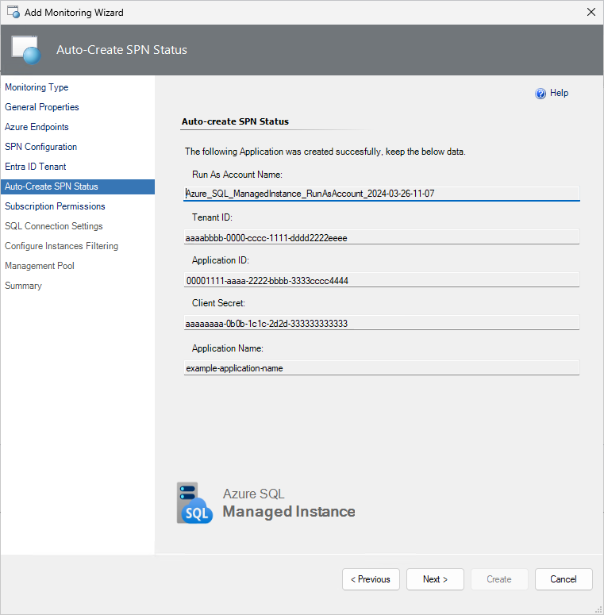
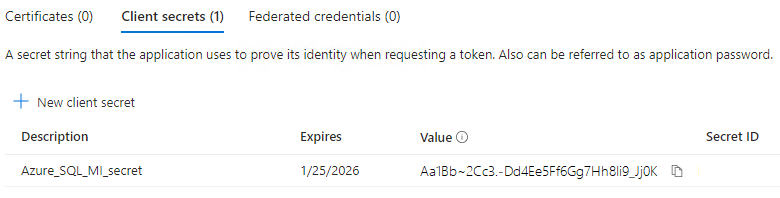

# Automatic Monitoring Template

Automatic monitoring template allows you to configure monitoring by discovering all managed instances in the specified Azure subscription automatically.

To configure monitoring using the automatic monitoring template, perform the following steps:

1. In the System Center Operations Manager console, navigate to **Authoring | Management Pack Templates**, right-click **Azure SQL MI - Automatic**, and select **Add Monitoring Wizard**.

    

2. At the **Monitoring Type** step, select **Azure SQL MI - Automatic**, and select **Next**.

    

3. At the **General Properties** step, enter a name and description, and from the **Select destination management pack** dropdown list, select a management pack that you want to use to store the template.

    

4. At the **Azure Endpoints** step, select the **Enable checkbox if you want to change default Azure Endpoints** checkbox, and modify the default Azure endpoints, if necessary. The default endpoints for creating Azure Service Principal Name are as follows:

   - Authority URI: `https://login.windows.net`
   - Management Service URI: `https://management.azure.com`
   - Database Resource URI: `https://database.windows.net`  
   - Graph API Resource URI: `https://graph.windows.net`

   

5. At the **SPN Configuration** step, select any of the following options:

   - **Auto-Create SPN**

       Select this option if you want your Azure Service Principal Name to be created automatically by the Azure SQL MI MP library using the Azure REST API.

       Ensure that the account that you use must have either the **Owner** role (or higher), **Active Directory Administrator**, **Service Administrator**, or **Сo-Administrator**.

        

        If you select the **Auto-Create SPN** option, the **Microsoft Azure sign-in** window will be displayed. In this window, enter your work, school, or personal Microsoft account credentials, select **Next**, and complete the form.

        

        Upon the successful creation of the Azure AD application, at the **Auto-Create SPN Status** step, authentication data will be displayed.

        > [!TIP]
        > This information is available only once. Ensure to save this information to a secure location for reuse.

        

   - **Use Existing Run As Profile**

       If you want to use your own Azure Service Principal Name, at the **SPN Configuration** step, select the **Use Existing Run As Profile** option, then select **Next**.

       

        For more information on how to create a Microsoft Entra application and service principal that can access resources, see the following [article](/azure/active-directory/develop/howto-create-service-principal-portal) or follow the steps below to create a single tenant application in the Azure portal:

        - Sign in to the [Azure portal](https://portal.azure.com).
        - Browse to **Microsoft Entra ID** > **App registrations** then select **New registration**.
        - Name the application, for example **Azure_SQL_ManagedInstance_App_customSPN**.
        - Select a supported account type, which determines who can use the application, then select **Register**.
        
        - Select **Certificates & secrets**, select **Client secrets**, and then Select **New client secret**.
        - Provide a description of the secret and a duration, then select **Add**.

            > [!TIP]
            > Once you've saved the client secret, the value of the client secret is displayed. This is only displayed once, so copy this value and store it to a secure location for reuse.

            

        - Staying in the portal, select the level of scope you wish to assign the application to. For example, to assign a role at the subscription scope, search for and select **Subscriptions**. If you don't see the subscription you're looking for, select **global subscriptions filter**. Make sure the subscription you want is selected for the tenant.
        - Select **Access control (IAM)**, select **Add**, then select **Add role assignment**.
        - In the **Role** tab, select the **Reader** role to assign to the application in the list, then select **Next**.
        - In the **Members** tab select **Assign access to**, then select **User, group, or service principal**.
        - Select **Select members** and find your application, search for it by its name. Select the **Select** button, then select **Review + assign**.
            
        Your service principal is set up. To start using it, at the **Set Azure Run As Account** monitoring wizard step, select **New** and complete the form with the values that you can find on the app's overview page:
            

        Once you've created the Run As Account associated with the Azure service principal name, select it from the drop-down list, then select **Next**. This Run As Account will be used for authentication in Azure Cloud.

        

6. At the **Subscription Permissions** step, select the Azure subscriptions that you want to monitor.

    

7. At the **SQL Connection Settings** step, select an authentication method that you want to use to connect to your managed instances.

    Regardless of the selected option, ensure to grant required permissions to the selected monitoring account for all the managed instances. For more information, see [Security Configuration](managed-instance-management-pack-security-configuration.md).

    

8. At the **Configure Instances Filtering** step, you can configure the filtering options:

   - Exclude

      Select this option to specify instances that shouldn't be discovered.

   - Include

      Select this option to specify only those instances that you want to be discovered.

    Use an asterisk to replace any symbol/symbols.

    

9. At the **Summary** step, review the connection settings and select **Create**.

    
