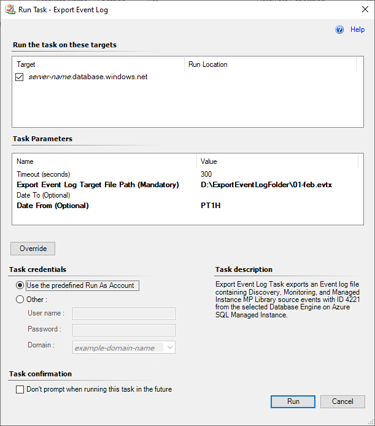

# Export Event Log Task

Export Event Log Task exports the Event log file containing Discovery, Monitoring, and Library Azure SQL Managed Instance MP source events with ID 4221 from the selected Azure SQL Managed Instance DB Engine.

## Steps to run the task

1. Verify debugging mode is turned on in the server monitoring Azure SQL Managed Instance. See more in [Enable Debugging](managed-instance-management-pack-enable-debugging.md).

2. Determine the log file location for saving:
   - Local computer

   - [File share (SMB) symbol server](/windows-hardware/drivers/debugger/file-share--smb--symbol-server)

3. In the System Center Operations Manager console, navigate to the **Database Engines view** and select the desired Azure SQL Managed Instance Database Engine. Select the **Export Event Log** task on the right pane Tasks dropdown.

4. Use the **Override** button to fine-tune the task parameters.

5. Specify the **Task Credentials** for the target Azure SQL Managed Instance DB Engine according and run the task. Date and/or time must be specified in at least one parameter.

**Use the predefined Run As Account** mode uses credentials for Azure SQL Managed Instance which were added in Monitoring Template to discover Azure SQL MI. This account was distributed to connect to selected Azure SQL MI. 

For using **Other** credentials create new account in the server connecting with Azure SQL MI with type `Windows account` and configure the distribution in the System Center Operations Manager.

## Tasks parameters

- **Timeout (seconds)**

    Specifies the time the rule is allowed to run before being stopped and marked as failed. The default value is 300 seconds, which can be changed.

- **Export Event Log Target File Path (Mandatory)**

    Specify the folder path, desired file name, and extension with Windows Event Viewer formats - .evtx, .evt, .etl.

- **Date To (Optional)**

    Specify the date and time until which the log file will be exported.

- **Date From (Optional)**

    Specify the date or time from which the log file will be exported.

## Date and time formats for override task parameters

Supported formats are **InvariantCulture** date time and **ISO 8106** durations. These formats can be combined in a single request. It's also possible to use date fields separately, only "Date from" or "Date to". If the date fields aren't filled in the overrides, an event log file is created with the entire existing log history from the selected instance.

The following date time formats can be used:

|Parameter|Format|
|-|-|
|Date|MM-YYYY-DD|
|| MM-YYYY
||YYYY-MM|
|Time|HH AM/PM|
||HH:MM:SS GMT|
||HH:MM:SS +H:00|

Separate the date numbers with symbols: ".", "/", "-".

The following parameters for specifying the duration range:

|Parameter|Definition|
|-|-|
|P|Duration designator, placed at the start of duration expression|
|Y|A number of years|
|M|A number of months|
|D|A number of days|
|T|Time designator, placed after the date range and before the time range|
|H|A number of hours|
|M|A number of minutes|
|S|A number of seconds|

**P1Y1DT30M.01S** means 1 year 1 day 30 minutes and 10 milliseconds.
**P1MT8H** means 1 month and 8 hours.
**PT1H15M** means 1 hour and 15 minutes.
**PT45M30S** means 45 minutes and 30 seconds.
  
## InvariantCulture date time examples

- The time range is one day.

    Date From=06/2023/15 and Date To=06/2023/16. An event log file is created with events from the whole day of June 15.

    >[!WARNING]
    > Specifying the range Date From and Date To with single date but without a time, creates a blank file.  

- The time range is several hours.

    Date From=2023-06-15T09:29:10.0000000Z and Date To=2023-06-15T19:29:10.0000000Z. The log is exported to the file according to the specified period.

    Date From=10:00:00 AM and Date To=06:30:00 PM. When the time is specified, but the date is not, the event log file is generated for the current day according to the specified time range.

- The time range is several days.

    Date From=06/2023/15 and Date To=06/2023/30. An event log file contains events from June 15 till the end of June 29.

    Date From=06/2023 and Date To=06/2023. An event log file is created with events from the whole month of June.

## Duration range examples

- The time range is last hour.

   Date From is empty and Date To=PT1H.

- The time range is one day (the previous 24 hours since the request time).

   Date From is empty and Date To=P1D.

- The time range is a specific period during the current day.

   Date From=PT10H30M30S and Date To=PT3H30M.

   An event log file is created with the log history exported for the period starting 10 hours, 30 minutes, and 30 seconds before the request time and ending 3 hours and 30 minutes before the request time.
