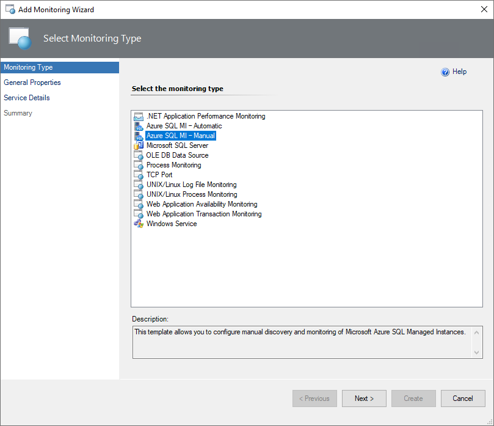
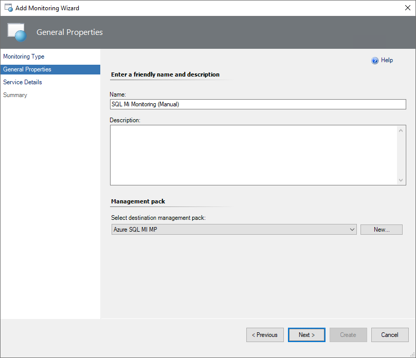
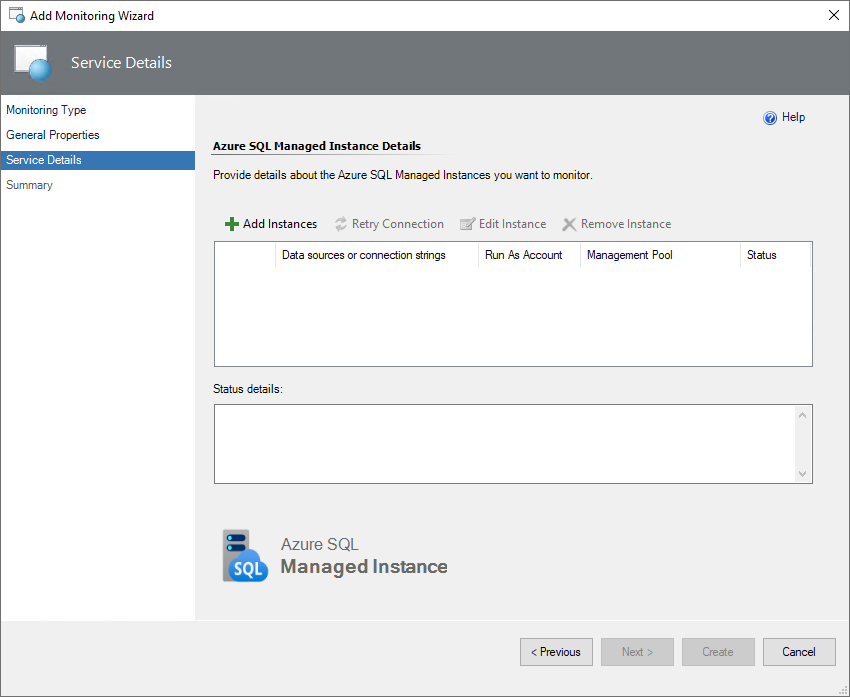
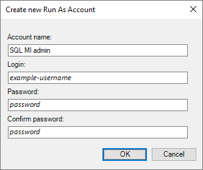
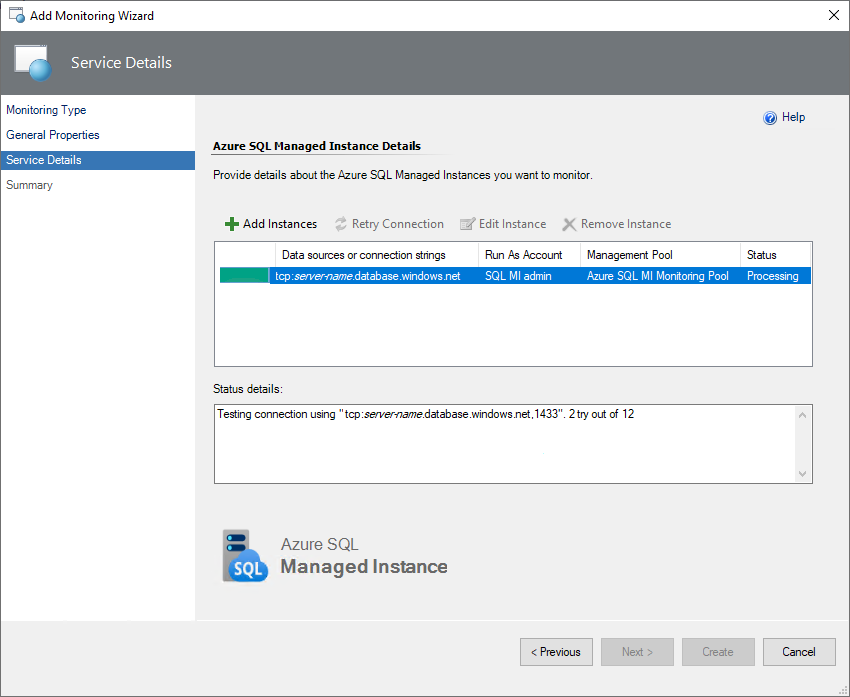
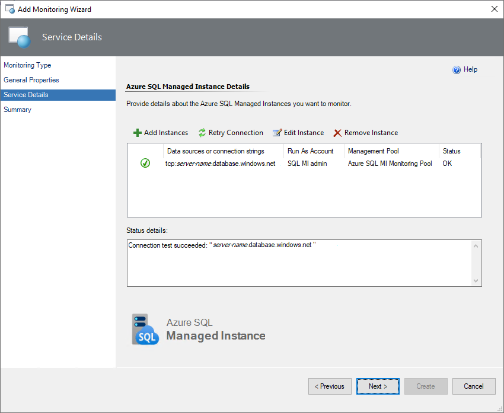
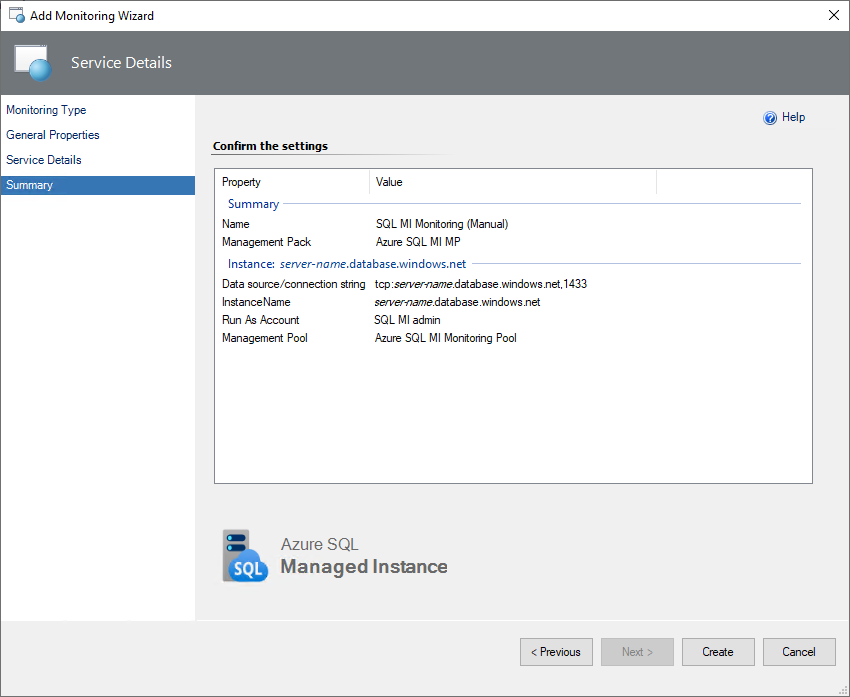

# Manual monitoring template

This article explains how to configure manual monitoring template in Management Pack for Azure SQL Managed Instance. Manual monitoring template allows you to add the selected instances to the monitoring list by specifying connection strings manually.

## Add Monitoring Wizard and create a destination management pack

To add wizard and create a management pack, follow these steps:

1. In the System Center Operations Manager console, navigate to **Authoring | Management Pack Templates**, right-click **Azure SQL MI - Manual**, and select **Add Monitoring Wizard**.

    

2. At the **Monitoring Type** step, select **Azure SQL MI - Manual**, and select **Next**.

    

3. At the **General Properties** step, enter a name and description, and from the **Select destination management pack** dropdown list, select a management pack that you want to use to store the template.

    

    You can also create a new management pack by selecting **New**.

## Service details

At this step, to add a new instance, select **Add Instances**.



In the **Add Instances** window, select a Run As Account with the appropriate SQL credentials, and specify data sources and (or) connection strings. Follow the instructions provided in the wizard to avoid errors.


Use the standard security connection string format to specify the connection settings:

```
Server=<ServerAddress>;Database=<DatabaseName>;
```

You can get a connection string for a managed instance using the Azure portal.

To create a Run As account from the connection string, use the following format:  

```
Server=<ServerAddress>;Database=<DatabaseName>;User Id=***;Password=***;
```

You can also create a new Run As account by selecting **New** and specifying an account name and connection credentials to access the managed instance.



After you select **OK** in the **Add Instances** window, a connection test will be performed.



After the connection test is complete, you can view and edit the properties of the added instance. For that, select an instance and select **Edit Instance**. You can also delete the added instance.

> [!NOTE]
> The monitoring template wizard may show the following error: "An error occurred discovery: A connection was successfully established with the server, but then an error occurred during the login process" or the “Monitoring error” exception while checking connection. For more information, see [Known Issues and Troubleshooting](managed-instance-management-pack-known-issues-and-troubleshooting.md).



## Summary

At this step, review all the configuration and connection settings and select **Create**.



## Related content

- [Security configuration in Management Pack for Azure SQL Managed Instance](managed-instance-management-pack-security-configuration.md)
