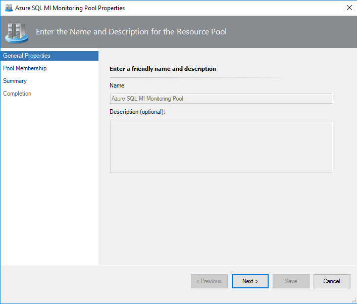
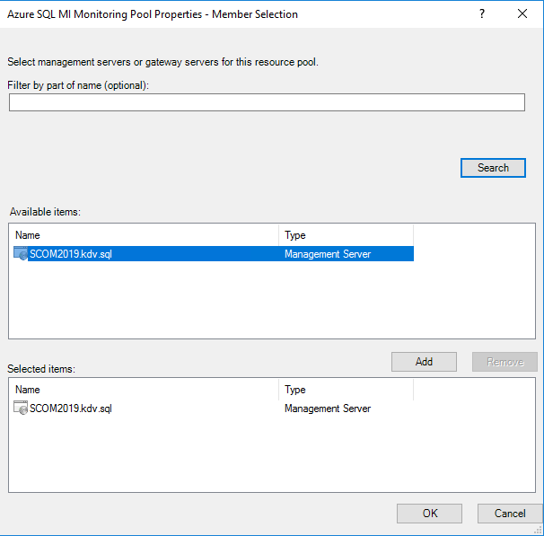
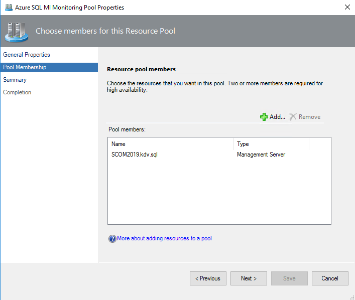
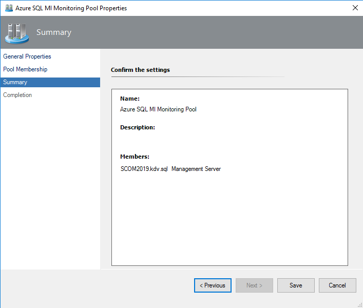

# Managed Instance Monitoring Pool

To configure a monitoring pool using the Operations Manager console, perform the following steps:

1. Navigate to **Administration | Resource Pools**, right-click **Azure SQL MI Monitoring Pool**, and select the **Manual Membership** option.

2. Click **Properties**.

3. At the **General Properties** step, enter a name and description for the resource pool, and click **Next**.

    

4. At the **Pool Membership** step, click **Add**, select management or gateway servers and click **OK**.

    If the pool is empty, it mirrors the contents of the **All Management Servers** pool. The pool can contain either gateways or management servers, but not both at the same time.

    

5. Click the **Next**.

    

6. At the **Summary** step, check the settings and click **Save**.

    

7. At the **Completion** step, click **Close**.
