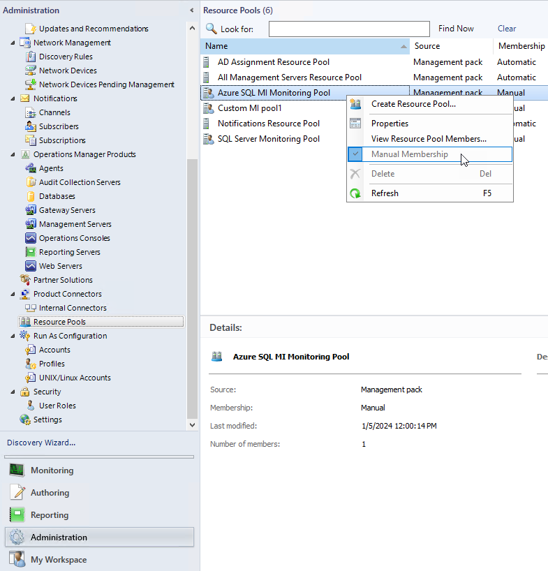
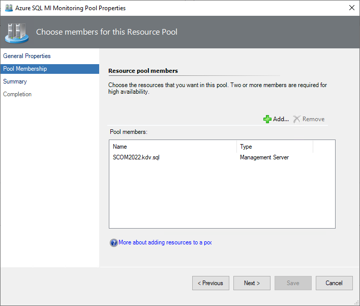
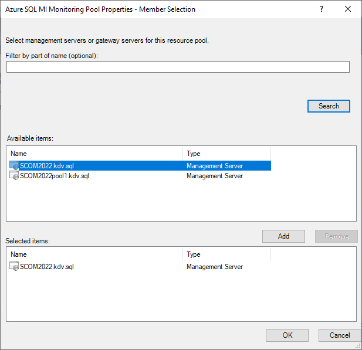
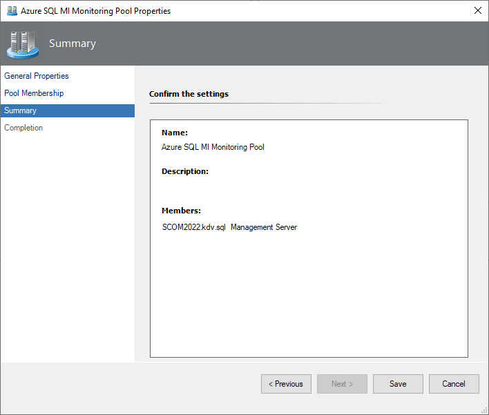

# Azure SQL Managed Instance Monitoring Pool

You can configure Azure SQL MI Monitoring Pool manually by adding custom gateways and management servers. Custom management server resource pools are also supported.

To configure a monitoring pool using the Operations Manager console, perform the following steps:

1. Navigate to **Administration | Resource Pools**, right-click **Azure SQL MI Monitoring Pool**.

2. Select the **Manual Membership** option, then right-click again **Azure SQL MI Monitoring Pool** and select **Properties**.

   

3. In the **Azure SQL MI Monitoring Pool** Properties window, open the **Pool Membership** tab and select **Add** to populate the monitoring pool.

    

4. If the pool is empty, it mirrors the contents of the **All Management Servers** pool. The pool can contain either gateways or management servers, but not both at the same time.

    

5. At the **Summary** step, check the settings and select **Save**.

    
