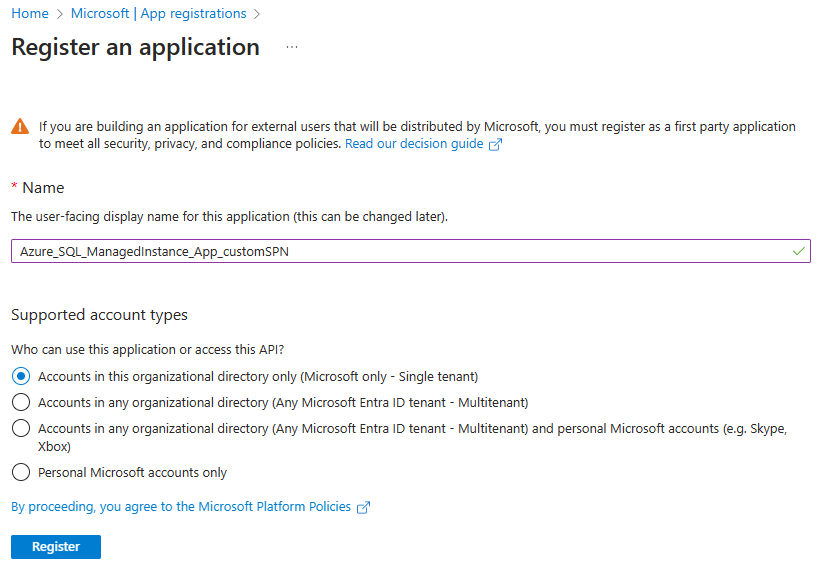
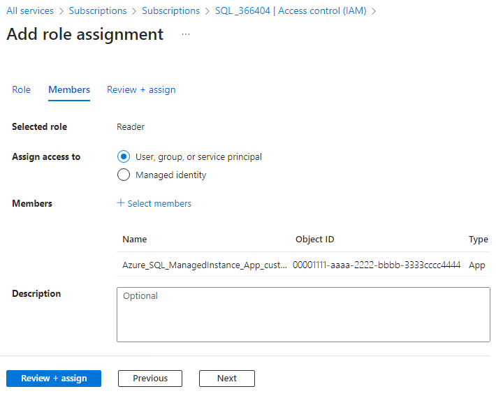
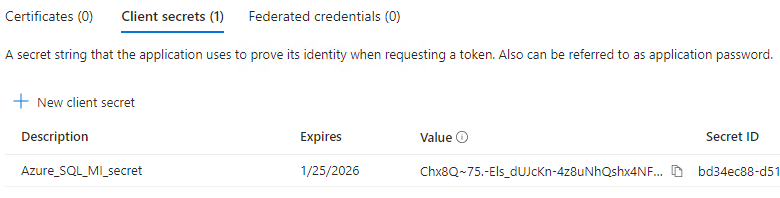
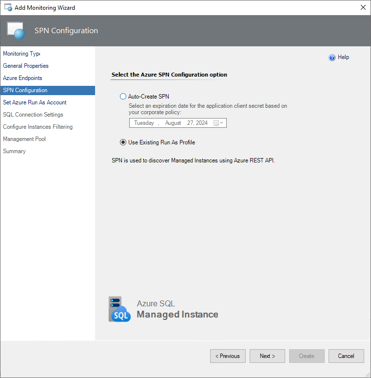
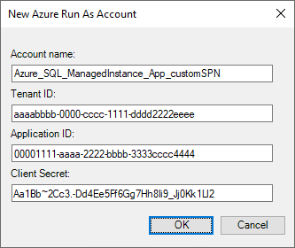
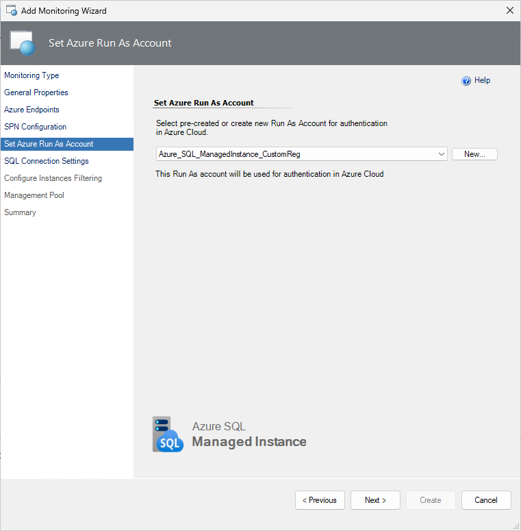

# Create a Service Principal

In this article, you'll learn how to create a Microsoft Entra application and service principal that can be used with the role-based access control for authenticate Azure SQL Managed Instance management pack workflows in Azure Cloud.

When you register a new application in Microsoft Entra ID, a service principal is automatically created for the app registration. The service principal is the app's identity in the Microsoft Entra tenant. Access to resources is restricted by the roles assigned to the service principal, giving you control over which resources can be accessed and at which level. For security reasons, it's always recommended to use service principals with automated tools rather than allowing them to sign in with a user identity.

In this article, you'll create a single tenant application in the Azure portal. This example is applicable for line-of-business applications used within one organization. You can also [use Azure PowerShell](/entra/identity-platform/howto-authenticate-service-principal-powershell) or the [Azure CLI](/cli/azure/create-an-azure-service-principal-azure-cli) to create a service principal.

## Prerequisites

Before you register an application in your Microsoft Entra tenant, ensure that you have:

A Microsoft Entra user account. If you don't already have one, you can [create an account for free](https://azure.microsoft.com/free/?WT.mc_id=A261C142F).

## Permissions required for registering an app

You must have sufficient permissions to register an application with your Microsoft Entra tenant, and assign to the application a role in your Azure subscription. To complete these tasks, you require `Application.ReadWrite.Allpermission.`

## Register an application with Microsoft Entra ID and create a service principal

To register an application and create a service principal, follow these steps:

1. Sign in to the [Azure portal](https://portal.azure.com).
2. Browse to **Microsoft Entra ID** > **App registrations** then select **New registration**.
3. Name the application, for example **Azure_SQL_ManagedInstance_App_customSPN**.
4. Select a supported account type, which determines who can use the application, then select **Register**.

    

    > [!TIP]
    > You can skip the Web URI redirection, this parameter is not needed for monitoring.

You've created your Microsoft Entra application and service principal.

## Assign a role to the application

To access resources in your subscription, you must assign a role to the application. Decide which role offers the right permissions for the application, however, for authenticating Azure SQL Managed Instance management pack workflows in Azure Cloud the **Reader** role is enough.

You can set the scope at the level of the subscription, resource group, or resource. Permissions are inherited to lower levels of scope.

To assign a role to the application, follow these steps:

1. Staying in the portal, select the level of scope you wish to assign the application to. For example, to assign a role at the subscription scope, search for and select **Subscriptions**. If you don't see the subscription you're looking for, select **global subscriptions filter**. Make sure the subscription you want is selected for the tenant.
2. Select **Access control (IAM)**, select **Add**, then select **Add role assignment**.
3. In the **Role** tab, select the **Reader** role to assign to the application in the list, then select **Next**.
4. In the **Members** tab select **Assign access to**, then select **User, group, or service principal**.
5. Select **Select members** and find your application, search for it by its name. Select the **Select** button, then select **Review + assign**.

    

## Sign in to the application

When programmatically signing in, pass the tenant ID and the application ID in your authentication request. You also need a certificate or an authentication key.

To obtain the directory (tenant) ID and application ID, follow these steps:

1. Browse to **Identity** > **Applications** > **App registrations**, then select your application.
2. On the app's overview page, copy the Directory (tenant) ID value and store it in your application code.
3. Copy the Application (client) ID value and store it in your application code.

## Set up authentication

There are two types of authentication available for service principals: password-based authentication (client secret) and certificate-based authentication. In this article the password-based authentication (client secret) will be used.

### Create a new client secret

To create a new client secret, follow these steps:

1. Browse to **Microsoft Entra ID** > **App registrations**, then select your application.
2. Select **Certificates & secrets**, select **Client secrets**, and then Select **New client secret**.
3. Provide a description of the secret and a duration based on your corporate policy, then select **Add**.

    > [!TIP]
    > Once you've saved the client secret, the value of the client secret is displayed. This is only displayed once, so copy this value and store it to a secure location for reuse.

    

Your service principal is set up.

## Set Azure Run As account

To start using the service principal, go to the System Center Operations Manager **Authoring** pane and select [Automatic Monitoring Template](managed-instance-management-pack-automatic-monitoring-service-principal-name.md#add-monitoring-wizard-and-create-a-destination-management-pack).

At the **SPN Configuration** monitoring wizard step use **Use Existing Run As Profile**.

At the **Set Azure Run As Account** step, select **New** and complete the form with the values that you can find on the app's overview page:

Once you've created the Run As Account associated with the Azure service principal name, select it from the drop-down list, then select **Next**. This Run As Account will be used for authentication in Azure Cloud.

