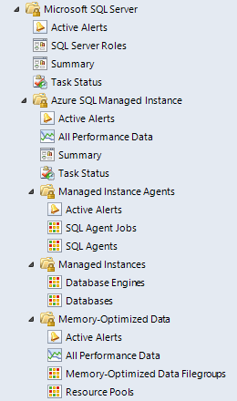

# Views and Dashboards in Management Pack for Azure SQL Managed Instance

Management Pack for Azure SQL Managed Instance introduces a common folder structure described in [Views and Dashboards in Management Pack for SQL Server](sql-server-management-pack-views-and-dashboards.md).

The following figure shows an example of views that are available in Management Pack for Azure SQL Managed Instance.

Some of these views may consist of a very long list of objects and metrics. To find specific objects, you can use the **Scope**, **Search**, and **Find** buttons on the Operations Manager toolbar. For more information, see [Finding data and objects in the Operations Manager consoles](manage-console-finding-data.md).