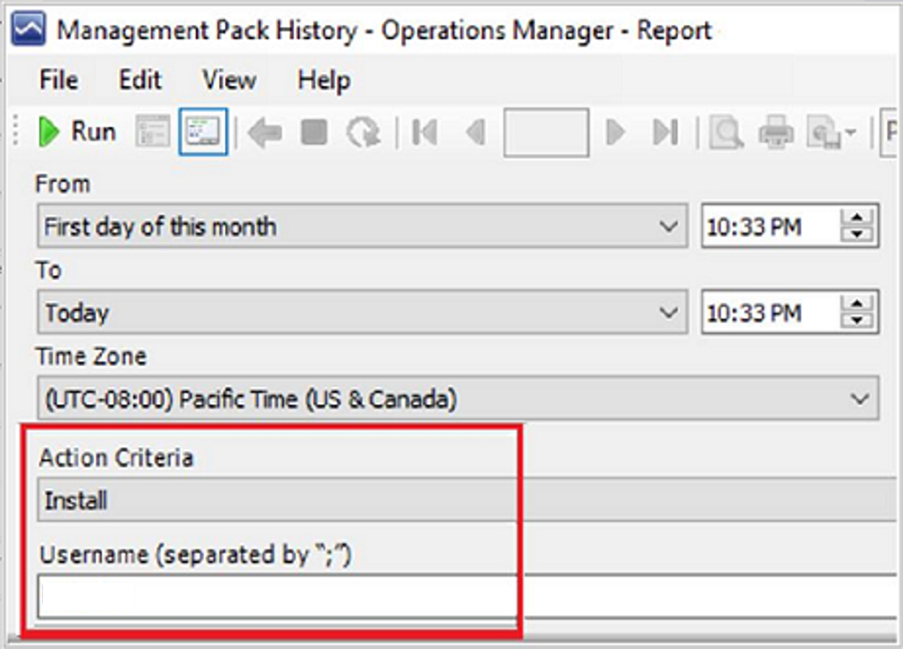
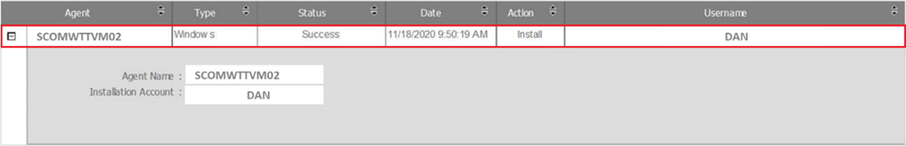

# Track changes in Operations Manager

In System Center - Operations Manager, user roles are defined to potentially change monitoring settings for applications and services through management packs. There can be multiple users associated with a single user role. In earlier versions of Operations Manager, there was no tracking of these changes to identify the user who has done the changes and when.

The track changes includes the following:

- [Change tracking for Management pack history](#change-tracking-for-management-pack-history)
- [Change tracking for Management pack objects](#change-tracking-for-management-pack-objects)
- [Change tracking for Overrides tracking](#change-tracking-for-overrides-tracking)
- [Change tracking for Data grooming settings](#change-tracking-for-data-grooming-settings)
- [Change tracking for agent and monitor health reset](#change-tracking-for-agent-and-monitor-health-reset)

## Change tracking for Management pack history

> [!NOTE]
> This feature is applicable for 2019 UR2 and later.

Operations Manager 2019 supports change tracking in management packs. Change tracking is enabled by default in 2019 UR2 to track and report the changes on the management packs and management pack objects.

Three new reports **Management Pack History**, **Management Pack Objects** and **Overrides tracking** are now available to display the changes. These reports are available under **Reporting** > **Microsoft Generic Report library**.

You can use the filters available in the reports to set the criteria and get the reports per your requirement.

This article details the reports used for change tracking and how to use them.

The management pack history report generates the list of all the management packs, which are either imported or deleted on any management server in your management group. You can filter the report by date, action, and username.

**Example:** Report of all the management packs imported by Bob and Dan from first day of last month till date. You can apply the filters as shown in the following example and generate the report for this user.

The report displays the following fields and values:

| **Field** | **Description** |
| --- | --- |
| **Management Pack** | Name of the management pack on which the action was performed. |
| **Version** | Version of the management pack on which the action was performed. |
| **Date** | Date and time when this action was performed. |
| **Action** | Type of the action performed - install or delete. |
| **Username** | Name of the user who has performed the action on the management pack.|

**Sample report:**

> [!NOTE]
> - Any management packs, which were imported/deleted/updated prior to UR2 upgrade will be captured in the report, but user context will not be captured for these.
> - Any update on management pack will be captured in two entries in the report. First entry for deletion of older management pack version and second entry for the installation of new version.

### Change tracking for Management pack objects

The management pack objects report tracks and generates the list of all management pack objects, which are newly created or deleted from the management server. This report also tracks edits on management pack objects like renaming a group/monitor/rule or adding/deleting a member in the group etc.

- This report displays the history of those management pack objects, which are changed after the upgrade of Operations Manager management server to UR2.
- Any management pack objects, which were created/deleted/edited prior to UR2 upgrade will also be shown in the report, but user context will not be captured for these objects.

You can filter the reports by date, username, management pack, action criteria (new, delete or edit) and type of objects.

**Example**: If you want to see all the new monitors created by user Dan in the past One month, then you will select the filters as shown in the following example:

The management pack object report contains the following fields and values:

| **Field** | **Description** |
| --- | --- |
| **Management pack name** | Name of the management pack to which the changed objects belong to. |
| **Object Name** | Name of the object, which was created/deleted/edited. |
| **Object Type** | Type of the object. Example: Monitor/Rule/Group/Module. |
| **Affected property** | The property of the object that was edited. |
| **Old Value** | Previous values of the affected property. |
| **New Value** | New value of the affected property. |
| **Date** | Date and time when the action was performed. |
| **Action Type** | Type of the action performed on the object such as add/delete/edit. |
| **Username** | Name of the user who has performed the action. |

### Change tracking for Overrides tracking

Overrides are created to tune monitoring. Multiple user roles can create these overrides in Operations Manager. When different users create overrides, it becomes crucial to track and capture the user who made these changes and when. With **Overrides tracking report,** all the overrides either created through console, PowerShell, or SDK APIs are captured.

This report has relevant fields/information to track overrides in detail such as **Management pack name, Object name, Object type, Affected Property, Old value, New value, Target of the object type and Date**. To view detailed information for every changed parameter, expand each of these rows, the results are grouped by management pack name.

**Filtering**: You can filter the report by username, type of object, management pack name and date, which makes it simple to track the changes you are interested in.

### Change tracking for Data grooming settings

Grooming settings are tied with management pack grooming settings for data warehouse. This means, by default, three versions of management packs and 400 days old data will be shown in the reports. For example: whenever you make a change in *MyCustomMP* and save your changes in a new version as v1, v2, v3, v4 over Seven days. Then by default, v1 will be groomed and you will only see changes for v2, v3 and v4. Besides this, any change which is 400 days old will be groomed.

## Change tracking for agent and monitor health reset

> [!NOTE]
> This feature is applicable for 2019 UR3 and later.

In System Center Operations Manager, user roles (profiles) are defined to access and perform actions on the monitored objects. As Operations Manager is a monitoring platform, multiple users interact with Operation Manager to monitor the data that is relevant to their role. A profile is defined for a group of users that imposes role-based security, and limit privileges that users have for various aspects of Operations Manager. When multiple users access and change the same object, it gets difficult to identify the user who has done the changes and when.

Operations Manager 2019 UR3 introduces further enhancements to the change tracking feature and supports change tracking for agent and monitor health reset. The following two reports are added to Microsoft generic report library:

1. **Agent tracking**: Reports all install/uninstall/repair/upgrade actions on Windows/Linux agent.
2. **Monitor health reset tracking**: Reports on monitor health reset status.
   For this feature to function, execute the script `DataWarehouseJobStatusSynchSproc.sql` in SQL Server Management Studio (SSMS) on operations manager database, before applying 2019 UR3 patches.

   > [!NOTE]
   > `DataWarehouseJobStatusSynchSproc.sql` script is available with the UR3 patches.

### View changes on agent

You can have a consolidated view of all the changes made to an agent under **Reports**. You can export the list to an Excel, PDF, Notepad and edit the exported content. You can filter the report by date, type of action (Install/Repair/ Upgrade/Uninstall/) and agent name.

**Example**: The following report shows the line items that are sorted by date/time with the latest item displayed in the top row. Click **+** to view the changed values.

### View monitor health reset actions

You can view health reset actions on the monitors as a consolidated view under **Reports**. You can export the list to an Excel, PDF, Notepad and edit the exported content. You can filter the report by date/time, username, and monitor name.

**Example**: The following report has the monitor name as **Operating System Performance Rollup** and Entity is **SCSCOMBEVM40085.smx.net**.

If you search for **SCSCOM**\* or **Operating System**\* or **\*.smx.net** etc., the monitor is displayed under **Available items.**

## Known issues

- When you upgrade Operations Manager 2019 server, you might see event ID 33333 and 31552 in event logs. These events might generate some alerts in the Operations Manager. Once the upgrade is complete, alerts and events will be resolved automatically.
- For Microsoft.SystemCenter.DBUpdateHelper management pack user context will not be captured.
- During the upgrade of management servers, some management packs that are imported, do not capture the user context. Once the upgrade is complete, then the user context will be captured. To make sure change tracking feature captures all transactions, upgrade all management servers.

## Next steps
- [Create, import or export a management pack](manage-mp-import-remove-delete.md)
- [Override a rule or monitor](manage-mp-override-rule-monitor.md)
