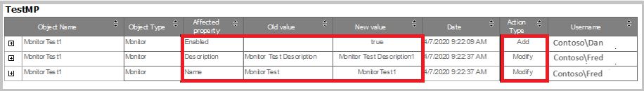

# Track changes in Operations Manager

::: moniker range="sc-om-2019"

In System Center - Operations Manager, user roles are defined to potentially change monitoring settings for applications and services through management packs. There can be multiple users associated with a single user role. In the earlier versions of Operations Manager, there was no tracking of these changes to identify the user who has done the changes and when.

As Operations Manager is a monitoring platform, multiple users interact with Operations Manager to monitor the data that's relevant to their role. A profile is defined for a group of users that imposes role-based security, and limit privileges that users have for various aspects of Operations Manager. When multiple users access and change the same object, it gets difficult to identify the user who has made the changes and when.

With Operations Manager 2019 UR2, change tracking feature was introduced. Change tracking is enabled by default in 2019 UR2 to track and report the changes on the management packs and management pack objects. 2019 UR3 supports change tracking for agent and monitor health reset status.

::: moniker-end

::: moniker range="sc-om-2022"

The change tracking feature in Operations Manager tracks and reports the changes on the management packs and management pack objects. It also supports tracking for agent and monitor's health reset status.

The change tracking feature is enabled by default. With Operations Manager 2022, all change tracking reports are available in one single folder by the name **Change Tracking**.

::: moniker-end

See the following sections for detailed information on the change tracking feature:

- [Change tracking for management packs](#change-tracking-for-management-packs)
- [Change tracking for agent](#change-tracking-for-agent)
- [Change tracking for monitor health reset](#change-tracking-for-monitor-health-reset)

## Change tracking for management packs

Three reports **Management Pack History**, **Management Pack Objects**, and **Overrides tracking** are available to display the changes.

::: moniker range="sc-om-2019"

These reports are available under **Reporting** > **Microsoft Generic Report library**.

::: moniker-end

::: moniker range="sc-om-2022"

These reports are available under **Reporting** > **Microsoft Change Tracking Report Library**.

::: moniker-end

You can use the filters available in the reports to set the criteria and get the reports per your requirement.

The following sections detail the reports used for change tracking in management packs and how to use them.

### Change tracking for management pack history

::: moniker range="sc-om-2019"

> [!NOTE]
> This feature is applicable for 2019 UR2 and later.

::: moniker-end

The management pack history report generates the list of all the management packs, which are either imported or deleted on any management server in your management group. You can filter the report by date, action, and username.

**Example:** Report of all the management packs imported by Bob and Dan from the first day of the last month till date. You can apply the filters as shown in the following example and generate the report for this user.

This report displays the following fields and values:

| **Field** | **Description** |
| --- | --- |
| **Management Pack** | Name of the management pack on which the action was performed. |
| **Version** | Version of the management pack on which the action was performed. |
| **Date** | Date and time when this action was performed. |
| **Action** | Type of the action performed - install or delete. |
| **Username** | Name of the user who has performed the action on the management pack.|

**Sample report:**

::: moniker range="sc-om-2019"

> [!NOTE]
> - Any management packs, which were imported/deleted/updated prior to UR2 upgrade will be captured in the report, but user context won't be captured for these.
> - Any update on management pack will be captured in two entries in the report. The first entry for the deletion of older management pack version and the second entry for the installation of the new version.

::: moniker-end

::: moniker range="sc-om-2022"

> [!NOTE]
> Any update on management pack will be captured in two entries in the report. The first entry for the deletion of the older management pack version and the second entry for the installation of the new version.

::: moniker-end
### Management pack objects

The management pack objects report tracks and generates the list of all management pack objects, which are newly created or deleted from the management server. This report also tracks edits on management pack objects like renaming a group/monitor/rule or adding/deleting a member in the group and so on.

::: moniker range="sc-om-2019"

- This report displays the history of those management pack objects, which are changed after the upgrade of Operations Manager management server to UR2.
- Any management pack objects, which were created/deleted/edited prior to UR2 upgrade will also be shown in the report, but user context won't be captured for these objects.

::: moniker-end

You can filter the reports by date, username, management pack, action criteria (new, delete, or edit), and type of objects.

**Example**: If you want to see all the new monitors created by a user Dan in the past one month, then you'll select the filters as shown in the following example:

The management pack object report contains the following fields and values:

| **Field** | **Description** |
| --- | --- |
| **Management pack name** | Name of the management pack to which the changed objects belong. |
| **Object Name** | Name of the object, which was created/deleted/edited. |
| **Object Type** | Type of the object. Example: Monitor/Rule/Group/Module. |
| **Affected property** | The property of the object that was edited. |
| **Old Value** | Previous values of the affected property. |
| **New Value** | New value of the affected property. |
| **Date** | Date and time when the action was performed. |
| **Action Type** | Type of the action performed on the object such as add/delete/edit. |
| **Username** | Name of the user who has performed the action. |

### Overrides tracking

Overrides are created to tune monitoring. Multiple user roles can create these overrides in Operations Manager. When different users create overrides, it becomes crucial to track and capture the user who made these changes and when. With **Overrides tracking report,** all the overrides created through either the console, PowerShell, or SDK APIs are captured.

This report has relevant fields/information to track overrides in detail such as **Management pack name, Object name, Object type, Affected Property, Old value, New value, Target of the object type and Date**. To view detailed information for every changed parameter, expand each of these rows; the results are grouped by management pack name.

**Filtering**: You can filter the report by username, type of object, management pack name, and date, which makes it simple to track the changes you're interested in.

## Data grooming settings in Management pack

Grooming settings are tied with management pack grooming settings for data warehouse. This means, by default, three versions of management packs and 400 days old data will be shown in the reports. For example: whenever you make a change in *MyCustomMP* and save your changes in a new version as v1, v2, v3, v4 over Seven days, then by default, v1 will be groomed and you'll only see changes for v2, v3, and v4. Besides this, any change that is 400 days old will be groomed.

## Change tracking for agent

::: moniker range="sc-om-2019"

> [!NOTE]
> This feature is applicable for 2019 UR3 and later.

::: moniker-end

Operations Manager supports change tracking for agent. A report **Agent tracking** is available in Microsoft generic report library to track changes for agent.

**Agent tracking** reports all install/uninstall/repair/upgrade actions on Windows/Linux agent.

### View changes on agent

You can get a consolidated view of all the changes made to an agent under **Reports**. You can export the list to an Excel, PDF, or Notepad and edit the exported content. You can filter the report by date, type of action (Install/Repair/ Upgrade/Uninstall/), and agent name.

**Example**: The following report shows the line items that are sorted by date/time with the latest item displayed in the top row. Select **+** to view the changed values.

## Change tracking for monitor health reset

::: moniker range="sc-om-2019"

> [!NOTE]
> This feature is applicable for 2019 UR3 and later.

::: moniker-end

Operations Manager supports change tracking for monitor health reset. A report **Monitor health reset tracking** is available in Microsoft generic report library to report on monitor health reset status.

### View monitor health reset actions

You can view health reset actions on the monitors as a consolidated view under **Reports**. You can export the list to an Excel, PDF, or Notepad and edit the exported content. You can filter the report by date/time, username, and monitor name.

**Example**: The following report has the monitor name as **Operating System Performance Rollup**, and Entity is **SCSCOMBEVM40085.smx.net**.

## Synchronization of change tracking data in Data Warehouse

::: moniker range="sc-om-2019"

> [!NOTE]
> This feature is applicable for 2019 UR3 and later.

::: moniker-end

Operations Manager supports synchronization of change tracking data in Data Warehouse.

 The rule, responsible for the synchronization of the change tracking data from Operations Manager DB to DW, is called the **Data Warehouse Job Status Information synchronization** rule.

You can override the default values of the parameters, including the following:

- **BatchGenerationFrequencySeconds** (Time after while the rule runs to sync data) – 30 seconds.
- **BatchSize** (Size of batches in which data is synced) – 100.

    

## Groom change tracking data in Data Warehouse

::: moniker range="sc-om-2019"

> [!NOTE]
> This feature is applicable for 2019 UR3 and later.

::: moniker-end

Operations Manager supports groom change tracking data in Data Warehouse. The parameters of the workflow can be customized through the **Data Warehouse Job Status Information Grooming** rule.

You can override the default values of the parameters, including the following:

- **ChangeTrackingGroomingFrequencyMinutes** (Time after which the grooming workflow runs for DW tables) - 1440 minutes.
- **ChangeTrackingAgentAgeDays** (Maximum instance age for agent data in DW) - 400 days.
- **ChangeTrackingResetMonitorAgeDays** (Maximum instance age for reset monitor data in DW) - 400 days.

   

### View alerts in console

If any of the grooming or the synchronization workflows fail to work, the corresponding alerts are generated as shown in the following example.

## Known issues

- When you update Operations Manager server, you might see event ID 33333 and 31552 in event logs. These events might generate some alerts in the Operations Manager. Once the update is complete, alerts and events will be resolved automatically.
- For Microsoft.SystemCenter.DBUpdateHelper management pack user context won't be captured.
- During the update of management servers, some management packs that are imported, don't capture the user context. Once the update is complete, then the user context will be captured. To ensure that the change tracking feature captures all the transactions, update all management servers.

## Next steps
- [Create, import, or export a management pack](manage-mp-import-remove-delete.md)
- [Override a rule or monitor](manage-mp-override-rule-monitor.md)
