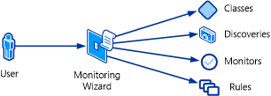

# Management pack templates

_Management Pack Templates_ provide _Monitoring wizards_ that let you create complete monitoring scenarios with minimal input. The wizard creates the required monitors, rules, and even targets to implement the particular scenario. There's no requirement for you to understand the management pack elements that are created. You can modify the configuration of the wizard itself if you want to change the way that monitoring is being performed.

## Conceptual view of a monitoring wizard

If a management pack template is available for your particular monitoring requirement, using the template most likely is your best strategy. In many cases, you could create the individual rules and monitors yourself, but this exercise is more complex than using an available template. In addition, some templates perform actions that you can't perform in any other way in the Operations console.

The following table lists the management pack templates that are part of the standard Operations Manager installation. You can install other management packs that might provide additional templates. Each of these templates is covered in detail in the subsequent sections of this article.

| Template | Description |
| --- | --- |
| [.NET Application Performance Monitoring Template](net-application-performance-monitoring-template.md) | Monitor .NET applications to get details about application performance and reliability. |
| [OLE DB Data Source Template](ole-db-datasource-template.md) | Monitor a database accessible with OLE DB. |
| [Process Monitoring Template](process-monitoring-template.md) | Discover and monitor instances of a particular Windows process. |
| [TCP Port Template](tcp-port-template.md) | Monitor the availability of an application that is listening on a specific port. |
| [UNIX or Linux Log File](unix-linux-logfile.md) | Monitor a UNIX or Linux log file for a specific entry. |
| [UNIX or Linux Process](unix-linux-process.md) | Monitor a UNIX or Linux process. |
| [Web Application Availability Monitoring Template](web-application-availability-monitoring-template.md) | Monitor the availability of one or more web application URLs and run these monitoring tests from internal locations. |
| [Web Application Transaction Monitoring Template](web-application-transaction-monitoring-template.md) | Monitor the availability, operation, and performance of a web application. |
| [Windows Service Template](windows-service-template.md) | Discover and monitor instances of a particular Windows service. |

## See also

- [Creating Management Pack Templates](create-management-pack-templates.md)
- [Watcher Nodes](/previous-versions/system-center/system-center-2012-R2/hh457584%28v%3dsc.12%29)
