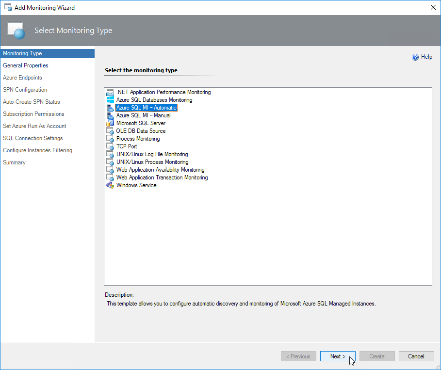
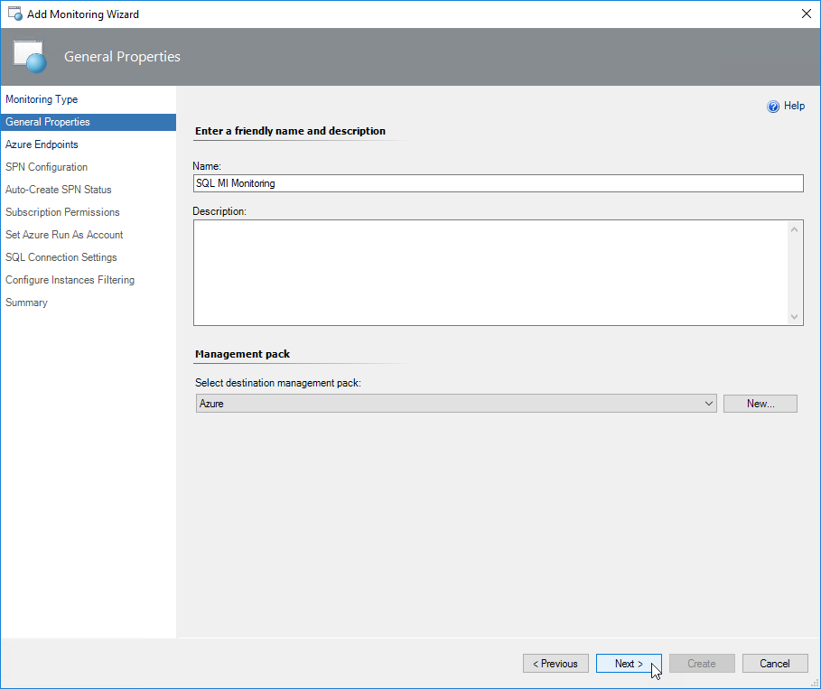
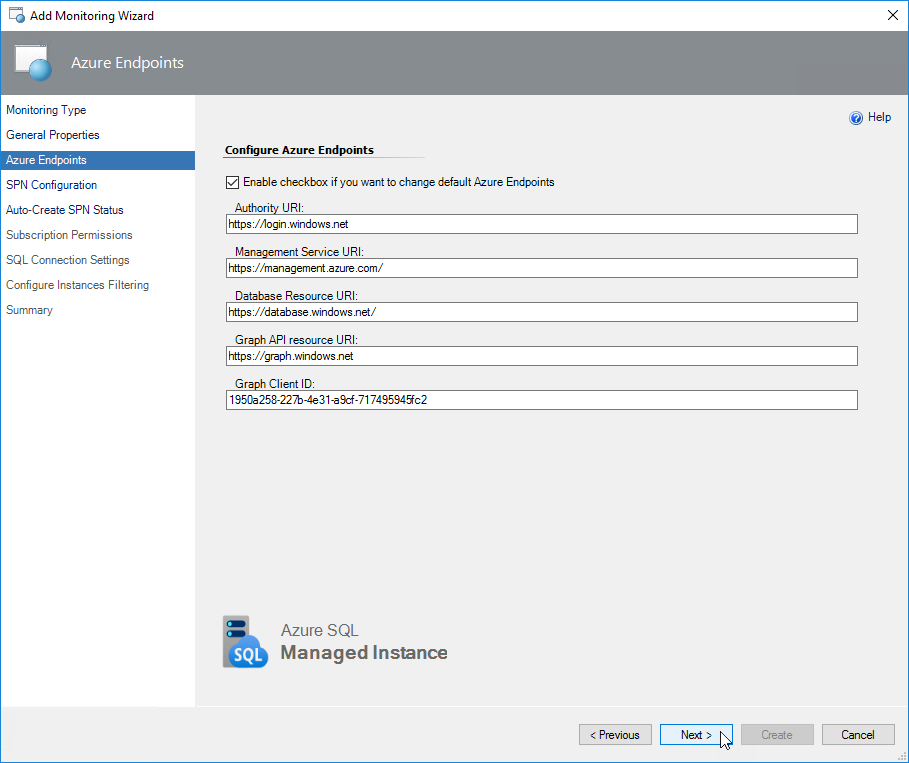
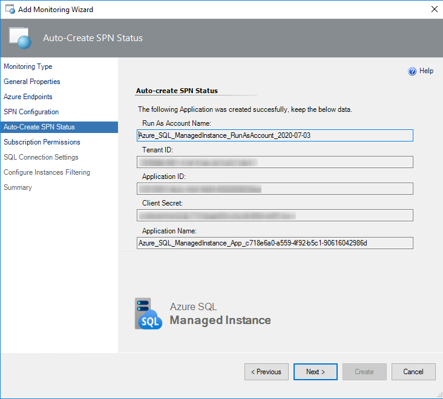
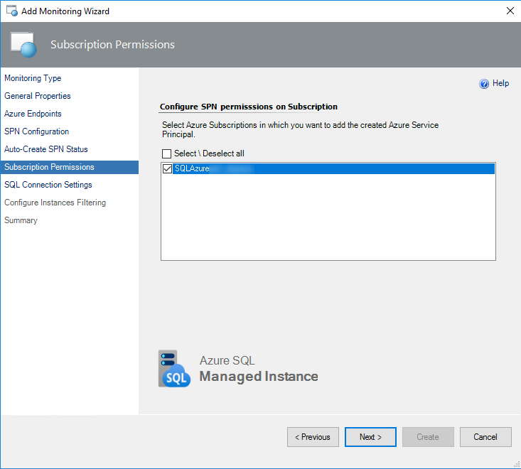
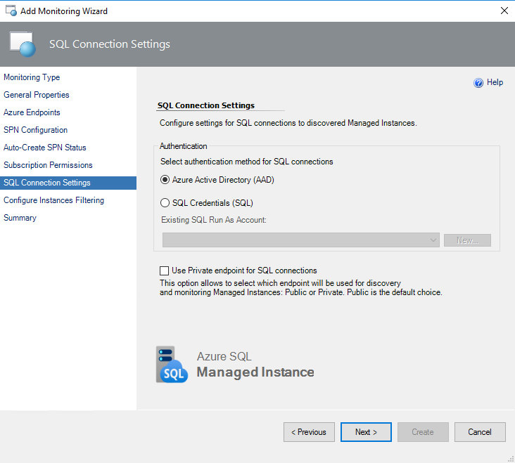
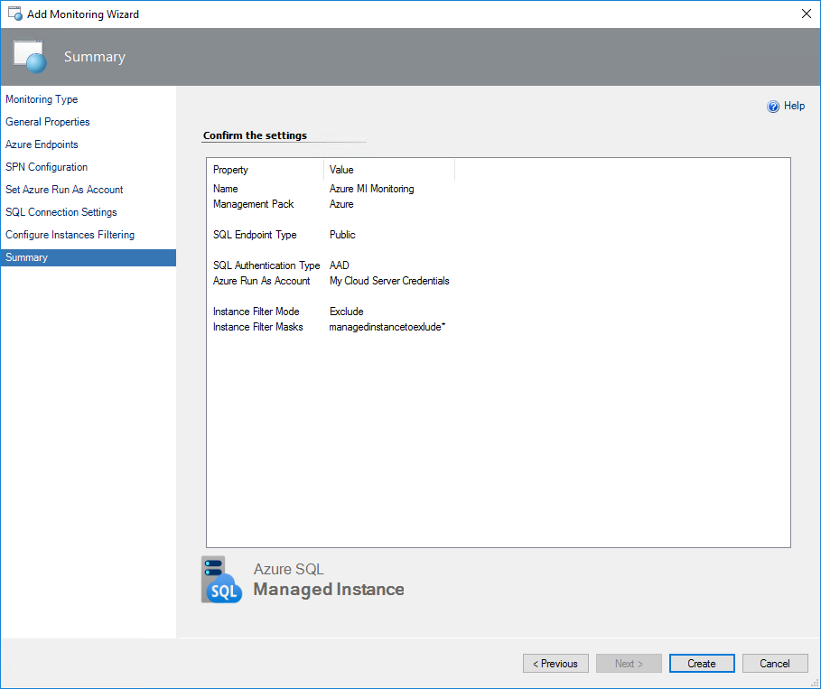

# Automatic Monitoring Template

This template allows you to configure monitoring by discovering all managed instances in the specified Azure subscription automatically.

## Configuring Automatic Monitoring Template

To configure monitoring using the automatic monitoring template, perform the following steps:

1. In the System Center Operations Manager console, navigate to **Authoring | Management Pack Templates**, right-click **Azure SQL MI - Automatic**, and select **Add Monitoring Wizard…**.

    

2. At the **Monitoring Type** step, select **Azure SQL MI - Automatic**, and click **Next**.

    

3. At the **General Properties** step, enter a name and description, and from the **Select destination management pack** drop-down list, select a management pack that you want to use to store the template.

    

4. At the **Azure Endpoints** step, select the **Enable checkbox if you want to change default Azure Endpoints** checkbox, and modify the default Azure endpoints if required. The default endpoints for creating Azure Service Principal Name are as follows:

   - Authority URI: <https://login.windows.net>
   - Management Service URI: <https://management.azure.com>
   - Database Resource URI: <https://database.windows.net>  
   - Graph API Resource URI: <https://graph.windows.net>

   

5. At the **SPN Configuration** step, select any of the following options:

   - **Auto-Create SPN**

       Select this option If you want your Azure Service Principal Name to be created automatically by the Azure SQL MI MP library using the Azure REST API. 
       
       Mind that the account that you use must have either the **Owner** role (or higher), or any of the following roles:

       - **Active Directory Administrator**
       
       - **Service Administrator** or C**o-Administrator**

       For more information, see [How to - Use the portal to create an Azure AD application and service principal that can access resources](https://docs.microsoft.com/azure/active-directory/develop/howto-create-service-principal-portal).

   - **Use Existing Run As Profile**

       Select this option if you want to use your own Azure Service Principal Name.

    

     If you select the **Auto-Create SPN** option, the **Microsoft Azure sign-in** window will be displayed. In this window, enter your work, school, or personal Microsoft account credentials, click **Next**, and complete the form.

    

    Upon successful creation of the Azure AD application, at the **Auto-Create SPN Status** step, authentication data will be displayed. Click **Next**.

    

    If you want to use an existing Run As Profile, at the **SPN Configuration** step, select the **Use Existing Run As Profile** option, click **Next**, and select an existing Run As Account associated with the Azure service principal name. This Run As Account will be used for authentication in Azure Cloud.

    

6. At the **Subscription Permissions** step, select Azure subscriptions that you want to monitor.

    

7. At the **SQL Connection Settings** step, select an authentication method that you want to use to connect to your managed instances. 

    Regardless of the selected option, make sure to grant required permissions to the selected monitoring account for all managed instances. For more information, see [Security Configuration](mimp-security-configuration.md).

    

8. At the **Configure Instances Filtering** step, you can configure filtering options:

   - Exclude

      Select this option to specify instances that should not be discovered.

   - Include

      Select this option to specify only those instances that you want to be discovered.

    Use an asterisk to replace any symbol/symbols.

    

9. At the **Summary** step, review connection settings and click **Create**.

    