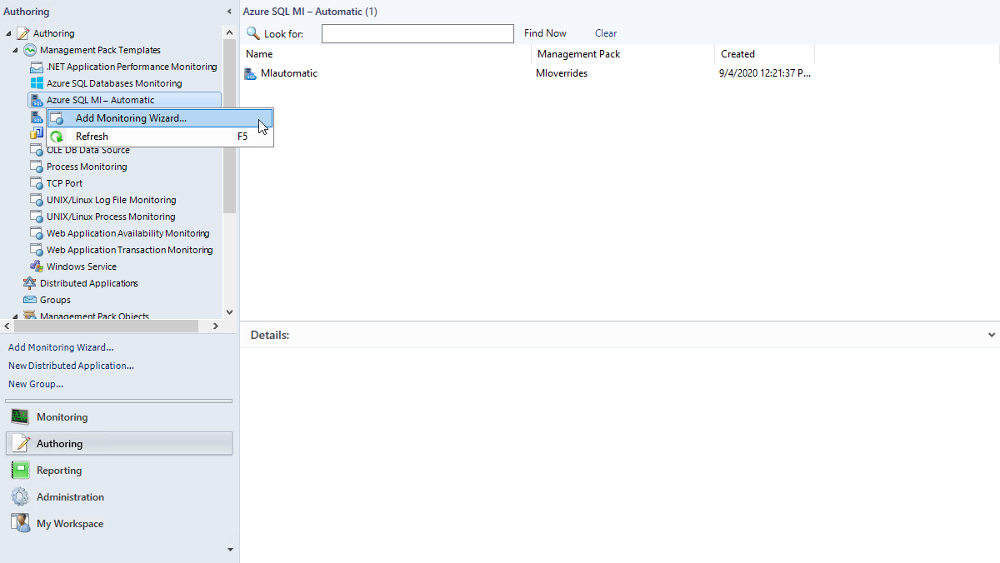
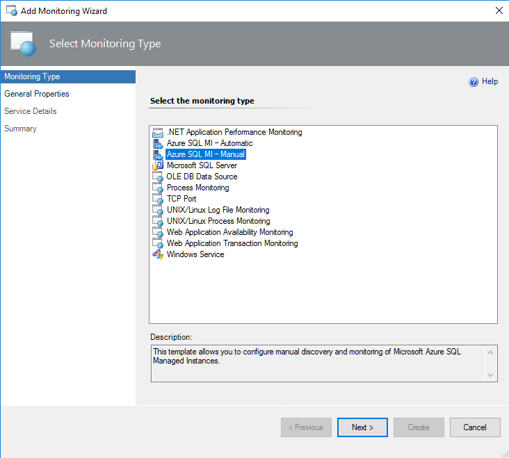
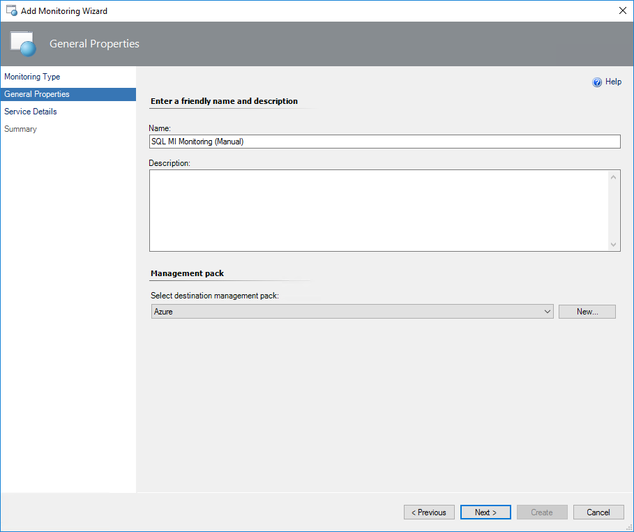
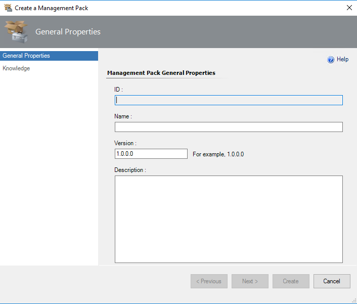
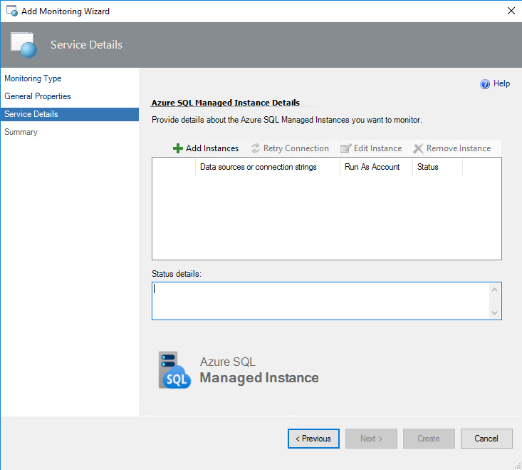
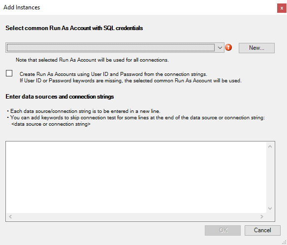
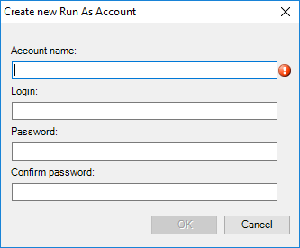
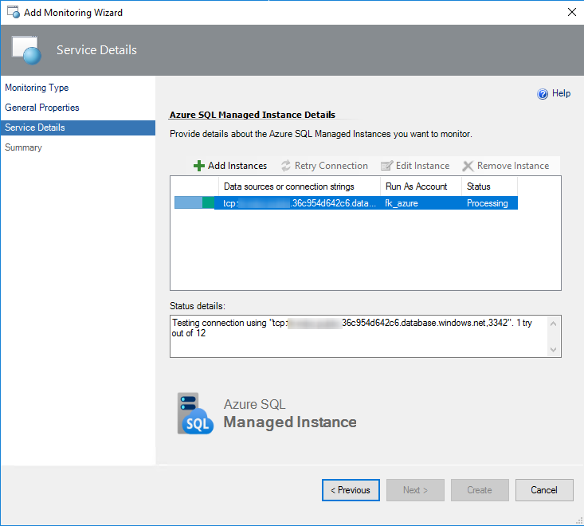
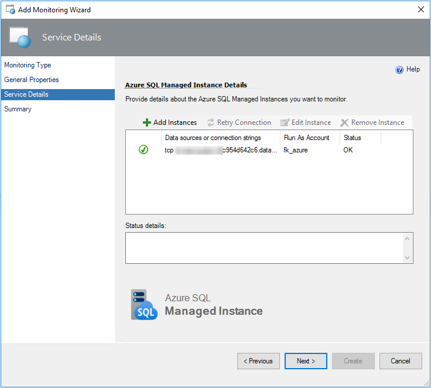
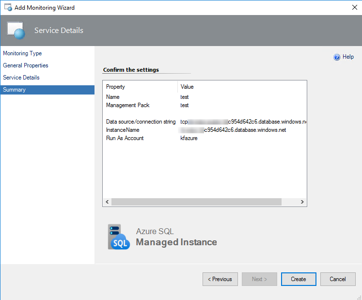

# Manual Monitoring Template

This template allows you to add the selected instances to the monitoring list by specifying connection strings manually.

## Configuring Manual Monitoring Template

To configure monitoring using the manual monitoring template, perform the following steps:

1. In the System Center Operations Manager console, navigate to **Authoring | Management Pack Templates**, right-click **Azure SQL MI - Manual**, and select **Add Monitoring Wizard…**.

    

2. At the **Monitoring Type** step, select **Azure SQL MI - Manual**, and click **Next**.

    

3. At the **General Properties** step, enter a name and description, and from the **Select destination management pack** drop-down list, select a management pack that you want to use to store the template.

    

    You can also create a new management pack by clicking **New**.

    

4. At the **Service Details** step, click **Add Instances**.

    

5. In the **Add Instances** window, select a Run As Account with appropriate SQL credentials, and specify data sources and (or) connection strings. Follow the instructions provided in the wizard to avoid errors.

    

    Use the standard security connection string format to specify connection settings:

    ```
    Server=\<ServerAddress>;Database=\<DatabaseName>;
    ```
    
    You can get a connection string for a managed instance using the Azure portal.

    To create a Run As account from the connection string, use the following format:  

    ```
    Server=\<ServerAddress>;Database=\<DatabaseName>;User Id=\<UserName>;Password=\<Password>;
    ```
    
    You can also create a new Run As account by clicking **New** and specifying an account name and connection credentials to access the managed instance.

    

    After you click **OK** in the **Add Instances** window, a connection test will be performed.

    

    After the connection test is complete, you can view and edit properties of the added instance. For that, select an instance and click **Edit Instance**.

    >[!NOTE]
    >The monitoring template wizard may show the following error: "An error occurred discovery: A connection was successfully established with the server, but then an error occurred during the login process" or the “Monitoring error” exception while checking connection. For more information, see [Known Issues and Troubleshooting](mimp-known-issues-and-troubleshooting.md)

    

6. At the **Summary** step, review monitoring settings and click **Create**.

    