# .NET application performance monitoring template

The  **.NET Application Performance Monitoring**  (APM) template in System Center – Operations Manager lets you monitor Internet Information Services (IIS)-hosted .NET applications from server- and client-side perspectives to get details about application performance and reliability that can help you pinpoint root causes of incidents. (For System Center 2012 SP1 only: You can also monitor Windows Services.) When you specify settings, the types of events to collect, the performance goals to measure, and servers to monitor, .NET Application Performance Monitoring reveals how applications are running. You can see how frequently a problem is occurring, how a server was performing when a problem occurred, and the chain of events related to the slow request or method that is raising exceptions. This information is required to partner with software developers and database administrators to help ensure that applications perform correctly and reliably for your customers.

This template lets you monitor applications and web services that are hosted in Internet Information Services (IIS) 7.0. You can select one or more applications or services discovered by the IIS 7.0 management pack and configure monitoring of performance and exception events. You must have the Windows Server 2008 Internet Information Services (IIS) 7.0 management pack installed to monitor applications and web services.

For System Center 2012 SP1, you can use the template to monitor applications and web services that are hosted in Internet Information Services (IIS) 8.0. You can select one or more applications or services discovered by the IIS 8.0 management pack and configure monitoring of performance and exception events. You must have the Windows Server 2012 Internet Information Services (IIS) 8.0 management pack installed to monitor applications and web services.

For more information, see [Before You Begin Monitoring .NET Applications](/previous-versions/system-center/system-center-2012-r2/hh543994(v=sc.12))

- Scenarios
- Monitoring Performed by the .NET Application Performance Monitoring Template
- Viewing Monitoring Data
- Wizard Options
- Server-Side Configuration
- Advanced Settings for Server-Side Monitoring
- Server-Side Customization
- Server-Side Modifying Settings
- Transaction Properties: Add ASP.NET Web Page
- Transaction Properties: Add ASP.NET Web Service
- Transaction Properties: Add ASP.NET MVC Page
- Transaction Properties: Add WCF Method
- Transaction Properties: Add Function
- Client-Side Configuration
- Advanced Settings for Client-Side Monitoring
- Enable Client-Side Monitoring
- Client-Side Modifying Settings
- Summary
- Creating and Modifying .NET Application Performance Monitoring Templates
- Viewing .NET Application Performance Monitoring Monitors and Collected Data

## Scenarios

Use the  **.NET Application Performance Monitoring**  template in scenarios where you've to monitor web-based applications. These scenarios include the following monitoring processes:

## Server-side monitoring: single- or multi-tier web applications

You might have applications that must always be running. Use the **.NET Application Performance Monitoring** template to ensure that your applications are reliable, have no exceptions, and meet service level agreements (SLAs). In short, they perform correctly on the computers where they're installed.

## Client-side monitoring: browser performance and reliability

You want to ensure that your customers are having quality web experiences. By creating or editing existing templates, you can extend your server-side monitoring by adding client-side monitoring that measures the browser experience of your customers.

## Monitoring performed by the .NET application performance monitoring template

By default, the  **.NET Application Performance Monitoring**  template configures the following monitoring. You can enable, disable, and modify monitors in the **Advanced Configuration**  page of the **.NET Application Performance Monitoring** template.

| Monitor description | Default values |
| --- | --- |
| Percentage of exception events per monitored requests | Enabled, Threshold=15%, Interval=5 minutes |
| Percentage of performance events per monitored requests | Enabled, Threshold=20%, Interval=5 minutes |
| Average Request Time | Enabled, Threshold=10,000 ms, Interval=5 minutes |

## Viewing monitoring data

All data collected by the **.NET Application Performance Monitoring** template appears in the  **.NET Monitoring**  folder in the  **Application Monitoring**  folder in the  **Monitoring**  navigation pane. For each of the application groups that you create by using the  **.NET Application Performance Monitoring**  template, the template creates a folder under  **.NET Monitoring**. The  **Application Monitoring**  folder contains the default views and subfolders that provide health state, Performance views, and alerts related to the application components in the application group. By using the top-level Application Group State view, you can see the health of the individual components and the monitoring configurations that have been enabled. The state of each object matches the state of the targeted object that has the worst health state so that you see the worst state of the monitors that are running. If one or more of the components are shown with an error while at least one other component is healthy, it could indicate a problem with that particular component, such as a credential issue. If all the components are unhealthy, it could indicate a problem with the infrastructure, such as network connectivity issues.

**Application monitoring folders**

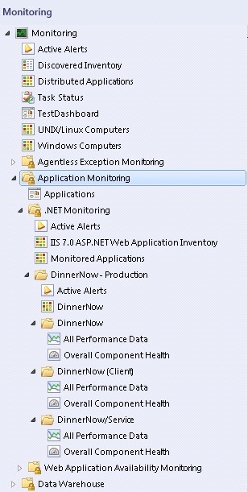

To view the state of the individual monitors, open the Health Explorer for each component. Drill down to the unhealthy monitors to see what is making your application unhealthy. For more information, see [Monitoring .NET Applications](/previous-versions/system-center/system-center-2012-R2/hh212856(v=sc.12))

## Wizard options

When you run the  **.NET Application Performance Monitoring**  template, you've to provide values for options as listed in the following tables. Each table represents a single page in the wizard.

## General properties

The following options are available on the **General Properties** page of the wizard.

| Option | Description |
| --- | --- |
| Name | Enter the friendly name used for the template and application group that you're creating. This name is displayed in the Operations console and used for the folder under the  **.NET Monitoring**  folder.   **Note:** After you've given the template a name and saved the template, this name can't be edited without deleting and re-creating the template instance.  |
| Description | Describe the application group. (Optional) |
| Select destination management pack | Select the management pack to store the views and configuration created by the template. Use the same name for your new management pack as the application group so that you can easily pair the two names. You can use an existing management pack or create a new management pack. For more information about management packs, see [Selecting a Management Pack File](select-management-pack-file.md). |

## What to monitor

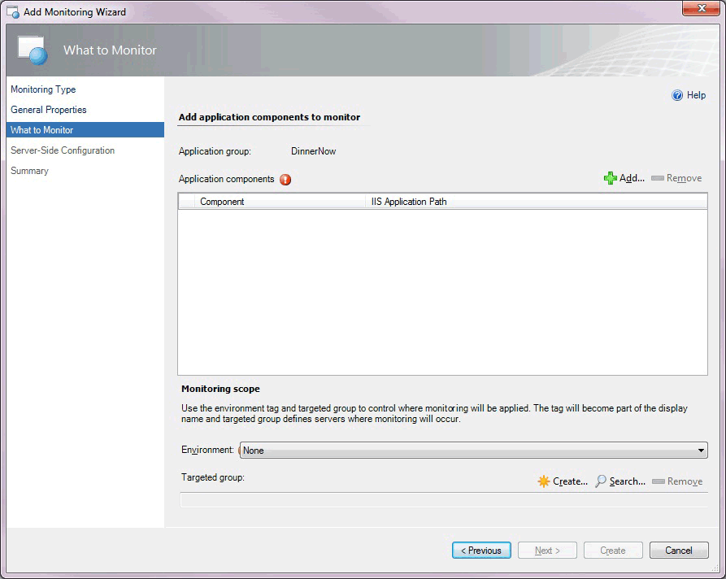

The following options are available on the  **What to Monitor**  page of the wizard.

| Option | Description |
| --- | --- |
| Application components, Add | Search for and add or remove the application components to monitor. When you select  **Add** , the Object Search page opens, which lets you select whether you want to monitor Web Applications and Services. For System Center 2012 SP1 only: You can monitor Windows Services.  **Note:** For System Center 2012 SP1 only: Before you begin monitoring Windows Services, you need to configure Windows Services using the Windows Service template. Once you do this, the.NET Application Performance Monitoring template can discover the Windows Services that are running. For more information, see [**Authoring the Windows Service Template**](/previous-versions/system-center/system-center-2012-R2/hh457595(v=sc.12)).  |
| Environment | Select the environment in which you want to monitor your application:  **None** ,  **Production** ,  **Staging** ,  **Test** ,  **Development** , or use  **New**  to create a new tag. Typically, you want to pair the environment tag with the server group that you're monitoring. The tag is appended to the application group name and component names, letting you differentiate the event data in Application Diagnostics and Application Advisor. From a monitoring perspective, the environment tag lets you separate the same application into multiple virtual applications.  **Note:** After you've selected an environment tag and saved the template, the tag can't be edited without deleting and re-creating the template instance.  |
| Targeted group | Select specific servers to limit monitoring to this specific set of servers. This is optional. Targeted group scoping only becomes necessary when you've the same application running in multiple environments, such as production and staging, and you intend to run the template multiple times, one for each environment. In this scenario, group which machines belong to production and which belong to the staging environment, and then use the targeted groups to restrict where the configuration is propagated. You can also use groups to apply configuration to a subset of your servers. Otherwise, it isn't necessary to specify targeted group scoping if you just want to monitor all instances of a given application. |

## Object search

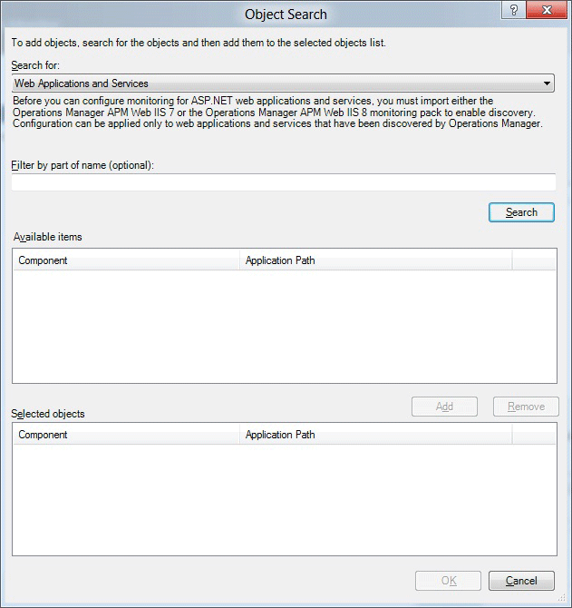

The following options are available on the **Object Search** page of the wizard.

| Option | Description |
| --- | --- |
| Search for | Select Web Applications and Services. For System Center 2012 SP1 only: You can also select Windows Services.  **Note:** For System Center 2012 SP1, before you begin monitoring Windows Services, you need to configure Windows Services using the Windows Service template. Once you do this, the.NET Application Performance Monitoring template can discover the Windows Services that are running. For more information, see [**Authoring the Windows Service Template**](/previous-versions/system-center/system-center-2012-R2/hh457595(v=sc.12))  |
| Filter by part of name (optional) | Enter part of the name of Web Application and Services that you want to select. For System Center 2012 SP1 only: You can also enter part of the name of a Windows Service that you want to select. |
| Available items | Displays the Windows Web Application and Services that are available for monitoring. For System Center 2012 SP1 only: Also displays the Windows Services that are available for monitoring. |
| Selected objects | Displays the application components that you've selected to monitor. |

## Server-side configuration

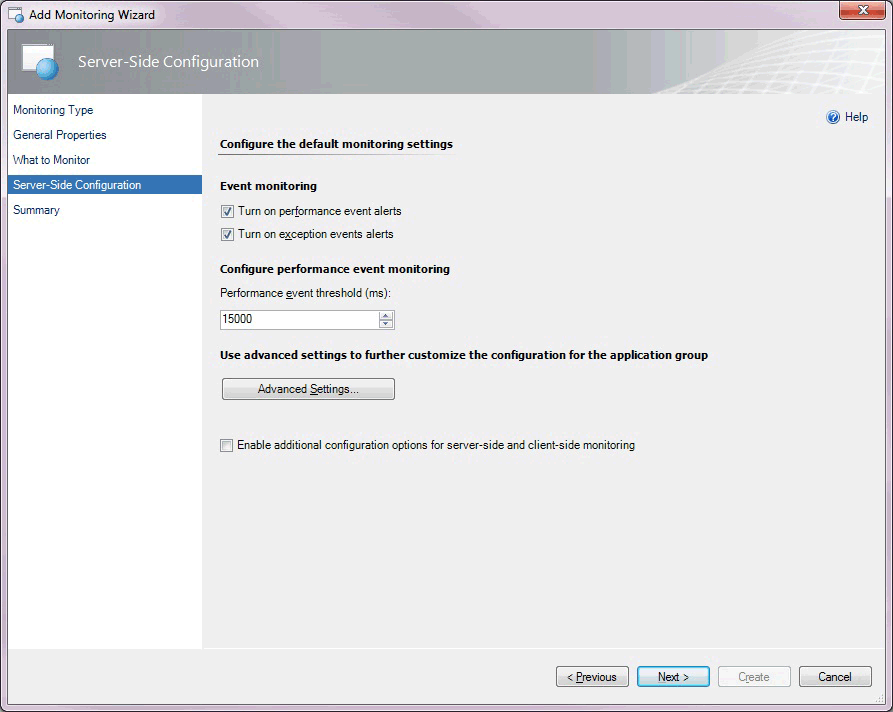

The following options are available on the  **Server-Side Configuration**  page of the wizard.

| Option | Description |
| --- | --- |
| Turn on performance event alerts | Turn performance event alert reporting for the application group on or off within the Operations console for server-side monitoring. Performance events are still logged to the Application Diagnostics console. You have the option whether to raise alerts after an Application Performance Monitoring event is generated. |
| Turn on exception event alerts | Turn the exception event alert notification for the application group on or off within the Operations console for server-side monitoring. Exception events are still logged to the Application Diagnostics console. You have the option whether to raise alerts after an Application Performance Monitoring event is generated. |
| Performance event threshold (ms) | Set the threshold in milliseconds (ms) that a user transaction must exceed before it raises a performance event. |
| Advanced Settings | Set advanced configurations, including sensitivity (restricting the collection of fast functions), namespaces (that define where you want to collect data from custom applications), methods (specific functions where you want to start monitoring), custom exception handlers (that define critical exceptions), and customize the configuration of the monitors that affect the component health state. |
| Enable additional configuration options for server-side and client-side monitoring | Specify additional options in the wizard to customize monitoring for individual application components and client-side monitoring. |

## Advanced settings for server-side monitoring

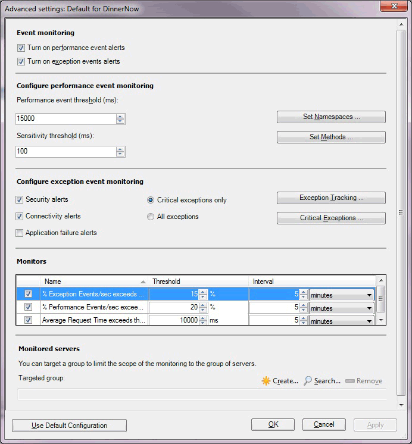

The following options are available on the  **Advanced Settings**  for server-side monitoring page of the wizard.

| Option | Description |
| --- | --- |
| Turn on performance event alerts | Turn performance event alert reporting for the application group on or off within the Operations console for server-side monitoring. Performance events are still logged to the Application Diagnostics console. You have the option whether to raise alerts after an Application Performance Monitoring event is generated. |
| Turn on exception event alerts | Turn the exception event alert notification for the application group on or off within the Operations console for server-side monitoring. Exception events are still logged to the Application Diagnostics console. You have the option whether to raise alerts after an Application Performance Monitoring event is generated. |
| Performance event threshold (ms) | Set the threshold in milliseconds (ms) that a request must be processed in before it causes a performance event. |
| Sensitivity threshold (ms) | Specify to filter out fast-running methods to reduce overall "noise" by reducing the size of the call stack by gathering less data for each event. For more information, see [Authoring Strategies for .NET Application Monitoring](author-strategies-net-application-monitoring.md) |
| Set Namespaces | Specify namespaces and classes where to start measuring for performance events and performance threshold violations, and define which namespaces should be treated by default as entry points. For more information, see [How to Add, Enable, and Disable Namespaces](/previous-versions/system-center/system-center-2012-R2/hh544004%28v%3dsc.12%29) |
| Set Methods | Specify how deep in the call stack to drill down to collect more detailed information, such as parameters and variables, for specific methods. For more information, see [How to Add, Edit, and Remove Methods](/previous-versions/system-center/system-center-2012-R2/hh543997%28v%3dsc.12%29) |
| Security alerts | Turn alerting of exceptions on or off that are classified as security alerts for the application group, with errors such as "Access Denied" or "Login Failed".Security events are logged to the Application Diagnostics console. You have the option to choose whether to raise alerts after an Application Performance Monitoring event is generated. |
| Connectivity alerts | Turn alerting of exceptions on or off that are classified as connectivity alerts for the application group, with errors such as "Connection timed out". Connectivity events are logged to the Application Diagnostics console. You have the option to choose whether to raise alerts after an Application Performance Monitoring event is generated. |
| Application failure alerts | Turn alerting of exceptions on or off that are classified as application, or code, failures for the application group. By default, this option is turned off to reduce the "noise" of alerts raised due to code failures that typically only development teams can resolve. For more information, see [Authoring Strategies for .NET Application Monitoring](author-strategies-net-application-monitoring.md)Exception events are logged to the Application Diagnostics console. You have the option to choose whether to raise alerts after an Application Performance Monitoring event is generated. |
| Critical exceptions only | Specify whether the exception is considered relevant by the Application Performance Monitoring agent and whether an event is created. An event is created if the exception raised is one of those in the list of critical exception handlers. For more information, see [Using Exception Handlers to Define Critical Exceptions](use-exception-handlers-define-critical-exceptions.md) |
| All exceptions | Specify whether all exceptions are considered relevant by the Application Performance Monitoring agent and events are created when exceptions are detected in monitored namespaces and classes. |
| Exception Tracking | Select to add namespace or classes where you track exception parameters or variables, and collect additional information about each exception that a namespace or class raised. For more information, see [How to Add, Edit, and Remove Exception Tracking](/previous-versions/system-center/system-center-2012-R2/hh544008%28v%3dsc.12%29) |
| Critical Exceptions | Select to add items to the Exception handlers list. Define exception handlers that catch critical exceptions that an application raised. For more information, see [Using Exception Handlers to Define Critical Exceptions](use-exception-handlers-define-critical-exceptions.md) |
| Monitors: Exception Events/sec exceeds | Monitor that watches the .NET App/% Exception Events/sec performance counter. |
| Monitors: Performance Events/sec exceeds | Monitor that watches the .NET Apps/% Performance Events/sec performance counter. |
| Monitors: Average Request Time exceeds | Monitor that watches the .NET Apps/Average Request Time performance counter. |
| Targeted group | Select specific servers to limit monitoring to this specific set of servers. This is optional. Targeted group scoping only becomes necessary when you have the same application running in multiple environments, such as production and staging, and you intend to run the template multiple times, one for each environment. In this scenario, group which machines belong to production and which belong to the staging environment, and then use the targeted groups to restrict where the configuration is propagated. You can also use groups to apply configuration to a subset of your servers. Otherwise, it isn't necessary to specify targeted group scoping if you just want to monitor all instances of a given application. |

## Server-side customization

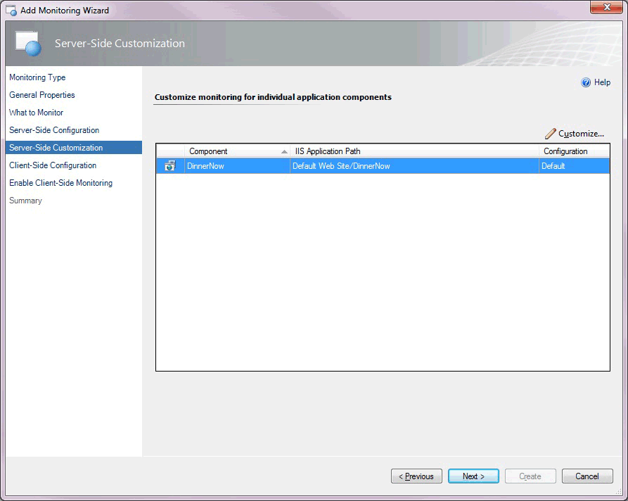

For System Center 2012 SP1, the following options are available on the  **Server-Side Customization** page of the wizard.

| Option | Description |
| --- | --- |
| Component | Select the component you want to customize for monitoring individual application components. |
| Customize | Modify the settings for the selected application component. This opens the  **Modifying Settings**  page. The settings on this page are the same as those on the  **Advanced Settings for Server-Side Monitoring**  page, except you can create individual transaction monitoring for ASP.NET webpages, ASP.NET web services, or individual functions in an assembly. These are described in the Transaction Properties: Add ASP.NET Web Page sections that follow.  **Note:** The buttons for namespaces, exception tracking, and critical exceptions are unavailable because these can only be set at the application-group level, not at the component level. For System Center 2012 SP1 only: you can customize these settings if you're configuring monitoring for Windows Services.  |
| Modifying Settings page | Customize settings for the application component and/or specify monitoring for a specific webpage, web method, or function within the application component. |

## Server-side modifying settings

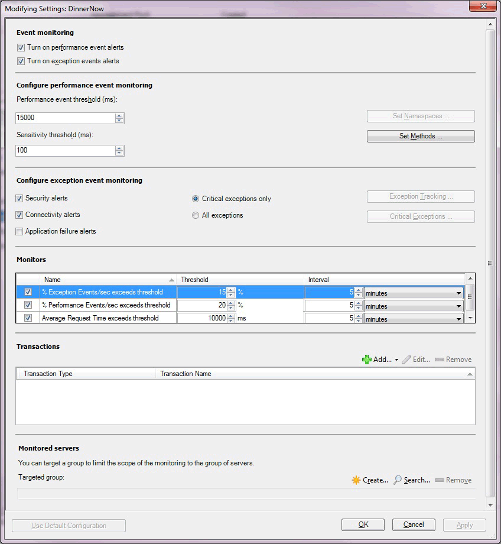

The following options are available on the  **Server-Side Modifying Settings**  page of the wizard.

| Option | Description |
| --- | --- |
| Turn on performance event alerts | Turn performance event alert reporting for the application group on or off within the Operations console for server-side monitoring. Performance events are still logged to the Application Diagnostics console. You have the option whether to raise alerts after an Application Performance Monitoring event is generated. |
| Turn on exception event alerts | Turn the exception event alert notification for the application group on or off within the Operations console for server-side monitoring. Exception events are still logged to the Application Diagnostics console. You have the option whether to raise alerts after an Application Performance Monitoring event is generated. |
| Performance event threshold (ms) | Set the threshold in milliseconds (ms) that a request must be process in before it causes a performance event. |
| Sensitivity threshold (ms) | Specify to filter out fast-running methods to reduce overall "noise" by reducing the size of the call stack by gathering less data for each event. For more information, see [Authoring Strategies for .NET Application Monitoring](author-strategies-net-application-monitoring.md) |
| Set Methods | Specify how deep in the call stack to drill down to collect more detailed information, such as parameters and variables, for specific methods. For more information, see [How to Add, Edit, and Remove Methods](/previous-versions/system-center/system-center-2012-R2/hh543997%28v%3dsc.12%29) |
| Security alerts | Turn on or off alerting of exceptions classified as security alerts for the application component, with errors such as "Access Denied" or "Login Failed".Security events are logged to the Application Diagnostics console. You have the option to choose whether to raise alerts after an Application Performance Monitoring event is generated. |
| Connectivity alerts | Turn on or off alerting of exceptions classified as connectivity errors for the application component, such as "Connection Timed Out".Connectivity events are logged to the Application Diagnostics console. You have the option to choose whether to raise alerts after an Application Performance Monitoring event is generated. |
| Application failure alerts | Turn on or off alerting of exceptions classified as application, or code, failures for the application component. By default, this option is turned off to reduce the "noise" of alerts raised due to code failures that typically only development teams can resolve. For more information, see [Authoring Strategies for .NET Application Monitoring](author-strategies-net-application-monitoring.md)Exception events are logged to the Application Diagnostics console. You have the option to choose whether to raise alerts after an Application Performance Monitoring event is generated. |
| Critical exceptions only | Specify whether the exception is considered relevant by the Application Performance Monitoring agent and whether an event is created. An event is created if the exception raised is one of those in the list of critical exception handlers. For more information, see [Using Exception Handlers to Define Critical Exceptions](/previous-versions/system-center/system-center-2012-R2/hh543992%28v%3dsc.12%29) |
| All exceptions | Specify whether all exceptions are considered relevant by the Application Performance Monitoring agent and events are created when exceptions are detected in monitored namespaces and classes. |
| Monitors: Exception Events/sec exceeds | Monitor that watches the .NET App/% Exception Events/sec performance counter. |
| Monitors: Performance Events/sec exceeds | Monitor that watches the .NET Apps/% Performance Events/sec performance counter. |
| Monitors: Average Request Time exceeds | Monitor that watches the .NET Apps/Average Request Time performance counter. |
| Transactions: Add | Add transactions for ASP.NET web pages, ASP.NET Web services, and functions. See the following tables. |
| Targeted group | Select specific servers to limit monitoring to this specific set of servers. This is optional. Targeted group scoping only becomes necessary when you have the same application running in multiple environments, such as production and staging, and you intend to run the template multiple times, one for each environment. In this scenario, group which machines belong to production and which belong to the staging environment, and then use the targeted groups to restrict where the configuration is propagated. You can also use groups to apply configuration to a subset of your servers. Otherwise, it isn't necessary to specify targeted group scoping if you just want to monitor all instances of a given application. |

> [!NOTE]
> The buttons for namespaces, exception tracking, and critical exceptions are unavailable because these can only be set at the application-group level, not at the component level. For System Center 2012 SP1 only: You can customize these settings if you're configuring monitoring for Windows services.

## Application types and server-side transactions you can monitor

For each application type, there are several transaction types you can choose to monitor. The following options are available:

| Application type | Transaction types for System Center 2012 | Transaction types for System Center 2012 SP1 |
| --- | --- | --- |
| ASP.NET Web application | - ASP.NET webpage   - ASP.NET web service   - Function | - ASP.NET webpage  - ASP.NET MVC page   - ASP.NET web service  - WCF method  - Function|
| ASP.NET Web service | - ASP.NET webpage   - ASP.NET web service   - Function |  - ASP.NET webpage  - ASP.NET MVC page   - ASP.NET web service  - WCF method  - Function|
| WCF service | Not available | - ASP.NET webpage  - ASP.NET MVC page   - ASP.NET web service  - WCF method  - Function |
| Windows service | Not available | - WCF method  - Function 

## Transaction properties: add ASP.NET web page

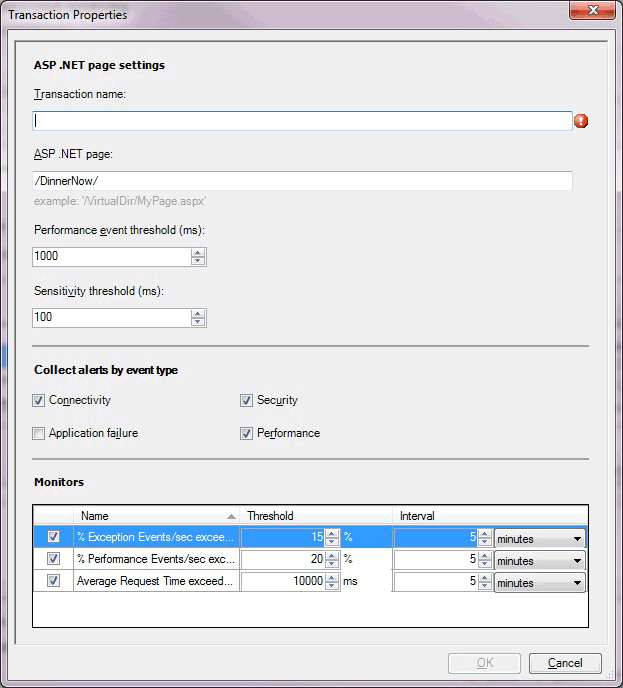

The following options are available on the  **Transaction Properties**  page for ASP.NET Web Page page of the wizard.

| Option | Description |
| --- | --- |
| Transaction name | Enter the friendly name for the transaction as it will be displayed on the  **Monitoring**  tab, performance counters, and elsewhere. |
| ASP.NET page | Enter the path to the page that you're configuring these monitoring settings for. |
| Performance event threshold (ms) | Set the threshold in milliseconds (ms) that a user transaction must exceed before it raises a performance event.  **Note:** The application component continues to monitor the page specified in the transaction by using the performance threshold that is set for the application component. This threshold is used as a second measure on the same page in the application component. If you set this threshold higher than the application component threshold, you get a single event, but you might get two performance alerts for the transaction when the threshold is breached—one from the application component and one from the transaction, depending on your alerting settings. Transactions are typically used to monitor the individual page more aggressively than the parent application, at a lower threshold, or to monitor a page where alerting has been disabled on the parent.  |
| Sensitivity threshold (ms) | Specify to filter out fast-running methods to reduce overall "noise" by reducing the size of the call stack by gathering less data for each event. An event is still generated if the threshold is surpassed. For more information, see [Authoring Strategies for .NET Application Monitoring](author-strategies-net-application-monitoring.md) |
| Collect alerts by event type: Connectivity | Turn on or off alerting of events, classified as connectivity alerts with errors such as "Connection Timed Out".Connectivity events are logged to the Application Diagnostics console. You have the option to choose whether to raise alerts after an Application Performance Monitoring event is generated. |
| Collect alerts by event type: Application failure | Turn on or off alerting of events classified as application, or code, failures. Turning this off reduces the "noise" of many alerts raised due to code failures. Because these alerts are raised from code failures, developers usually resolve these issues. For more information, see [Authoring Strategies for .NET Application Monitoring](author-strategies-net-application-monitoring.md)Exception events are logged to the Application Diagnostics console. You have the option to choose whether to raise alerts after an Application Performance Monitoring event is generated. |
| Collect alerts by event type: Security | Turn on or off alerting of events classified as security alerts, with errors such as "Access Denied" or "Login Failed". Security events are logged to the Application Diagnostics console. You have the option to choose whether to raise alerts after an Application Performance Monitoring event is generated. |
| Collect alerts by event type: Performance | Turn on or off alerting of events classified as performance alerts. Performance events are logged to the Application Diagnostics console. You have the option to choose whether to raise alerts after an Application Performance Monitoring event is generated. |
| Monitors: % Exception Events/sec | Monitor that watches the .NET App/% Exception Events/sec performance counter. |
| Monitors: % Performance Events/sec | Monitor that watches the .NET Apps/% Performance Events/sec performance counter. |
| Monitors: Average Request Time | Monitor that watches the .NET Apps/Average Request Time performance counter. |

## Transaction properties: add ASP.NET web service

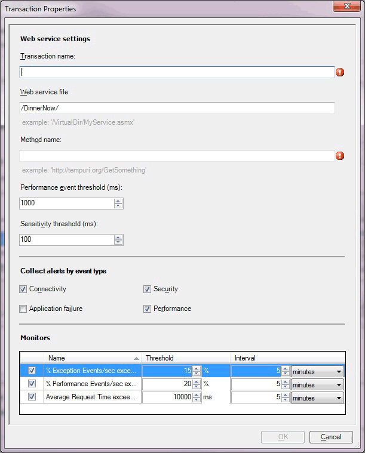

The following options are available on the  **Transaction Properties**  page for the  **ASP.NET Web Service**  page of the wizard.

| Option | Description |
| --- | --- |
| Transaction name | Enter the friendly name for the transaction as it will be displayed on the  **Monitoring**  tab, performance counters, and so on. |
| Web service file | Enter the path to the file for which you're configuring these monitoring settings. |
| Method name | Enter the URI of the web method that you want to monitor. |
| Performance event threshold (ms) | Set the threshold in milliseconds (ms) that a user transaction must exceed before it raises a performance event.  **Note:** The application component continues to monitor the page specified in the transaction by using the performance threshold that is set for the application component. This threshold is used as a second measure on the same page in the application component. If you set this threshold higher than the application component threshold, you get a single event, but you might get two performance alerts for the transaction when the threshold is breached—one from the application component and one from the transaction, depending on your alerting settings. Transactions are typically used to monitor the individual page more aggressively than the parent application, at a lower threshold, or to monitor a page where alerting has been disabled on the parent.  |
| Sensitivity threshold (ms) | Specify to filter out fast-running methods to reduce overall "noise" by reducing the size of the call stack by gathering less data for each event. For more information, see [Authoring Strategies for .NET Application Monitoring](author-strategies-net-application-monitoring.md) |
| Collect alerts by event type: Connectivity | Turn on or off alerting of events classified as connectivity alerts, with errors, such as "Connection Timed Out".Connectivity events are logged to the Application Diagnostics console. You have the option to choose whether to raise alerts after an Application Performance Monitoring event is generated. |
| Collect alerts by event type: Application failure | Turn on or off alerting of events classified as application, or code, failures. Turning off this option reduces the "noise" of many alerts raised due to code failures. Because these alerts are raised from code failures, developers usually resolve these issues. For more information, see [Authoring Strategies for .NET Application Monitoring](author-strategies-net-application-monitoring.md)Exception events are logged to the Application Diagnostics console. You have the option to choose whether to raise alerts after an Application Performance Monitoring event is generated. |
| Collect alerts by event type: Security | Turn on or off alerting of events classified as security alerts, with errors such as "Access Denied" or "Login Failed".Security events are logged to the Application Diagnostics console. You have the option to choose whether to raise alerts after an Application Performance Monitoring event is generated. |
| Collect alerts by event type: Performance | Turn on or off alerting of events classified as performance alerts. Performance events are logged to the Application Diagnostics console. You have the option to choose whether to raise alerts after an Application Performance Monitoring event is generated. |
| Monitors: % Exception Events/sec | Monitor that watches the .NET App/% Exception Events/sec performance counter. |
| Monitors: % Performance Events/sec | Monitor that watches the .NET Apps/% Performance Events/sec performance counter. |
| Monitors: Average Request Time | Monitor that watches the .NET Apps/Average Request Time performance counter. |

## Transaction properties: add ASP.NET MVC page

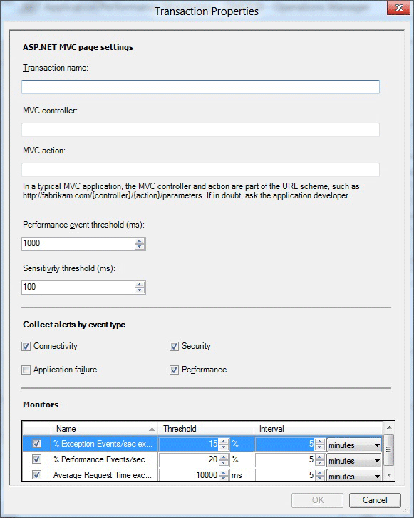

For System Center 2012 SP1 the following options are available on the  **Transaction Properties**  for the  **ASP.MVC**  page of the wizard.

| Option | Description |
| --- | --- |
| Transaction name | Enter the friendly name for the transaction as it will be displayed on the Monitoring tab, performance counters, and so on. |
| MVC controller | Enter the name of the MVC controller for which you're configuring these monitoring settings. |
| MVC action | Specify the name of the MVC action for which you're configuring these monitoring settings. |
| Performance event threshold (ms) | Set the threshold in milliseconds (ms) that a user transaction must exceed before it raises a performance event.  **Note:** The application component continues to monitor the page specified in the transaction by using the performance threshold that is set for the application component. This threshold is used as a second measure on the same page in the application component. If you set this threshold higher than the application component threshold, you get a single event, but you might get two performance alerts for the transaction when the threshold is breached—one from the application component and one from the transaction, depending on your alerting settings. Transactions are typically used to monitor the individual page more aggressively than the parent application, at a lower threshold or to monitor a page where monitoring has been disabled on the parent.  |
| Sensitivity threshold (ms) | Specify to filter out fast-running methods to reduce overall "noise" by reducing the size of the call stack by gathering less data for each event. For more information, see [Authoring Strategies for .NET Application Monitoring](author-strategies-net-application-monitoring.md) |
| Collect alerts by event type: Connectivity | Turn on or off alerting of events classified as connectivity alerts, with errors such as "Connection Timed Out". Connectivity events are logged to the Application Diagnostics console. You have the option to choose whether to raise alerts after an Application Performance Monitoring event is generated. |
| Collect alerts by event type: Application failure | Turn on or off alerting of events classified as application, or code, failures. Turning off this option reduces the "noise" of many alerts raised due to code failures. Because these alerts are raised from code failures, developers usually resolve these issues. For more information, see [Authoring Strategies for .NET Application Monitoring](author-strategies-net-application-monitoring.md)Exception events are logged to the Application Diagnostics console. You have the option to choose whether to raise alerts after an Application Performance Monitoring event is generated. |
| Collect alerts by event type: Security | Turn on or off alerting of events classified as security alerts with errors such as "Access Denied" or "Login Failed".Security events are logged to the Application Diagnostics console. You have the option to choose whether to raise alerts after an Application Performance Monitoring event is generated. |
| Collect alerts by event type: Performance | Turn on or off alerting of events classified as performance alerts. Performance events are logged to the Application Diagnostics console. You have the option to choose whether to raise alerts after an Application Performance Monitoring event is generated. |
| Monitors: % Exception Events/sec | Monitor that watches the .NET App/% Exception Events/sec performance counter. |
| Monitors: % Performance Events/sec | Monitor that watches the .NET Apps/% Performance Events/sec performance counter. |
| Monitors: Average Request Time | Monitor that watches the .NET Apps/Average Request Time performance counter. |

## Transaction properties: add WCF method

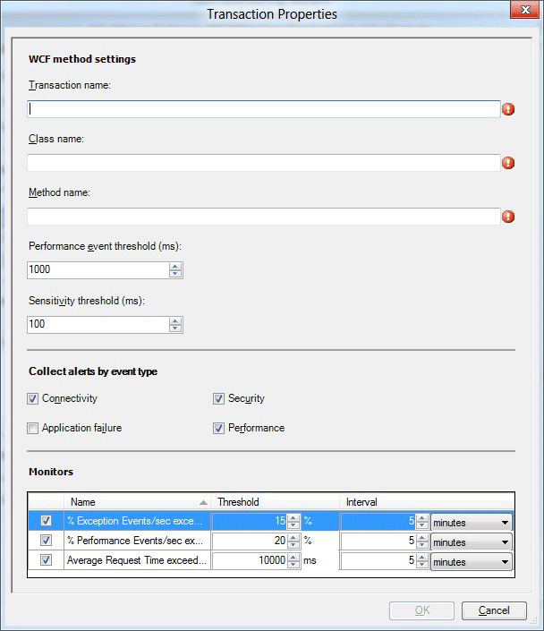

The following options are available on the  **Transaction Properties**  for the  **Add WCF method settings**  page of the wizard.

| Option | Description |
| --- | --- |
| Transaction name | Enter the friendly name for the transaction as it will be displayed on the Monitoring tab, performance counters, and so on. |
| Class name | Enter the name of the class for which you're configuring these monitoring settings. The class name is in the format: Namespace.Class. For example: wcfservice.myclass. |
| Method name | Specify the name of the method that is expected to be in the class for which you're configuring these monitoring settings. |
| Performance event threshold (ms) | Set the threshold in milliseconds (ms) that a user transaction must exceed before it raises a performance event.  **Note:** The application component continues to monitor the page specified in the transaction by using the performance threshold that is set for the application component. This threshold is used as a second measure on the same page in the application component. If you set this threshold higher than the application component threshold, you get a single event, but you might get two performance alerts for the transaction when the threshold is breached—one from the application component and one from the transaction, depending on your alerting settings. Transactions are typically used to monitor the individual page more aggressively than the parent application, at a lower threshold or to monitor a page where alerting has been disabled on the parent.  |
| Sensitivity threshold (ms) | Specify to filter out fast-running methods to reduce overall "noise" by reducing the size of the call stack by gathering less data for each event. For more information, see [Authoring Strategies for .NET Application Monitoring](author-strategies-net-application-monitoring.md) |
| Collect alerts by event type: Connectivity | Turn on or off alerting of events classified as connectivity alerts, with errors such as "Connection Timed Out". Connectivity events are logged to the Application Diagnostics console. You have the option to choose whether to raise alerts after an Application Performance Monitoring event is generated. |
| Collect alerts by event type: Application failure | Turn on or off alerting of events classified as application, or code, failures. Turning off this option reduces the "noise" of many alerts raised due to code failures. Because these alerts are raised from code failures, developers usually resolve these issues. For more information, see [Authoring Strategies for .NET Application Monitoring](author-strategies-net-application-monitoring.md)Exception events are logged to the Application Diagnostics console. You have the option to choose whether to raise alerts after an Application Performance Monitoring event is generated. |
| Collect alerts by event type: Security | Turn on or off alerting of events classified as security alerts with errors such as "Access Denied" or "Login Failed".Security events are logged to the Application Diagnostics console. You have the option to choose whether to raise alerts after an Application Performance Monitoring event is generated. |
| Collect alerts by event type: Performance | Turn on or off alerting of events classified as performance alerts. Performance events are logged to the Application Diagnostics console. You have the option to choose whether to raise alerts after an Application Performance Monitoring event is generated. |
| Monitors: % Exception Events/sec | Monitor that watches the .NET App/% Exception Events/sec performance counter. |
| Monitors: % Performance Events/sec | Monitor that watches the .NET Apps/% Performance Events/sec performance counter. |
| Monitors: Average Request Time | Monitor that watches the .NET Apps/Average Request Time performance counter. |

## Transaction properties: add function

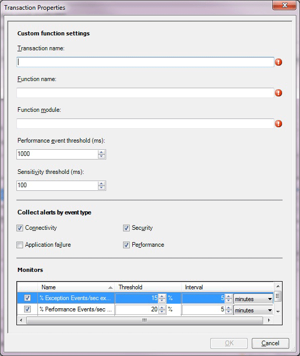

The following options are available on the  **Transaction Properties**  for the  **Add Function**  page of the wizard.

| Option | Description |
| --- | --- |
| Transaction name | Enter the friendly name for the transaction as it will be displayed on the Monitoring tab, performance counters, and so on. |
| Function name | Enter the name of the function for which you're configuring these monitoring settings. The function name is in the format: Namespace.Class.Method. For example: [System.Web.UI.Page.ProcessRequest](/dotnet/api/system.web.ui.page.processrequest). |
| Function module | Specify the name of the assembly, such as System.Web.dll, that defines the function for which you're configuring these monitoring settings. |
| Performance event threshold (ms) | Set the threshold in milliseconds (ms) that a user transaction must exceed before it raises a performance event.  **Note:** The application component continues to monitor the page specified in the transaction by using the performance threshold that is set for the application component. This threshold is used as a second measure on the same page in the application component. If you set this threshold higher than the application component threshold, you get a single event, but you might get two performance alerts for the transaction when the threshold is breached—one from the application component and one from the transaction, depending on your alerting settings. Transactions are typically used to monitor the individual page more aggressively than the parent application, at a lower threshold or to monitor a page where alerting has been disabled on the parent.  |
| Sensitivity threshold (ms) | Specify to filter out fast-running methods to reduce overall "noise" by reducing the size of the call stack by gathering less data for each event. For more information, see [Authoring Strategies for .NET Application Monitoring](author-strategies-net-application-monitoring.md) |
| Collect alerts by event type: Connectivity | Turn on or off alerting of events classified as connectivity alerts, with errors such as "Connection Timed Out". Connectivity events are logged to the Application Diagnostics console. You have the option to choose whether to raise alerts after an Application Performance Monitoring event is generated. |
| Collect alerts by event type: Application failure | Turn on or off alerting of events classified as application, or code, failures. Turning off this option reduces the "noise" of many alerts raised due to code failures. Because these alerts are raised from code failures, developers usually resolve these issues. For more information, see [Authoring Strategies for .NET Application Monitoring](author-strategies-net-application-monitoring.md)Exception events are logged to the Application Diagnostics console. You have the option to choose whether to raise alerts after an Application Performance Monitoring event is generated. |
| Collect alerts by event type: Security | Turn on or off alerting of events classified as security alerts with errors such as "Access Denied" or "Login Failed".Security events are logged to the Application Diagnostics console. You have the option to choose whether to raise alerts after an Application Performance Monitoring event is generated. |
| Collect alerts by event type: Performance | Turn on or off alerting of events classified as performance alerts. Performance events are logged to the Application Diagnostics console. You have the option to choose whether to raise alerts after an Application Performance Monitoring event is generated. |
| Monitors: % Exception Events/sec | Monitor that watches the .NET App/% Exception Events/sec performance counter. |
| Monitors: % Performance Events/sec | Monitor that watches the .NET Apps/% Performance Events/sec performance counter. |
| Monitors: Average Request Time | Monitor that watches the .NET Apps/Average Request Time performance counter. |

## Client-side configuration

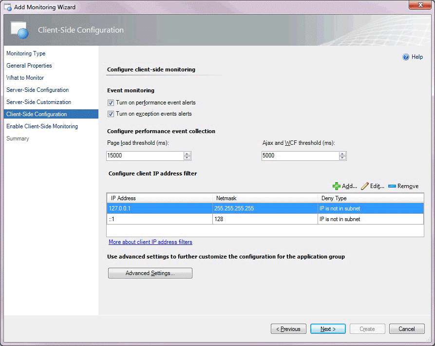

The following options are available on the  **Client-Side Configuration**  page of the wizard.

| Option | Description |
| --- | --- |
| Turn on performance event alerts | Turn performance event alert reporting on or off within the Operations console for server-side monitoring. Performance events are still logged to the Application Diagnostics console. You have the option whether to raise alerts after an Application Performance Monitoring event is generated. |
| Turn on exception event alerts | Turn exception event alert reporting on or off within the Operations Manager console for server-side monitoring. Exception events are still logged to the Application Diagnostics console. You have the option whether to raise alerts after an Application Performance Monitoring event is generated. |
| Page load threshold (ms) | Set the threshold in milliseconds (ms) that a page load must exceed before it causes a performance event. You have the option whether to raise alerts after an Application Performance Monitoring event is generated. The event is only turned into an alert if you have selected  **Turn on performance event alerts**. |
| IP address filter: IP Address | Specify the IP addresses that you want to exclude from monitoring. For more information, see [How to Configure IP Address Exclusion Filters for Client-Side Monitoring](/previous-versions/system-center/system-center-2012-R2/hh543988%28v%3dsc.12%29) |
| IP address filter: Netmask | The part of the filter IP address and user IP address that have to be compared for equality. |
| IP address filter: Comparison Type | Specify to exclude IP addresses that match the IP addresses in the subnet ( **IP is in subnet** ), or to exclude the user IP addresses that don't match the IP addresses in the subnet ( **IP is not in subnet** ). |
| IP address filter: Use IPv6 | Add the IPv6 filter if the IPv6 protocol is enabled on the web server. |
| Advanced Settings | Specify settings, such as performance and event monitoring thresholds, exception event monitoring, Critical Exceptions, and monitors. |

## Advanced settings for Client-side monitoring

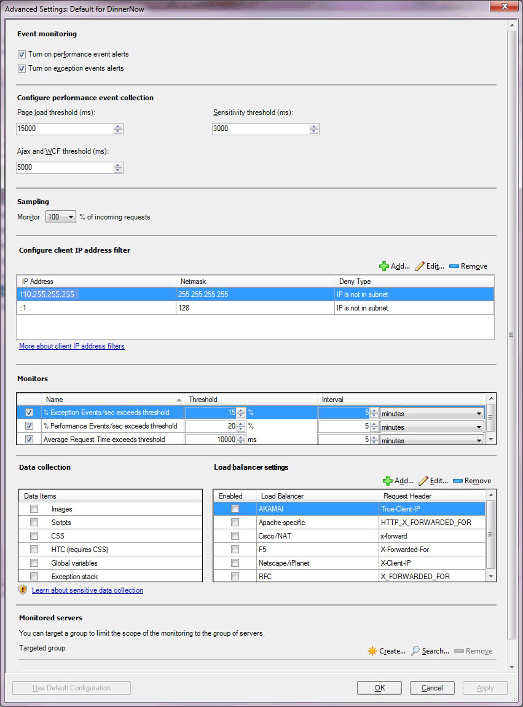

The following options are available on the  **Advance Settings**  for  **Client-Side Monitoring**  page of the wizard.

| Option | Description |
| --- | --- |
| Turn on performance event alerts | Turn performance event alert reporting on or off within the Operations console for server-side monitoring. Performance events are still logged to the Application Diagnostics console. You have the option whether to raise alerts after an Application Performance Monitoring event is generated. |
| Turn on exception event alerts | Turn exception event alert notification on or off within the Operations console for server-side monitoring. Exception events are still logged to the Application Diagnostics console. You have the option whether to raise alerts after an Application Performance Monitoring event is generated. |
| Page load threshold (ms) | Set the threshold in milliseconds (ms) that a page load must exceed before it causes a performance event. You have the option whether to raise alerts after an Application Performance Monitoring event is generated. The event is only turned into an alert if you have selected  **Turn on performance event alerts**. |
| Ajax and WCF threshold (ms) | Set the threshold in milliseconds (ms) that an Ajax or Windows Communications Foundation (WCF) call initiated from the page must exceed before it causes a performance event. The event is only turned to an alert if you have selected  **Turn on performance event alerts**. |
| Monitor % of incoming requests. | Specify a sample size of incoming requests, defined as a percentage of the total number of incoming requests that you want to monitor. For more information, see [Authoring Strategies for .NET Application Monitoring](author-strategies-net-application-monitoring.md) |
| IP address: IP Address | Specify the IP addresses that you want to exclude from monitoring. For more information, see [How to Configure IP Address Exclusion Filters for Client-Side Monitoring](/previous-versions/system-center/system-center-2012-R2/hh543988%28v%3dsc.12%29) |
| IP address: Netmask | Specify the part of the filter IP address and user IP address that have to be compared for equality. |
| IP address: Comparison Type | Specify to exclude IP addresses that match the IP addresses in the subnet ( **IP is in subnet** ), or to exclude the user IP addresses that don't match the IP addresses in the subnet ( **IP is not in subnet** ). |
| IP address: Use IPV6 | Specify to add the IPv6 filter if the IPv6 protocol is enabled on the web server. |
| Monitors: Exception Events\sec exceeds | Monitor that watches the .NET CSM Apps/% Exceptions Events/sec performance counter. |
| Monitors: Performance Events\sec exceeds | Monitor that watches the .NET CSM Apps/% Performance Events/sec performance counter. |
| Monitors: Average Request Time exceeds | Monitor that watches the .NET CSM Apps/Average Page Load Response Time performance counter. |
| Data Items | Select the type of client-side data that you want to collect. For more information, see [Working with Sensitive Data for .NET Applications](/previous-versions/system-center/system-center-2012-R2/hh543995(v=sc.12)) |
| Load balancer settings | Select the type of load balancer that you're using with your application. You can also add your own load balancer, if it isn't included in the list. For more information, see [Client-Side Monitoring with Targeted Groups and Load Balancers](/previous-versions/system-center/system-center-2012-R2/hh544003%28v%3dsc.12%29)  |
| Targeted group | Select specific servers to limit monitoring to this specific set of servers. This is optional. Targeted group scoping only becomes necessary when you have the same application running in multiple environments, such as production and staging, and you intend to run the template multiple times, one for each environment. In this scenario, group which machines belong to production and which belong to the staging environment, and then use the targeted groups to restrict where the configuration is propagated. You can also use groups to apply configuration to a subset of your servers. Otherwise, it isn't necessary to specify targeted group scoping if you just want to monitor all instances of a given application. |

## Enable client-side monitoring

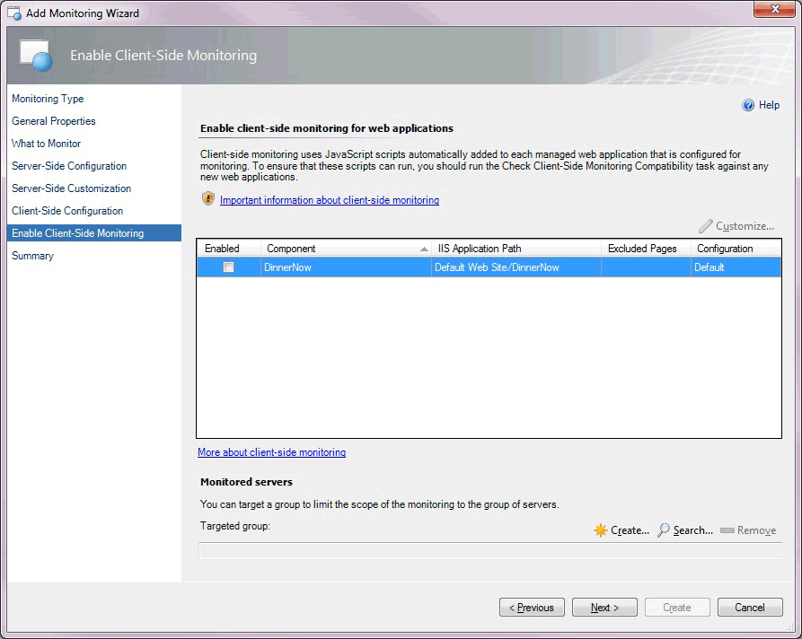

The following options are available on the  **Enable Client-Side Monitoring**  page of the wizard.

| Option | Description |
| --- | --- |
| Component | Select the component you want to customize for monitoring individual application components. Only the components of the ASP.NET Web application type are displayed. Web Services and WCF Services don't serve HTML pages to browsers, so you can't enable client-side monitoring for them. For System Center 2012 SP1 only: .NET applications hosted in Windows Services don't serve HTML pages to browsers, so you can't enable client-side monitoring for them. |
| Customize | Modify the settings for the selected application component. This opens the  **Modifying Settings**  page. The settings on this page are similar to those on the  **Advanced Settings for Client-Side Monitoring**  page. On the  **Modifying Settings**  page, you can specify the pages to be excluded from monitoring. |
| Targeted group | Select specific servers to limit monitoring to this specific set of servers. This is optional. Targeted group scoping only becomes necessary when you have the same application running in multiple environments, such as production and staging, and you intend to run the template multiple times, one for each environment. In this scenario, group which machines belong to production and which belong to the staging environment, and then use the targeted groups to restrict where the configuration is propagated. You can also use groups to apply configuration to a subset of your servers. Otherwise, it isn't necessary to specify targeted group scoping if you just want to monitor all instances of a given application. |

## Client-side modifying settings

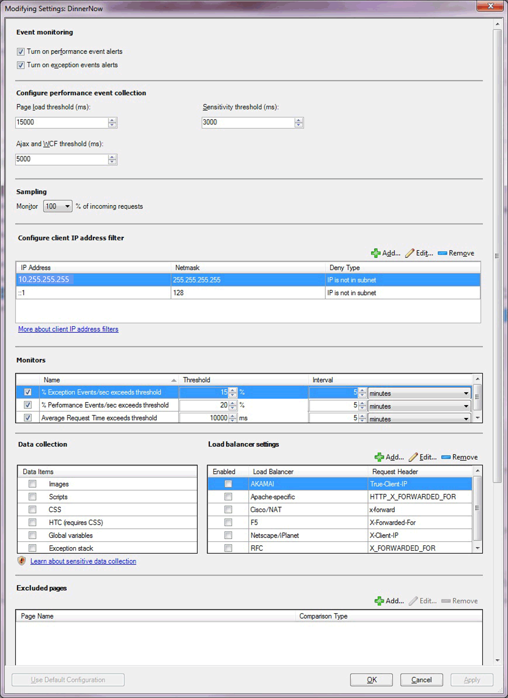

The following options are available on the  **Client-Side Modifying Settings**  page of the wizard.

| Option | Description |
| --- | --- |
| Turn on performance event alerts | Turn performance event alert reporting on or off within the Operations console for server-side monitoring. Performance events are still logged to the Application Diagnostics console. You have the option whether to raise alerts after an Application Performance Monitoring event is generated. |
| Turn on exception event alerts | Turn exception event alert reporting on or off within the Operations console for server-side monitoring. Exception events are still logged to the Application Diagnostics console. You have the option whether to raise alerts after an Application Performance Monitoring event is generated. |
| Page load threshold (ms) | Set the threshold in milliseconds (ms) that a page load must exceed before it causes a performance event alert. You have the option whether to raise alerts after an Application Performance Monitoring event is generated. The event is only turned into an alert if you have selected  **Turn on performance event alerts**. |
| Ajax and WCF threshold (ms) | Sets the threshold in milliseconds that an Ajax or Windows Communications Foundation (WCF) call initiated from the page must exceed before it causes a performance event. The event is only turned into an alert if you have selected  **Turn on performance event alerts**. |
| Sensitivity threshold (ms) | Specify to filter out fast-running methods to reduce overall "noise" by reducing the size of the call stack by gathering less data for each event. For more information, see [Authoring Strategies for .NET Application Monitoring](author-strategies-net-application-monitoring.md) |
| Monitor % of incoming requests. | Specify a sample size of incoming requests, defined as a percentage of the total number of incoming requests that you want to monitor. For more information, see [Authoring Strategies for .NET Application Monitoring](author-strategies-net-application-monitoring.md) |
| IP address: IP Address | Enter the IP addresses that you want to exclude from monitoring. For more information, see [How to Configure IP Address Exclusion Filters for Client-Side Monitoring](/previous-versions/system-center/system-center-2012-R2/hh543988%28v%3dsc.12%29) |
| IP address: Netmask | Specify the part of the filter IP address and user IP address that have to be compared for equality. |
| IP address: Comparison Type | Specify to exclude IP addresses that match the IP addresses in the subnet ( **IP is in subnet** ), or to exclude the user IP addresses that don't match the IP addresses in the subnet  **IP is not in subnet** ). |
| IP address: Use IPV6 | Specify to add the IPv6 filter if the IPv6 protocol is enabled on the web server. |
| Monitors: Exception Events\sec exceeds | Monitor that watches the .NET CSM Apps/% Exceptions Events/sec performance counter. |
| Monitors: Performance Events\sec exceeds | Monitor that watches the .NET CSM Apps/% Performance Events/sec performance counter. |
| Monitors: Average Request Time exceeds | Monitor that watches the .NET CSM Apps/Average Page Load Response Time performance counter. |
| Data collection | Select the type of client-side data you want to collect. For more information, see [Working with Sensitive Data for .NET Applications](/previous-versions/system-center/system-center-2012-R2/hh543995(v=sc.12)) |
| Load balancer settings | Select the type of load balancer that you're using with your application. You can also add your own load balancer, if it isn't included in the list. For more information, see [Client-Side Monitoring with Targeted Groups and Load Balancers](/previous-versions/system-center/system-center-2012-R2/hh544003%28v%3dsc.12%29). |
| Excluded pages: Add | Specify to add the pages to exclude from monitoring. You typically exclude pages that are considered unimportant for given metrics or that didn't pass the compatibility check. |
| Transactions: Add | Specify transactions to add for ASP.NET web pages. |
| Targeted group | Select specific servers to limit monitoring to this specific set of servers. This is optional. Targeted group scoping only becomes necessary when you have the same application running in multiple environments, such as production and staging, and you intend to run the template multiple times, one for each environment. In this scenario, group which machines belong to production and which belong to the staging environment, and then use the targeted groups to restrict where the configuration is propagated. You can also use groups to apply configuration to a subset of your servers. Otherwise, it isn't necessary to specify targeted group scoping if you just want to monitor all instances of a given application. |

## Summary

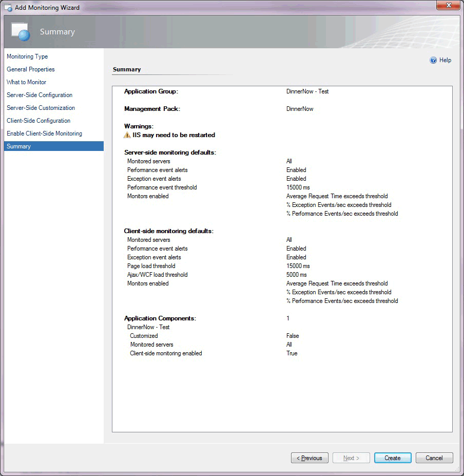

The  **Summary**  page of the wizard lists the settings you've configured for the  **.NET Application Performance Monitoring**  template. If you want to change any of these settings, select  **Previous**  or the template page until you reach the page with the settings that you want to change.

## Creating and modifying .NET application performance monitoring templates

For the procedure to run the .NET Application Performance Monitoring wizard, see [How to Configure Monitoring for .NET Applications](/previous-versions/system-center/system-center-2012-R2/hh543989%28v%3dsc.12%29).

#### To modify an existing .NET application performance monitoring template

1. Open the Operations console with a user account that has Author credentials in the management group.
2. Select the  **Authoring**  workspace.
3. In the  **Authoring**  navigation pane, expand  **Management Pack Templates** , and then select  **.NET Application Performance Monitoring**.
4. In the  **.NET Application Performance Monitoring**  pane, locate the template to change.
5. Right-click the application group that you want to modify, and then select  **Properties**.
6. Using the tabs to navigate the pages of settings, make the desired changes, such as adding customized monitoring for a specific application component or configuring and enabling client-side monitoring, and select  **OK**.

## Viewing .NET application performance monitoring monitors and collected data

After you configure monitoring for an application, these three views will help you get started with the monitoring experience.

#### To view all .NET application performance monitoring monitored applications

1. Open the Operations console.
2. Select the  **Monitoring**  workspace.
3. In the  **Monitoring**  navigation pane, expand  **Application Monitoring** , expand  **.NET Monitoring** , and select  **Monitored Applications**.

#### To view the state of each monitor

1. Open the Operations console.
2. Select the  **Monitoring**  workspace.
3. In the  **Monitoring**  navigation pane, expand  **Application Monitoring** , expand  **.NET Monitoring** , and select  **Monitored Applications**.
4. In the  **Monitored Applications**  view, right-click an object. Select  **Open** , and select  **Health Explorer**.
5. Expand the  **Availability**  and  **Performance**  nodes to view the individual monitors.

#### To view the performance collected for an application component

1. Open the Operations console.
2. Select the  **Monitoring**  workspace.
3. In the  **Monitoring**  navigation pane, expand  **Application Monitoring** , expand  **.NET Monitoring** , and select  **Monitored Applications**.
4. In the  **Monitored Applications**  pane, right-click an object. Select  **Open** , and select  **Performance View**.
5. In the  **Legend**  pane, select the counters that you want to view.
6. Use options in the  **Actions**  pane to modify the Performance view.

## See also

- [Before You Begin Monitoring .NET Applications](/previous-versions/system-center/system-center-2012-r2/hh543994(v=sc.12))
- [How to Configure Monitoring for .NET Applications](/previous-versions/system-center/system-center-2012-R2/hh543989%28v%3dsc.12%29)
- [How to Start Monitoring a New Application](/previous-versions/system-center/system-center-2012-R2/hh544005%28v%3dsc.12%29)
- [Authoring Strategies for .NET Application Monitoring](author-strategies-net-application-monitoring.md)
