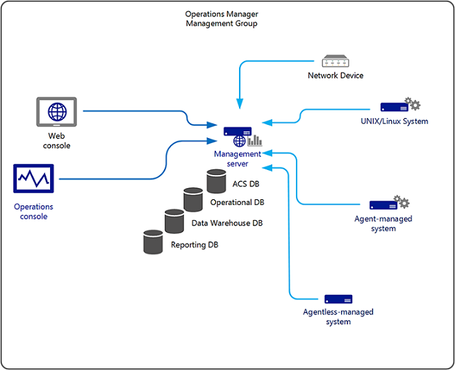

# Planning a Management Group Design

>Applies To: System Center 2016 - Operations Manager

## Overview

A management group is identified by a single operational database, one or more management servers, and one or more monitored agents and devices.  Connecting management groups allows alerts and other monitoring data to be viewed and edited from a single console.  Tasks can also be initiated from a local management group to run on the managed objects of a connected management group.

The simplest Operations Manager implementation is a single management group.  Each additional group requires at least its own operational database and management server.  Each group must also be separately maintained with its own configuration settings, management packs, and integration with other monitoring and ITSM solutions.  

The distributed management group implementation will form the foundation of 99 percent of Operations Manager deployments. It allows for the distribution of features and services across multiple servers to allow for scalability and redundancy for some of those features. It can include all Operations Manager server roles and supports the monitoring of devices across trust boundaries through the use of the gateway server.

The following diagram presents one possible option for the distributed management group topology.

> [!NOTE]
> There is no direct communication between the Operations console and the databases. All communication is directed to a specific management server over port TCP 5724, and then to the database servers using OLE DB on TCP 1433 or a user-defined port specified by the SQL administrator during setup of the SQL Server database engine instance. However, there is direct communication between an Application Diagnostics console (co-located with the Web console) and the SQL Server hosting the operational and data warehouse databases.

A management group that you have deployed in your environment can integrate with [Microsoft Operations Management Suite (OMS)](https://azure.microsoft.com/documentation/articles/operations-management-suite-overview), and by utilizing Log Analytics, you can further correlate, visualize, and act on performance, events and alerts.  This provides you with increased visibility by being able to perform custom searches across the entire dataset in order to correlate data between systems and applications, hosted on-premise or in the cloud.    

Integration with Operations Manager extends to other products such as BMC Remedy, IBM Netcool or other enterprise management solutions used by your organization.  For more information about planning for interoperability with these solutions, check out [Integration with other management solutions](../om/plan/planning-integration-with-other-management-solutions.md).

## Management group components

### Management server

In Operations Manager 2007, the root management server (RMS) was a specialized type of management server in a management group, and was the first management server installed in a management group.  The RMS was the focal point for administering the management group configuration, administering and communicating with agents, and communicating with the Operational database and other databases in the management group.  The RMS also served as the target for the Operations console and the preferred target for the Web consoles.
In System Center 2012 R2 – Operations Manager, the root management server role was removed and all management servers are now peers.  This configuration continues to exist in System Center 2016 - Operations Manager. 

The RMS is no longer a single point of failure as all management servers host the services previously hosted only by the RMS.  Roles are distributed to all the management servers.  If one management server becomes unavailable, its responsibilities are automatically redistributed.  An RMS emulator role provides for backwards compatibility for management packs targeting the RMS.  If you do not have any management packs that previously targeted the RMS, you will not need to make use of the RMS Emulator.

The management group can contain multiple management servers to provide additional capacity and continuous availability.  When two or more management servers are added to a management group, the management servers automatically become part of the three default resource pools and work is spread across the members of the pool.  For custom defined resource pools, members are manually added.  When a member of the resource pool fails, other members in the resource pool will pick up that member’s workload.  When a new management server is added, the new management server automatically picks up some of the work from existing members in the resource pool.  Review [Resource pool design considerations](../om/plan/planning-resource-pool-design.md) to learn more about how they function and recommendations that influence your design plan.  

If a management server is unavailable for any reason, by default agents that rely on it will automatically failover to another management server.  When selecting the number and placement of management servers, this failover ability should be considered if high availability is a requirement.

Agents connect to a management server to communicate with all other Operations Manager components. Some of the work performed by a management server is the process of taking the operational data sent by agents and inserting it into the operational database and the data warehouse. 

A typical management server will handle approximately 3,000 agents.  Actual server performance varies according to the volume of operational data collected; however, management servers typically can support 3,000 agents each, even with a relatively high volume of operational data. 

There is no limit on the maximum number of management servers per management group. However, it is generally best practice to use as few management servers as possible after addressing scalability, high availability, and disaster recovery constraints. 

Management servers should have a good network connectivity to the Operations Manager database and data warehouse because they frequently send large volumes of data to these stores.  In general, these SQL Server connections consume more bandwidth and are more sensitive to network latency.  Therefore, all management servers should be on the same local area network as the Operational database and the Data Warehouse database and never deployed across a wide area network.  There should be less than 10 milliseconds of latency between a management server and SQL Server instance hosting the Operations Manager databases.  

### Gateway server

Operations Manager requires mutual authentication be performed between agents and management servers prior to the exchange of information between them.  To secure the authentication process between the two, the process is encrypted.  When the agent and the management server reside in the same Active Directory domain or in Active Directory domains that have established trust relationships, they make use of Kerberos&nbsp;V5 authentication mechanisms provided by Active Directory. When the agents and management servers do not lie within the same trust boundary, other mechanisms must be used to satisfy the secure mutual authentication requirement.  

Gateway servers are used when a firewall separates the agents from the management servers or when the agents are in a separate, un-trusted domain.  The gateway server acts as a proxy between the agents and the management server.  Without the gateway server, the agents could still perform certificate authentication with a management server, but a X.509 certificate would need to be issued and installed on each agent, and each would require access to the management server through the firewall.  If the agents are in the same domain as the gateway server or if they are in a trusted domain, they may use Kerberos authentication.  In this case, only the gateway server and the connected management servers will require certificates.  This includes monitoring of virtual machines running in Microsoft Azure Infrastructure as a Service (IaaS), with Operations Manager (i.e. hybrid cloud monitoring) that are not joined to the same trusted realm as the roles supporting the Operations Manager management group, or you have deployed Operations Manager in Azure IaaS (a virtual machine with SQL Server hosting the operational databases and one or more virtual machines hosting the management server role) and are monitoring un-trusted on-premise workloads.  

The following presents an example Operations Manager deployment monitoring Azure IaaS resources. 

The following is an example Operations Manager deployment hosted in Azure IaaS.  

Typically gateway servers are not be used for managing bandwidth utilization because the overall volume of data sent from agents to a management server is similar whether a gateway server is used or not. The intended purpose of a gateway server is to reduce the effort required in managing certificates for agents in un-trusted domains and to reduce the number of communication paths that must be allowed through firewalls.  

- Having more than 2,000 agents per gateway server can adversely affect the ability to recover in the event of a sustained outage that prevents the gateway server from communicating with the management server.  Multiple gateway servers are recommended if more than 2,000 agents are required. The alternative, if gateway server recovery time is a concern, is to test the system to make sure that the gateway server is able to quickly empty its queue after a sustained outage between the gateway server and the management server.  In addition, after the incoming queue on the gateway server is filled, data in the queue is dropped according to its priority, meaning that a sustained gateway server outage in this scenario could result in lost data. 
- When there are a large number of agents connected through gateway servers, consider using a dedicated management server for all gateway servers.  Having all gateway servers connect to a single management server with no other agents connected to it can speed recovery time in the event of a sustained outage.  The effective load on the management server is the total number of agents reporting to it either directly or by way of gateway servers.
- To prevent the gateway server from initiating communication with a management server, including when configured to failover between multiple management servers for high availability, the gateway Approval tool includes the /ManagementServerInitiatesConnection command-line argument.  This allows Operations Manager to conform to a customer’s security policy when systems are deployed in a DMZ or other network environment and communication can only be initiated from the intranet.  

### Web console server

The Web console provides an interface to the management group that is accessible via a Web browser.  It does not have the full functionality of the Operations console, however, and provides access to only the Monitoring and My Workspace views.  The Web console provides access to all the monitoring data and tasks that are actions that can be run against monitored computers from the Operations console.  Access to data in the Web console has the same restrictions as access to content in the Operations console.

###  Reporting server

Reporting for System Center 2016 – Operations Manager is installed on SQL Server Reporting Services 2014 or 2016, and the only valid configuration of Reporting Services supported by Operations Manager Reporting is native mode.

> [!NOTE] 
> Installing System Center 2016 – Operations Manager Reporting Services integrates the security of the SQL Reporting Services instance with the Operations Manager role-based security.  Do not install any other Reporting Services applications in this same instance of SQL Server.

The Operations Manager Report Server components can be installed on the same server that is running SQL Server 2014 or 2016 Reporting Services or on a different computer.  For optimum performance, especially in an enterprise environment with high-volume, parallel report generation by users while interactive or scheduled reports are processing concurrently, you need to scale-up to handle more concurrent users and larger report execution loads.  It is generally recommended that Operations Manager Reporting service is not co-located on the same SQL Server hosting the data warehouse database and installed on a dedicated system.  

### Operational database

The operational database is a SQL Server database that holds all the operational data, configuration information, and monitoring rules for a management group.  The Operations Manager database is a single source of failure for the management group, so it can be made highly available using supported clustering configurations.

To keep this database at a consistent size, the grooming settings in Operations Manager specify the length of time that data may be retained in it. By default, this duration is seven (7) days.

### Reporting Data Warehouse database

The Reporting data warehouse is a SQL Server database that collects and stores operational data for long-term reporting.  This data is written directly from rules that collect data to report and from data synchronization processes in the operational database.  Maintenance of the data warehouse, including aggregation, grooming, and optimization, is performed automatically by Operations Manager.

The following table highlights the default data types and retention period after initial setup of the data warehouse database.

| Dataset | Aggregation Type| Retention Period (in days) |
|-----------|---------------|---------------|
| Alert | Raw | 400 | 
| Client Monitoring | Raw | 30 |
| Client Monitoring | Daily | 400 | 
| Events | Raw | 100 | 
| Performance | Raw | 10 | 
| Performance | Hourly | 400 |
| Performance | Daily | 400 | 
| State | Raw | 180 | 
| State | Hourly | 400 | 
| State | Daily | 400 | 

A data warehouse may serve multiple management groups. This allows a single report to incorporate data from all the computers across the organization.

Like the Operations Manager database, the data warehouse database can be clustered for high availability.  If it is not clustered, it should be carefully monitored so that any issues can be quickly addressed.
   

### ACS Collector

The ACS collector receives and processes events from ACS forwarders and then sends this data to the ACS database. This processing includes disassembling the data so that it can be spread across several tables within the ACS database, minimizing data redundancy, and applying filters so that unnecessary events are not added to the ACS database. 

### ACS database

The ACS database is the central repository for events that are generated by an audit policy within an ACS deployment. The ACS database can be located on the same computer as the ACS collector, but for best performance, each should be installed on a dedicated server.  By default, the data is retained for fourteen (14) days.  

### ACS Forwarder

The service that runs on ACS forwarders is included in the Operations Manager agent. By default, this service is installed but not enabled when the Operations Manager agent is installed. You can enable this service for multiple agent computers at once using the Enable Audit Collection task or using PowerShell. After you enable this service, all security events are sent to the ACS collector in addition to the local Security log.

## Design considerations

The following factors should be taken into consideration when deciding to implement a single or multiple management groups:

- Increased Capacity.  Operations Manager has no built-in limits regarding the number of agents that a single management group can support.  Depending on the hardware that you use and the monitoring load (more management packs deployed means a higher monitoring load) on the management group, you might need multiple management groups in order to maintain acceptable performance. 
- Consolidated Views.  When multiple management groups are used to monitor an environment, a mechanism is needed to provide a consolidated view of the monitoring and alerting data from them.  This can be accomplished by deploying an additional management group (which might or might not have any monitoring responsibilities) that has access to all the data in all other management groups.  These management groups are then said to be connected.  The management group that is used to provide a consolidated view of the data is called the Local management group, and the others that provide data to it are called Connected management groups.
- Security and Administrative.  Partitioning management groups for security and administrative reasons is very similar in concept to the delegation of administrative authority over Active Directory Organizational Units or domains to different administrative groups.  Your company might include multiple IT groups, each with its own area of responsibility.  The area might be a specific geographical area or business division.  For example, in the case of a holding company, it can be one of the subsidiary companies.  Where this type of full delegation of administrative authority from the centralized IT group exists, it might be useful to implement a management group structure in each of the areas.  Then they can be configured as Connected management groups to a Local management group that resides in the centralized IT data center. 
- Installed Languages.  All servers with an Operations Manager server role installed on them must be installed in the same language.  That is to say, you cannot install the management server by using the English version of Operations Manager 2012 R2 and then deploy the Operations Console by using the Japanese version.  If the monitoring needs to span multiple languages, an additional management group will be needed for each language of the operators.
- Production and Pre-Production Functionality.  In Operations Manager, it is a recommended practice to have a production implementation that is used for monitoring your production applications and a pre-production implementation that has minimal interaction with the production environment.  The pre-production management group is used for testing and tuning management pack functionality before it is migrated into the production environment.  In addition, some companies employ a staging environment for servers where newly built servers are placed for a burn-in period prior to being placed into production.  The pre-production management group can be used to monitor the staging environment to ensure the health of servers prior to production rollout.
- Dedicated ACS Functionality.  If your requirements include the need to collect Windows Audit Security log events or UNIX/Linux security events, you will be implementing the Audit Collection Service (ACS).  It might be beneficial to implement a management group that supports the ACS function exclusively if your company's security requirements mandate that the ACS function be controlled and administered by an administrative group other than the one that manages the rest of the production environment.
- Disaster Recovery Functionality.  In Operations Manager 2016, all interactions with the Operations Manager database are recorded in transaction logs prior to being committed to the database.  Those transaction logs can be sent to another server running Microsoft SQL Server  2014 or 2016 and committed to a copy of the Operations Manager database there.  This feature is an option to provide redundancy of the Operations Manager operational database between two SQL Servers in the same management group.  When a controlled failover needs to be performed, the management servers in the management group require a registry change in order to reference and communicate with the secondary SQL Server.  A failover management group can be deployed which matches exact configuration of the primary management group (management packs, overrides, notification subscriptions, security, etc.) and the agents are configured to report to both management groups.  If the primary management group in its entirety becomes unavailable for any reason, there is no downtime of the monitoring environment.  This solution ensures service continuity of the management group and zero loss of operational monitoring.   

Before you deploy System Center 2016 Operations Manager in a production environment, plan the design of your management group. During the planning phase, understanding the IT service components (i.e. infrastructure and application-level) and the number of systems and devices supporting them, how it will integrate and support your incident and problem management processes, and how you will visualize the data for different incident escalation support tiers, engineering, service consumers, and management.  

## Connected management groups

Many enterprises with servers in multiple geographical locations require central monitoring of those servers.  The Connected management group configuration, illustrated in the image below, is a set of workflow processes that are designed to create a hierarchical systems management infrastructure.   

This configuration can be used to achieve centralized monitoring.  It is designed to support the viewing of alerts and monitoring data, as well as to initiate tasks against a managed object of a connected management group.

By connecting Operations Manager 2016 management groups, centralized monitoring functionality can be maintained while at the same time enabling:

- Monitoring of a larger number of manage objects than is possible with a single management group. 
- Isolation of monitoring activity according to logical business units, such as “Marketing,” or physical locations, such as Rome. 

When you connect management groups, you are not deploying any new servers; rather, you are allowing the local management group to have access to the alerts and discovery information that is in a connected management group.  In this way, you can view and interact with all the alerts and other monitoring data from multiple management groups in a single Operations console.  In addition, you can run tasks on the monitored computers of the connected management groups.  To learn how to connect management groups, see [Connecting management groups in Operations Manager](../om/manage/connecting-management-groups-in-operations-manager.md). 

### Installed languages

Operations Manager management groups support only one installed language. If the overall IT environment that you need to monitor has more than one installed language, a separate management group will be needed per language.
