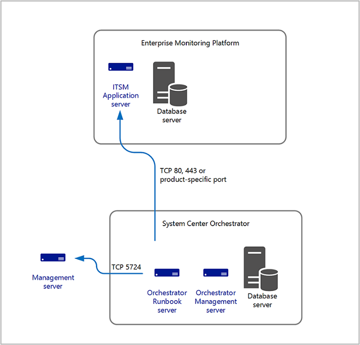
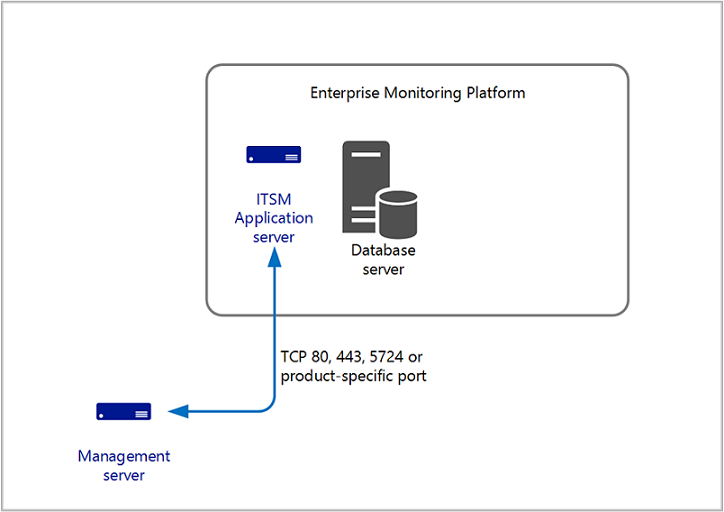

# Integration with other enterprise management products

Many customers have one or more monitoring platforms, where one provides consolidated operational data across business infrastructure, data centers, complex networks, and IT domains in the enterprise. From this central monitoring platform, they correlate this data and forward to service management solution for incident recording and escalation, and to analyze and visualize the data presented through different types of dashboards. System Center - Operations Manager is included in that service operations framework to forward alert or alert and performance data, or is the primary monitoring platform extended to meet your business needs.  

Interoperability between Operations Manager and other products is accomplished from many different methods depending on the technical and business requirements. The following are common methods to interface with Operations Manager:

- System Center - Orchestrator with integration packs available from Microsoft, third parties, and the community.  Integration packs for Orchestrator contain additional activities that extend the functionality of Orchestrator to communicate and exchange data with other third-party systems.
- Connectors built on the Operations Manager Connector Framework (OMCF). Connectors built on the OMCF, which are developed from the [Operations Manager SDK](/previous-versions/system-center/developer/hh329086(v=msdn.10)), provide methods and types that you can use to initialize and manage a connector and to get or send operations data.  Some examples of connectors used to integrate with Operations Manager are other System Center products like Service Manager and Virtual Machine Manager (VMM), and third-party products such as Nagios or IBM Netcool.  Connections to external systems are commonly performed using a web service.  
- Querying the SQL operational or data warehouse databases to extract certain datasets for custom reports or dashboards.

Other custom connectors are developed and implemented to support advanced scenarios such as alert enrichment, including additional information before the alert is forwarded to the incident management system, perform alert correlation, or provide advanced notification functionality with Operations Manager.

Operations Manager also integrates with [Azure Monitor](/azure/azure-monitor/platform/om-agents/) to forward collected events, alerts, and performance data for further analysis and provides greater visibility for the enterprise.

## When separated by a firewall

The ports and communication between Operations Manager and the other management products depends on the method of integration used. If you're using System Center - Orchestrator, the Orchestrator runbook server connects to the Operations Manager management server over TCP port 5724. It's a one-way directed communication.  

If you're using a connector provided by the vendor, review their documentation in order to understand what ports and which direction the traffic flows.

## Design considerations

Integration between Operations Manager and other monitoring and management products is commonly configured between a single management server and the other management product. Or in other cases, between multiple management servers or specifying the Operations Manager management group name. Support for multiple, connected management groups isn't supported, and each management group will need to install a separate instance of the connector for each management group. This includes integration between System Center Orchestrator, VMM, and Service Manager.

When planning for service continuity, it's important to evaluate and determine the risks, impact, and recovery options for your Operations Manager deployment to support your service level targets.  

If a management server is supporting integration (via a connector hosted directly on the management server or from another System Center product such as VMM, Orchestrator, or Service Manager), you need to plan for this with manual or automatic recovery steps depending on the integration configuration and sequence of steps required to return to normal functionality.
