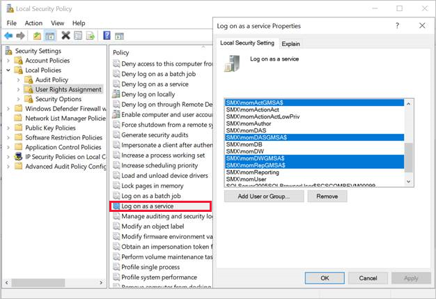
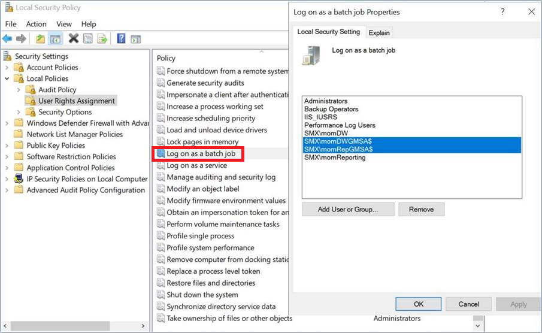
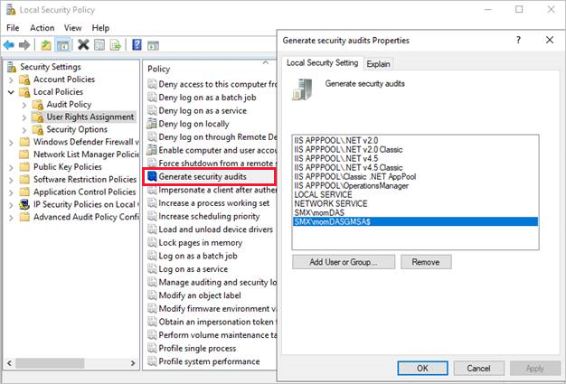

# Provide security rights

This article provides information on how to provide security rights to group Managed Service Accounts (gMSA). For more information, see [accounts used for gMSA](support-group-managed-service-accounts.md).

::: moniker range="sc-om-2019"

>[!NOTE]
>This article is applicable for Operations Manager 2019 Update Rollup 1 (UR1) and later.

::: moniker-end

## Provide *Log on as a service* right

To provide *log on as a service* right to gMSA accounts, follow these steps:

1. Open the *Local Security Policy* MMC snap-in. Or you can open a run box and enter: `secpol.msc`
2. Go to **Local Policies**>**User Rights Assignment**
3. Double-click **Log on as a service** job under **Policy**.
4. Add the gMSAs to the list of accounts that are allowed to log on as a service.

    Here are the account details:

    - **SMX\momActGMSA$**: Management Server Action account

    - **SMX\momDASGMSA$**: Data Access Service account (SDK)

    - **SMX\momDWGMSA$**: Data Warehouse Write account

    - **SMX\momRepGMSA$**: Data Warehouse Read account

        

## Provide *Log on as a batch* right

To grant *log on as a batch right* to Data Writer and Data Reader gMSAs, follow these steps:

1. Open the *Local Security Policy* MMC snap-in. Or you can open a run box and enter: `secpol.msc`
2. Go to **Local Policies**>**User Rights Assignment**
3. Select **Log on as a batch** under **Policy**.  
4. Add the gMSAs to the list of accounts that are allowed to log on as a batch.

    

## Generate security audits

Provide permissions to the gMSA SDK account if you wish to generate auditing events. Follow these steps:

1. Open the *Local Security Policy* MMC snap-in. Or you can open a run box and enter: `secpol.msc`
2. Go to **Local Policies**>**User Rights Assignment**
3. Double-click **Generate security audits** under **Policy**.
4. Add the gMSAs to the list of accounts that are allowed to generate security audits.

    

## Next step

After you've provided the required access rights, [change the databases](database-changes.md).
