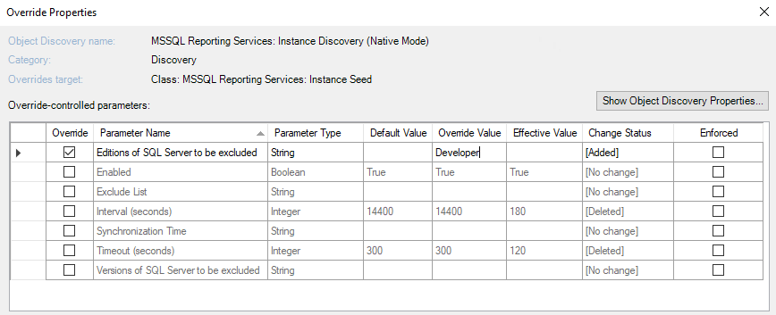

# Disabling monitoring of specified SQL Servers in Management Pack SQL Server Reporting Services

This section explains how to disable monitoring of SQL Servers Reporting Services.

## Disabling Monitoring of Specified SQL Server Reporting Services Versions

Management Pack for SQL Server Reporting Services allows you to exclude certain versions of SQL Server Reporting Services from monitoring.

To exclude versions that you don't want to monitor, override the **Versions of SQL Server to be excluded** parameter in the **MSSQL Reporting Services: Instance Discovery (Native Mode)** discovery with the versions that you want to exclude. Use commas to specify multiple versions.

For example, an override "2016,2017" instructs the management pack to skip instances of SQL Server Reporting Services 2016 and 2017.

## Disabling Monitoring of Specified SQL Server Reporting Services Editions

Management Pack for SQL Server Reporting Services allows you to exclude certain editions of SQL Server Reporting Services instances from monitoring.

To exclude editions that you don't want to monitor, override the **Editions of SQL Server to be excluded** parameter in the **MSSQL Reporting Services: Instance Discovery (Native Mode)** discovery with the editions that you want to exclude. Use commas to specify multiple editions.

The following table lists short names that you can use to override the **Editions of SQL Server to be excluded** parameter.

|Short Name|Covered Editions|
|-|-|
|Enterprise|Enterprise Edition, Enterprise Edition: Core-based Licensing|
|Standard|Standard Edition, Business Intelligence Edition|
|Web|Web Edition|
|Developer|Developer Edition|
|Express|Express Edition, Express Edition with Advanced Services|
|Evaluation|Enterprise Evaluation Edition|

