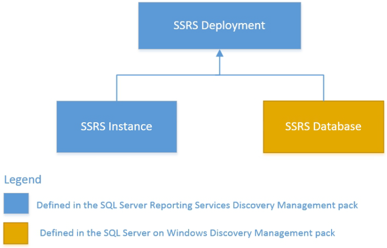

# Monitoring Configuration in Management Pack for SQL Server Reporting Services

Management Pack for SQL Server Reporting Services automatically discovers instances of SQL Server Reporting Services and Power BI Report Server by implementing the following workflows:

- Reading the registry to detect if SQL Server Reporting Services and Power BI Report Server are installed on the server. If installed, the management pack creates a seed object.

- If the seed object is discovered, the management pack reads such data sources as the registry, WMI, SQL Server Reporting Services configuration file, and so on, to discover instance properties and the **Deployment Seed** object.

  The **Deployment Seed** object is an unhosted object managed by System Center Operations Manager Management Server. Appropriate permissions are required to access the necessary data sources. For more information, see [Reporting Services Run As Profiles](reporting-services-management-pack-run-as-profiles.md).

## Discovery of SQL Server Reporting Services Deployment

SQL Server Reporting Services Deployment includes the following components:

- One or more instances of SQL Server Reporting Services
- Reporting Services Database and SQL Server that hosts Reporting Services Database

Reporting Services Database is a term that describes two databases used by Server Reporting Services:

- Catalog Database
- Temporary Database

> [!NOTE]
> Pre-installation of **Microsoft SQL Server on Windows (Discovery)** version 7.0.20.0 or later is required to discover Server Reporting Services Deployment. This MP file is part of the **Microsoft System Center Management Pack for SQL Server on Windows** delivery. In case of absence of **Microsoft SQL Server on Windows (Discovery)**, this management pack won't be able to discover and monitor the availability and performance of Server Reporting Services Deployment. Monitoring of Server Reporting Services is still possible without having **Microsoft SQL Server on Windows (Discovery)** installed.

Management Pack for SQL Server Reporting Services supports different kinds of installations of SQL Server. The Reporting Services Database can be deployed to:

- Standalone instance (either named or the default one)
- Cluster instance
- Availability group

For Availability Group failover, it will take about 8 hours to rediscover deployment. As a workaround, you can temporarily change the running intervals for the following discoveries:

- MSSQL Reporting Services: Native Mode Deployment Discovery
- MSSQL Reporting Services: Deployment Seed Discovery

To find a SQL Server instance that hosts Reporting Services Database, the management pack uses the connection string utilized by Reporting Services Instance to connect to the database. The following connection string formats are supported:

- MachineName
- MachineName\InstanceName
- IPAddress
- IPAddress\PortNumber
- (local)

Deployment discovery runs on a System Center Operations Manager server and queries API to get a list of Reporting Services instances and databases discovered on different SQL Servers.

Not only deployment discovery creates a new **Deployment** object, but it also creates a new **Deployment Watcher** object, both of which are unhosted.

SQL Server Reporting Services Scale-out Deployment is a distributed application. Therefore, the deployment object is managed by the management server. The main purpose of the deployment object is to combine the health state of various Reporting Services components and group respective System Center Operations Manager objects.

Deployment watcher is an auxiliary object managed either by an agent installed on the server that hosts SQL Server Reporting Services Database, or an agent that hosts one of Reporting Services instances from the given deployment. This object is used to collect information about SQL Server Reporting Services deployments.

## Availability of SQL Server Reporting Services Components

This management pack introduces a set of monitors for SQL Server Reporting Services Deployments and Instances. These monitors verify availability from the following perspectives:

- Scale-out Deployment:
  - Catalog database is accessible
  - Temporary database is accessible
  - There are no broken references to shared data sources
  - Number of failed report executions (expressed as a percentage of total report executions) is below the threshold
  - All instances within the deployment are discovered
  - Number of failed subscriptions
- Instance:
  - Catalog database is accessible
  - Temporary database is accessible
  - Windows service is started
  - Web service is accessible
  - Report manager is accessible
  - Instance is not using too much CPU resources
  - Instance is not using too much memory resources
  - There is no memory configuration conflict between Reporting Services Instance and SQL Server Database Engine (if both components are running on the same server)
  - Other processes allow enough memory resources for the Reporting Services Instance
  - Number of failed report executions per minute is below the threshold for the given Reporting Services Instance

### Report Manager and Web Server Accessible

Management Pack for SQL Server Reporting Services supports the monitoring of Reporting Services Web Service and Report Manager using multiple endpoint URLs to determine whether they are available. By default, the first URL in the sequence is used. If you want to use a different URL, you can explicitly set the **URL position** override by changing its default value to a value that corresponds to the desirable URL.

### Failed Subscriptions Monitoring

Management Pack for SQL Server Reporting Services supports monitoring of failed subscriptions and scheduled refresh plans and produces corresponding alerts when any of these are found.

To determine whether you have failed subscriptions or plans, the monitor scans the **LastStatus** column in the **Subscriptions** table. For more information about the statuses, see [this article](/sql/reporting-services/subscriptions/monitor-reporting-services-subscriptions).

Report subscriptions and scheduled refresh plans may fail due to various reasons. For more information on what caused the failure, see **My subscriptions** on the reporting portal and **Scheduled refresh** on the Power BI reporting portal.

### Running Power BI reports monitoring

Management Pack for Reporting Services is capable of tracking the amount of memory consumed by running Power BI reports. Once the threshold that you define in the 'Threshold' override (specified in GB) is exceeded, the alert is thrown. By default, the monitor uses the top 10 memory-heavy reports that are counted in memory consumption. You can redefine both overrides at any time based on your environment preferences.

## Performance of SQL Server Reporting Services Installation

This management pack collects the following performance metrics:

- Scale-out Deployment:
  - Failed report executions per minute
  - Report executions per minute
  - Number of reports
  - Number of shared data sources
  - Number of subscriptions
  - On-demand execution failures per minute
  - On-demand executions per minute
  - Scheduled execution failures per minute
  - Scheduled executions per minute
- Instance:
  - CPU utilization (%)
  - WorkingSetMaximum (GB)
  - WorkingSetMinimum (GB)
  - Memory consumed by other processes (%)
  - Memory consumed by SSRS (GB)
  - Total memory on the Server (GB)
  - Total memory consumed on the server (GB)
  - Failed report executions per minute
  - Report executions per minute
  - Working set memory consumed by Power BI Analysis Services process (GB)
  - Private memory consumed by Power BI Analysis Services process (GB)
  - Working set memory consumed by Power BI Mashup containers (GB)
  - Private memory consumed by Power BI Mashup containers (GB)
  - Total memory usage by running Power BI reports on the Server (GB)

## Securables Configuration Status Monitor

This monitor checks if each of the required SQL Server Reporting Services securables is accessible to the **ReportServer** database under the configured [Reporting Services Run As Profiles](reporting-services-management-pack-run-as-profiles.md).

The following is a complete list of securables that are checked by the monitor targeted to the Reporting Services instance:

- SELECT permission on catalog views
  - dbo.ExecutionLog2

- SELECT permission on tables
  - dbo.Keys

The following is a complete list of securables that are checked by the monitor targeted to the Reporting Services deployment watcher:

- SELECT permission on catalog views
  - dbo.ExecutionLog2

- SELECT permission on tables
  - dbo.Catalog
  - dbo.DataSource
  - dbo.Subscriptions

## Feature Groups

In System Center Operations Manager, groups are logical collections of objects, such as Windows-based computers, hard disks, or instances of Microsoft SQL Server. For more information about the groups, see [Creating and managing groups](./manage-create-manage-groups.md).

In Management Pack for SQL Server Reporting Services you can use two groups, which have the dynamic type of membership:

- MSSQL Reporting Services: Deployment Group
  
  This group is used to contain all Reporting Services Deployment objects.

- MSSQL Reporting Services: Power BI Feature Group
  
  This group is used to enable Power BI for particular Reporting Services instances, which support this feature; for example:

  - Memory consumed by running Power BI reports monitor
  - MSSQL Reporting Services: Working set memory consumed by Power BI Mashup containers (GB) performance rule
  - MSSQL Reporting Services: Private memory consumed by Power BI Mashup containers (GB) performance rule
  - MSSQL Reporting Services: Working set memory consumed by Power BI Analysis Services process (GB) performance rule
  - MSSQL Reporting Services: Private memory consumed by Power BI Analysis Services process (GB) performance rule
  - MSSQL Reporting Services: Total memory usage by running Power BI reports on Server (GB) performance rule

## How Health Rolls Up

The following diagram shows how health states of objects roll up for the SQL Server on Windows management pack.

## Best Practice: Create a Management Pack for Customizations

The management pack is sealed; you can't change any of its original settings. However, you can create customizations, such as overrides or new monitoring objects, and save them to a different management pack.

By default, Operations Manager saves all customizations to the default management pack. As a best practice, you should create a separate management pack for each sealed management pack that you want to customize.

Creating a new management pack for storing overrides has the following advantages:

- When you create a management pack for storing customized settings for a sealed management pack, it's helpful to base the name of the new management pack on the name of the management pack you're customizing; for example, **Microsoft SQL Server Reporting Services Overrides**.

- Creating a new management pack for storing customizations of each sealed management pack makes it easier to export the customizations from a test environment to a production environment. It also makes it easier to delete a management pack because you must delete any dependencies before you can delete a management pack. If customizations for all management packs are saved in the Default Management Pack and you need to delete a single management pack, you must delete the default management pack first, which also deletes customizations for other management packs.

For more information about management pack customizations and the default management pack, see [What is in an Operations Manager management pack?](manage-overview-management-pack.md).
