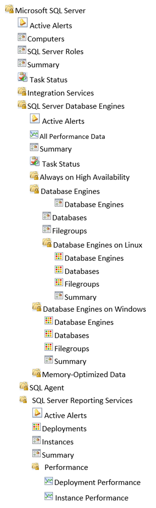
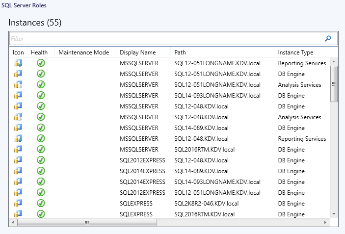
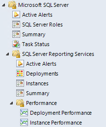

# Views and Dashboards in Management Pack for SQL Server Reporting Services

Management Pack for SQL Server Reporting Services introduces a common folder structure that will be used by future releases of management packs for different components of SQL Server.

The following views and dashboards are version-independent and show information about all versions of SQL Server:

The **Computers** view displays computers on which agents are installed and the management pack discovery is running. Note that this view does not display computers configured for agentless monitoring.

The **SQL Server Roles** dashboard provides information about all instances of SQL Server Database Engine, SQL Server Reporting Services, SQL Server Analysis Services and SQL Server Integration Services:

### Reporting Services Views and Dashboards

Management Pack for SQL Server Reporting Services introduces a comprehensive set of state, performance and alert view that can be found in the dedicated folder.

Some views may contain a very long list of objects and metrics. To find a specific object or group of objects, you can use **Scope** , **Search** , and **Find** buttons on the Operations Manager toolbar. For more information, see the "[Finding Data and Objects in the Operations Manager Consoles](https://go.microsoft.com/fwlink/?LinkId=717834)" article in the Operations Manager Help.

This management pack includes a set of rich dashboards, which provide detailed information about SQL Server Reporting Services Instances and Deployments. The structure of the management pack views and folders is as follows:

