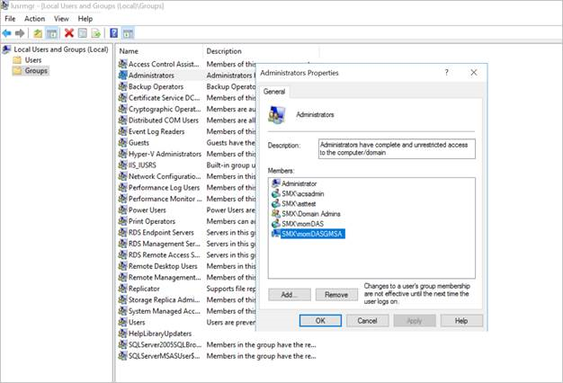
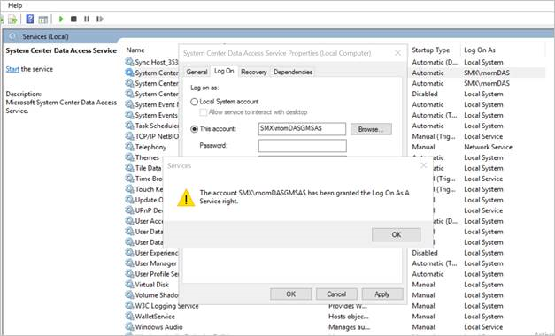
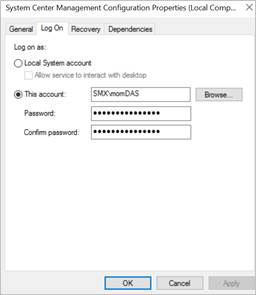
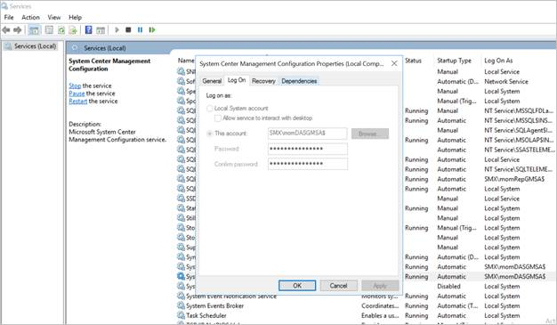
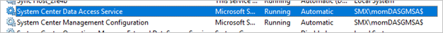
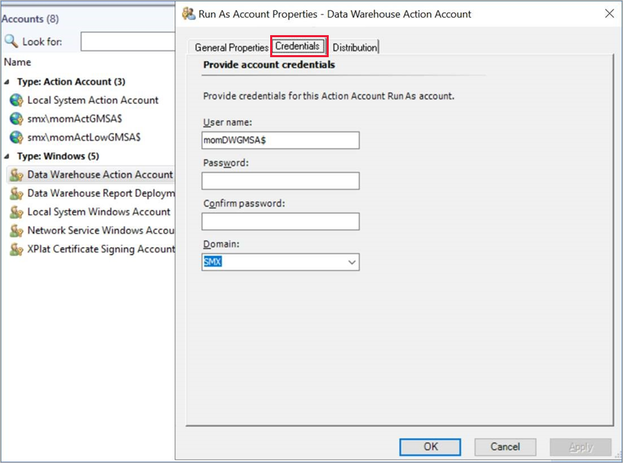
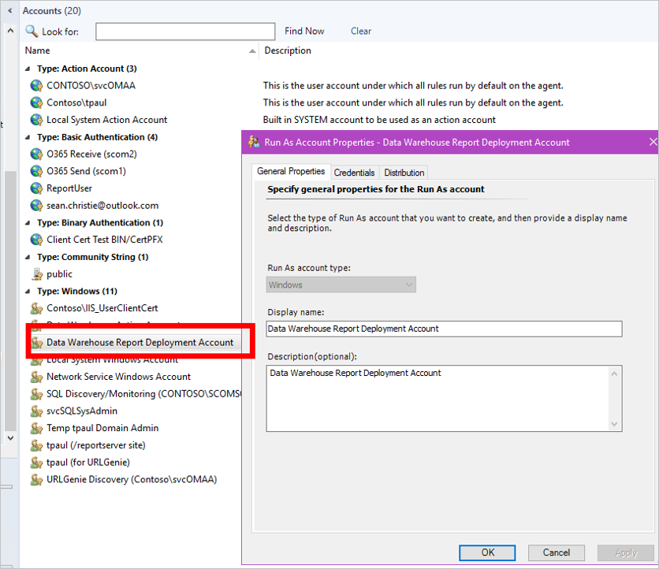

# Service-level changes

This article describes the service-level changes that are required to use group Managed Service Accounts (gMSAs) in System Center Operations Manager.

>[!Note]
>[Group Managed Service Accounts (gMSAs)](/windows-server/security/group-managed-service-accounts/group-managed-service-accounts-overview) are not supported as a report server service account.

## Change the service account for System Center Data Access Service to gMSA

To enable System Center Data Access Service to use gMSA:

1. Add **gMSA** to the local Administrators group on the computer on which the management server is installed, as shown.

    

1. Change the existing service account for System Center Data Access Service to **gMSA** from Windows Services Console, as shown.

    

## Change the credentials for the System Center configuration service

Change the sign-in credentials for this service account from Windows Services Console, as shown.





Validate that both the services are running with gMSA.



## Change the Data Warehouse Write account to use gMSA

Operations Manager stores the credentials for the Data Warehouse Write account within a Run As account called the Data Warehouse Action account.

Change the credentials of this Action account to gMSA that you intend to use as a Data Warehouse Write account, which is a Windows account.  



Validate that the *MonitoringHost.exe* uses the gMSA credentials for the Data Warehouse Write account.

## Change the Data Warehouse Report Deployment account to use gMSA

Operations Manager stores the credentials for the Data Warehouse Report Deployment account within a Run As account called the Data Warehouse Action account.

Change the credentials of this Action account to gMSA that you intend to use as a Data Warehouse Report Deployment account, which is a Windows account.  



Validate that the *MonitoringHost.exe* uses the gMSA credentials for the Data Warehouse Write account.

## Update your data warehouse database

1. Run the following SQL query against your data warehouse database. Replace *DataWarehouseName* with the name of your data warehouse database.

    ```sql   
    SELECT [ManagementGroupDefaultName],[WriterLoginName] FROM [DataWarehouseName].[dbo].[ManagementGroup]

    ```
1. If the previous query doesn't return the gMSA that you created for the Data Warehouse Write account, then execute the following query to update it.

    ```sql    
    UPDATE [DataWarehouseName].[dbo].[ManagementGroup] SET [WriterLoginName] = 'DOMAIN\USERNAME' WHERE [ManagementGroupDefaultName] = 'SCOM MANAGEMENT GROUP NAME'
    ```

## Next steps

[Console-level changes](console-level-changes.md)
