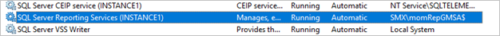
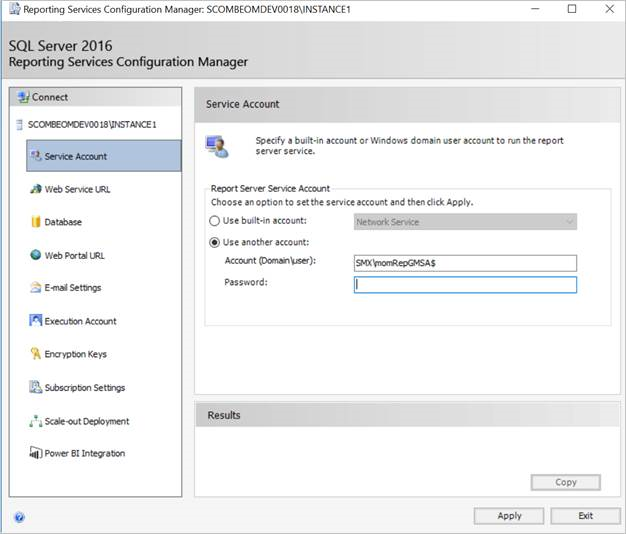
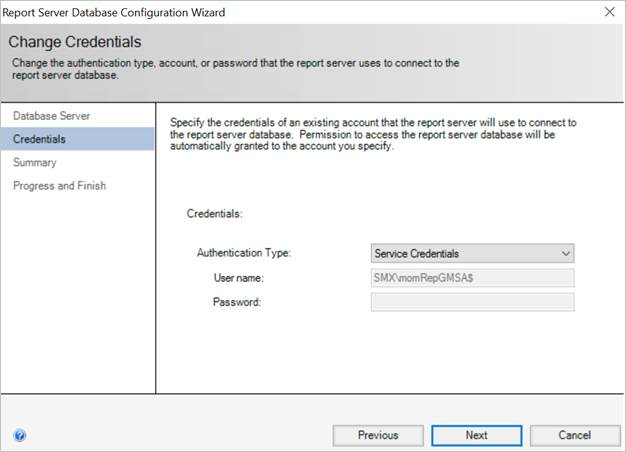
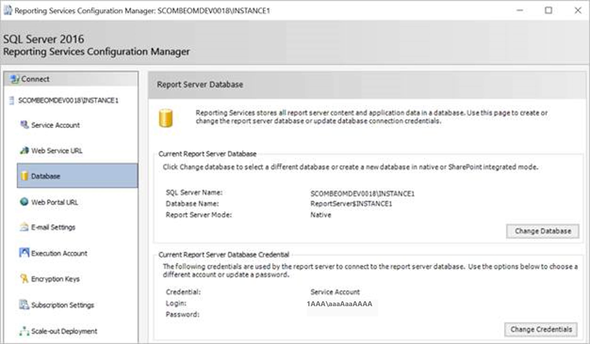

# Service-level changes

This article describes the service-level changes that are required to use group Managed Service Accounts (gMSAs).

>[!NOTE]
>This article applies to System Center 2019 Update Rollup 1 (UR1) Operations Manager.


## Change the service account for System Center Data Access Service to gMSA

To enable System Center Data Access Service to use gMSA:

1. Add **gMSA** to the local Administrators group on the computer on which the management server is installed, as shown.

    

1. Change the existing service account for System Center Data Access Service to **gMSA** from Windows Services Console, as shown.

    


## Change the credentials for the System Center configuration service

Change the sign-in credentials for this service account from Windows Services Console, as shown.


Validate that both the services are running with gMSA.


## Change the service account for SQL Server Reporting Services to gMSA

You can change the data reader account in the following two ways.

### From Windows Services Console

Change the existing service account for SQL Server Reporting Services to **gMSA** from Windows Services Console, as shown.


Validate that SQL Server Reporting Services is running with gMSA.



### From Reporting Services Configuration Manager



Select **Service Credentials** as **Authentication Type**, which is already specified as a gMSA earlier in Reporting Services Configuration Manager.





>[!NOTE]
>SQL Server doesn't support gMSA for the SQL Server Reporting Services Execution account. Continue to use a non-gMSA account for this account.


## Change the Data Warehouse Write account to use gMSA

Operations Manager stores the credentials for the Data Warehouse Write account within a Run As account, called the Data Warehouse Action account.

Change the credentials of this Action account to gMSA that you intend to use as a Data Warehouse Write account.


Validate that the *MonitoringHost.exe* uses the gMSA credentials for the Data Warehouse Write account.

## Update the Data Warehouse database

1. Run the following SQL query against your Data Warehouse database. Replace *DataWarehouseName* with the name of your Data Warehouse database.

    ```
    SELECT [ManagementGroupDefaultName],[WriterLoginName] FROM [DataWarehouseName].[dbo].[ManagementGroup]

    ```
1. If the previous query doesn't return the gMSA that you created for the Data Warehouse Write account, then execute the following query to update it.

    ```
    UPDATE [DataWarehouseName].[dbo].[ManagementGroup] SET [WriterLoginName] = 'DOMAIN\USERNAME' WHERE [ManagementGroupDefaultName] = 'SCOM MANAGEMENT GROUP NAME'
    ```


## Next steps

[Console-level changes](console-level-changes.md)
